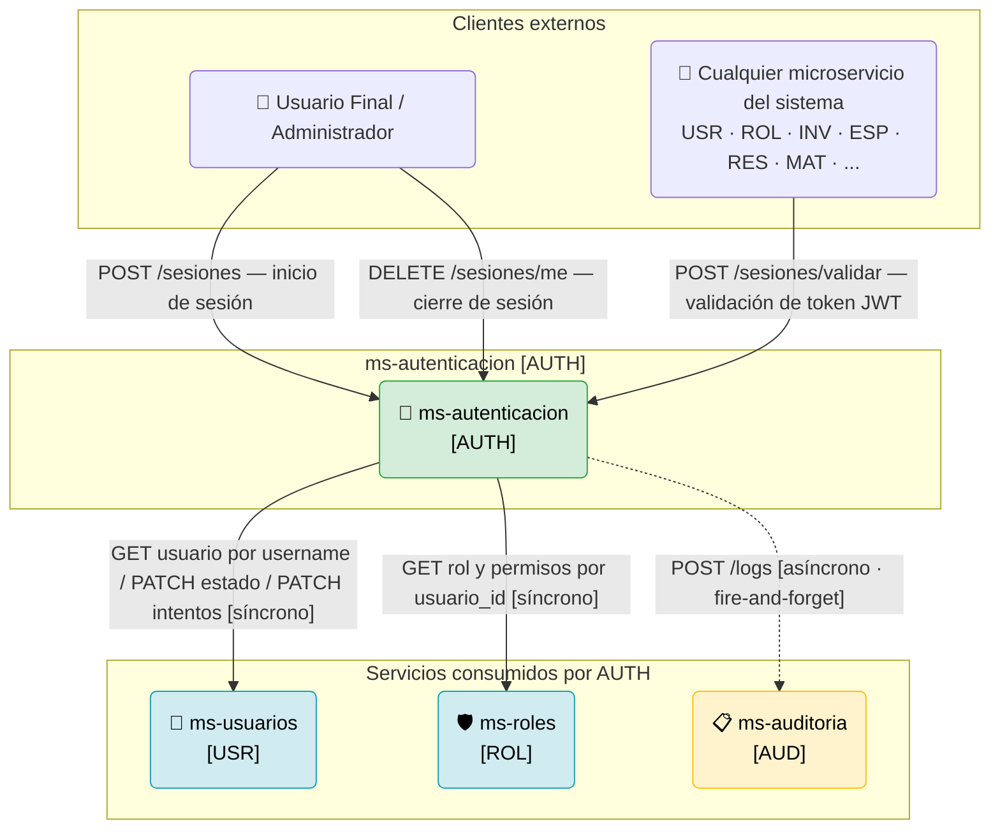
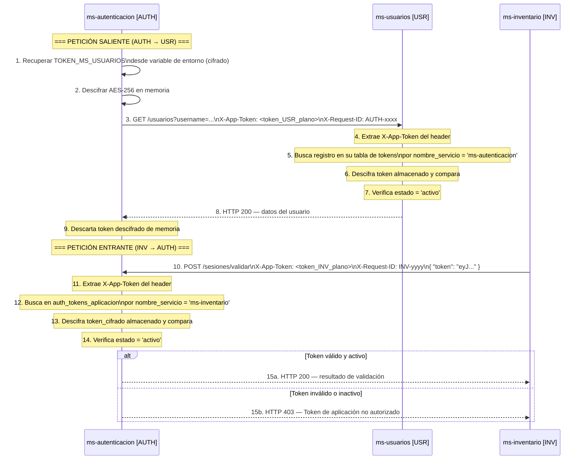
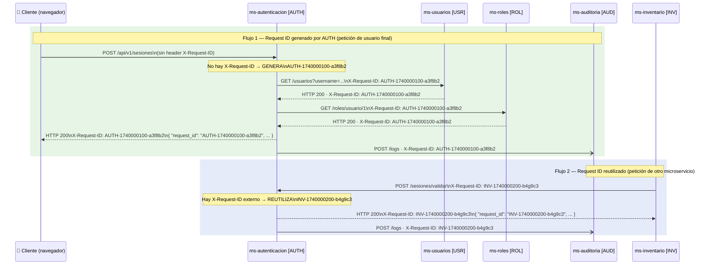
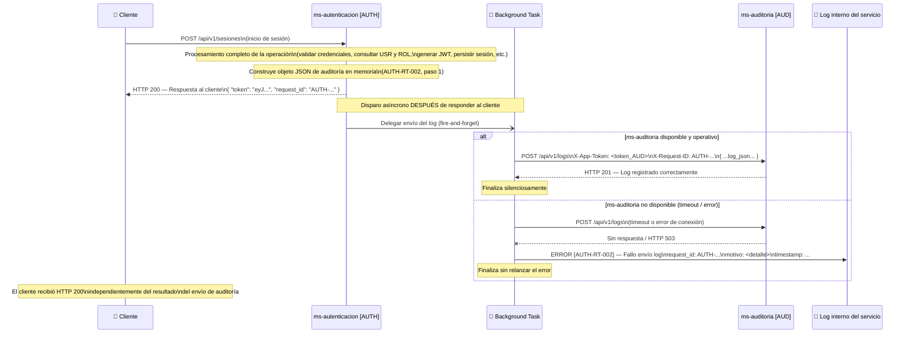
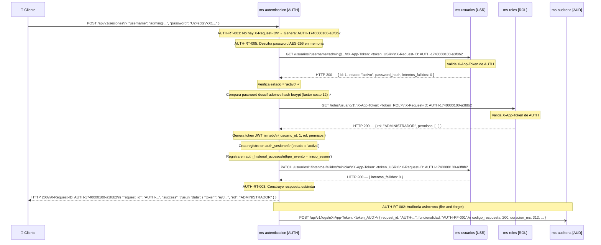
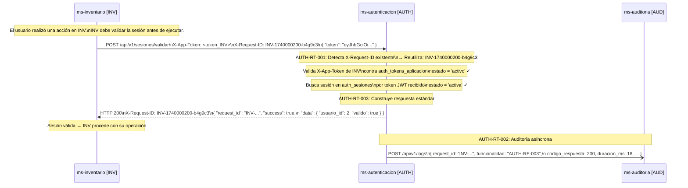
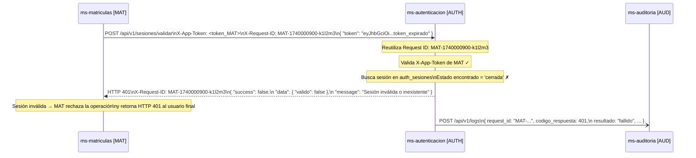
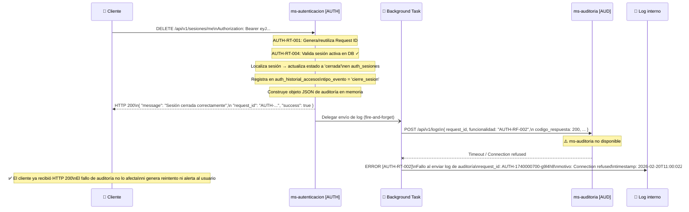

# Diseño de Integración — MS-AUTENTICACION [AUTH]

> **Versión:** 1.0
> **Fecha:** Febrero 2026
> **Generado a partir de:** AUTH_Requisitos_Funcionales.md + MS-AUTENTICACION_ModeloDatos.md
> **Stack tecnológico:** FastAPI + Python + PostgreSQL

---

## Tabla de Contenido

1. [Información General](#1-información-general)
2. [Mapa de Integraciones](#2-mapa-de-integraciones)
3. [Contratos de Comunicación Saliente](#3-contratos-de-comunicación-saliente)
4. [Contratos de Comunicación Entrante](#4-contratos-de-comunicación-entrante)
5. [Configuración de Tokens de Aplicación](#5-configuración-de-tokens-de-aplicación)
6. [Flujo de Request ID](#6-flujo-de-request-id)
7. [Flujo de Auditoría](#7-flujo-de-auditoría)
8. [Diagramas de Secuencia](#8-diagramas-de-secuencia)

---

## 1. Información General

| Campo | Detalle |
|---|---|
| **Nombre del microservicio** | ms-autenticacion |
| **Código** | AUTH |
| **Módulo** | Módulo 1 — Seguridad y Acceso |
| **Stack tecnológico** | FastAPI + Python + PostgreSQL |
| **Servicios consumidos (saliente)** | 3 (ms-usuarios, ms-roles, ms-auditoria) |
| **Servicios que lo consumen (entrante)** | Todos los microservicios del sistema ERP |

**Resumen de las integraciones:**
ms-autenticacion es el núcleo de seguridad del sistema ERP universitario. Consume de forma síncrona a **ms-usuarios [USR]** para verificar credenciales y gestionar estados de cuenta, y a **ms-roles [ROL]** para obtener rol y permisos durante el inicio de sesión; ambas son dependencias críticas sin las cuales no puede operar. Envía registros de auditoría de forma asíncrona (fire-and-forget) hacia **ms-auditoria [AUD]** al finalizar cada operación. En el sentido entrante, **todos los demás microservicios del sistema** son consumidores de su endpoint de validación de sesión (AUTH-RF-003), el cual constituye el punto de control de acceso centralizado de toda la plataforma.

---

## 2. Mapa de Integraciones



**Descripción narrativa del mapa de integraciones:**

ms-autenticacion se integra directamente con **3 servicios externos**. La comunicación con **ms-usuarios [USR]** y **ms-roles [ROL]** es **síncrona y bloqueante**: el microservicio no puede completar el inicio de sesión ni emitir el token JWT sin la respuesta de ambos. Son, por tanto, **dependencias críticas**: si cualquiera de los dos no responde, el flujo de inicio de sesión devuelve HTTP 503 sin generar sesión.

La comunicación con **ms-auditoria [AUD]** es **asíncrona (fire-and-forget)**, representada con línea discontinua: el log se construye y se envía en un hilo separado después de retornar la respuesta al cliente. Si ms-auditoria no está disponible, ms-autenticacion continúa operando con normalidad y el fallo se registra únicamente en el log interno del servicio. Es, por tanto, una **dependencia opcional** desde el punto de vista de la disponibilidad operativa.

En el sentido entrante, **todos los microservicios del sistema** son consumidores del endpoint `/sesiones/validar`, que es el más crítico del sistema por volumen y por impacto: si este endpoint no responde, todos los demás microservicios quedan bloqueados.

---

## 3. Contratos de Comunicación Saliente

### 3.1. Servicio: ms-usuarios [USR]

---

#### Operación 1 — Obtener datos de usuario por nombre de usuario

| Campo | Detalle |
|---|---|
| **Servicio destino** | ms-usuarios [USR] |
| **Operación** | Obtener datos de usuario por nombre de usuario |
| **Método HTTP** | GET |
| **Endpoint sugerido** | `/api/v1/usuarios?username={username}` |
| **Headers requeridos** | `X-App-Token: <token_AUTH_cifrado_AES256>`, `X-Request-ID: <request_id>`, `Accept: application/json` |
| **Timeout sugerido** | 3 000 ms |
| **Requisito relacionado** | AUTH-RF-001 (paso 3) |

```json
// Request — parámetros en query string
// GET /api/v1/usuarios?username=admin%40universidad.edu.co
// Sin cuerpo (body vacío)
```

```json
// Response exitoso — HTTP 200
{
  "request_id": "AUTH-1740000100-a3f8b2",
  "success": true,
  "data": {
    "id": 1,
    "username": "admin@universidad.edu.co",
    "estado": "activo",
    "password_hash": "$2b$12$KIX8T3Zm.VeTX3j4N/HqGe...",
    "intentos_fallidos": 0
  },
  "message": "Usuario encontrado",
  "timestamp": "2026-02-20T10:00:00Z"
}
```

```json
// Response de error — HTTP 404 (usuario no encontrado)
{
  "request_id": "AUTH-1740000100-a3f8b2",
  "success": false,
  "data": null,
  "message": "Usuario no encontrado",
  "timestamp": "2026-02-20T10:00:01Z"
}
```

---

#### Operación 2 — Incrementar contador de intentos fallidos

| Campo | Detalle |
|---|---|
| **Servicio destino** | ms-usuarios [USR] |
| **Operación** | Incrementar contador de intentos fallidos del usuario |
| **Método HTTP** | PATCH |
| **Endpoint sugerido** | `/api/v1/usuarios/{usuario_id}/intentos-fallidos/incrementar` |
| **Headers requeridos** | `X-App-Token: <token_AUTH_cifrado_AES256>`, `X-Request-ID: <request_id>`, `Content-Type: application/json` |
| **Timeout sugerido** | 3 000 ms |
| **Requisito relacionado** | AUTH-RF-001 (secuencia alterna 5A) |

```json
// Request
// PATCH /api/v1/usuarios/1/intentos-fallidos/incrementar
// Sin cuerpo (body vacío)
```

```json
// Response exitoso — HTTP 200
{
  "request_id": "AUTH-1740000100-a3f8b2",
  "success": true,
  "data": {
    "usuario_id": 1,
    "intentos_fallidos": 3
  },
  "message": "Contador de intentos incrementado",
  "timestamp": "2026-02-20T10:00:02Z"
}
```

```json
// Response de error — HTTP 404
{
  "request_id": "AUTH-1740000100-a3f8b2",
  "success": false,
  "data": null,
  "message": "Usuario no encontrado",
  "timestamp": "2026-02-20T10:00:02Z"
}
```

---

#### Operación 3 — Reiniciar contador de intentos fallidos

| Campo | Detalle |
|---|---|
| **Servicio destino** | ms-usuarios [USR] |
| **Operación** | Reiniciar contador de intentos fallidos a cero tras inicio de sesión exitoso |
| **Método HTTP** | PATCH |
| **Endpoint sugerido** | `/api/v1/usuarios/{usuario_id}/intentos-fallidos/reiniciar` |
| **Headers requeridos** | `X-App-Token: <token_AUTH_cifrado_AES256>`, `X-Request-ID: <request_id>`, `Content-Type: application/json` |
| **Timeout sugerido** | 3 000 ms |
| **Requisito relacionado** | AUTH-RF-001 (paso 10) |

```json
// Request
// PATCH /api/v1/usuarios/1/intentos-fallidos/reiniciar
// Sin cuerpo
```

```json
// Response exitoso — HTTP 200
{
  "request_id": "AUTH-1740000100-a3f8b2",
  "success": true,
  "data": {
    "usuario_id": 1,
    "intentos_fallidos": 0
  },
  "message": "Contador de intentos reiniciado",
  "timestamp": "2026-02-20T10:00:03Z"
}
```

```json
// Response de error — HTTP 503
{
  "request_id": "AUTH-1740000100-a3f8b2",
  "success": false,
  "data": null,
  "message": "Servicio temporalmente no disponible",
  "timestamp": "2026-02-20T10:00:03Z"
}
```

---

#### Operación 4 — Bloquear cuenta de usuario

| Campo | Detalle |
|---|---|
| **Servicio destino** | ms-usuarios [USR] |
| **Operación** | Bloquear la cuenta de un usuario por acumulación de intentos fallidos |
| **Método HTTP** | PATCH |
| **Endpoint sugerido** | `/api/v1/usuarios/{usuario_id}/bloquear` |
| **Headers requeridos** | `X-App-Token: <token_AUTH_cifrado_AES256>`, `X-Request-ID: <request_id>`, `Content-Type: application/json` |
| **Timeout sugerido** | 3 000 ms |
| **Requisito relacionado** | AUTH-RF-006 (paso 2) |

```json
// Request
{
  "motivo": "bloqueo_automatico_intentos_fallidos",
  "intentos_acumulados": 5
}
```

```json
// Response exitoso — HTTP 200
{
  "request_id": "AUTH-1740000600-f8k3g7",
  "success": true,
  "data": {
    "usuario_id": 7,
    "estado": "bloqueada"
  },
  "message": "Cuenta bloqueada correctamente",
  "timestamp": "2026-02-20T10:05:00Z"
}
```

```json
// Response de error — HTTP 503
{
  "request_id": "AUTH-1740000600-f8k3g7",
  "success": false,
  "data": null,
  "message": "Servicio temporalmente no disponible",
  "timestamp": "2026-02-20T10:05:00Z"
}
```

---

#### Operación 5 — Desbloquear cuenta de usuario

| Campo | Detalle |
|---|---|
| **Servicio destino** | ms-usuarios [USR] |
| **Operación** | Desbloquear cuenta y reiniciar contador de intentos fallidos (desbloqueo manual por administrador) |
| **Método HTTP** | PATCH |
| **Endpoint sugerido** | `/api/v1/usuarios/{usuario_id}/desbloquear` |
| **Headers requeridos** | `X-App-Token: <token_AUTH_cifrado_AES256>`, `X-Request-ID: <request_id>`, `Content-Type: application/json` |
| **Timeout sugerido** | 3 000 ms |
| **Requisito relacionado** | AUTH-RS-001 (paso 4) |

```json
// Request
{
  "motivo": "desbloqueo_manual_administrador",
  "admin_id": 1
}
```

```json
// Response exitoso — HTTP 200
{
  "request_id": "AUTH-1740001000-z1a2b3",
  "success": true,
  "data": {
    "usuario_id": 7,
    "estado": "activo",
    "intentos_fallidos": 0
  },
  "message": "Cuenta desbloqueada correctamente",
  "timestamp": "2026-02-20T11:00:00Z"
}
```

```json
// Response de error — HTTP 409 (la cuenta no está bloqueada)
{
  "request_id": "AUTH-1740001000-z1a2b3",
  "success": false,
  "data": null,
  "message": "La cuenta no se encuentra bloqueada",
  "timestamp": "2026-02-20T11:00:00Z"
}
```

---

### 3.2. Servicio: ms-roles [ROL]

---

#### Operación 1 — Obtener rol y permisos del usuario

| Campo | Detalle |
|---|---|
| **Servicio destino** | ms-roles [ROL] |
| **Operación** | Obtener el rol asignado y la lista de permisos del usuario por su identificador |
| **Método HTTP** | GET |
| **Endpoint sugerido** | `/api/v1/roles/usuario/{usuario_id}` |
| **Headers requeridos** | `X-App-Token: <token_AUTH_cifrado_AES256>`, `X-Request-ID: <request_id>`, `Accept: application/json` |
| **Timeout sugerido** | 3 000 ms |
| **Requisito relacionado** | AUTH-RF-001 (paso 6) |

```json
// Request
// GET /api/v1/roles/usuario/1
// Sin cuerpo
```

```json
// Response exitoso — HTTP 200
{
  "request_id": "AUTH-1740000100-a3f8b2",
  "success": true,
  "data": {
    "usuario_id": 1,
    "rol": "ADMINISTRADOR",
    "permisos": [
      "sesiones:leer",
      "sesiones:cerrar_forzado",
      "tokens:crear",
      "tokens:actualizar",
      "tokens:desactivar",
      "historial:leer",
      "cuentas:desbloquear"
    ]
  },
  "message": "Rol y permisos obtenidos correctamente",
  "timestamp": "2026-02-20T10:00:04Z"
}
```

```json
// Response de error — HTTP 503 (ms-roles no disponible)
{
  "request_id": "AUTH-1740000100-a3f8b2",
  "success": false,
  "data": null,
  "message": "Servicio temporalmente no disponible",
  "timestamp": "2026-02-20T10:00:04Z"
}
```

---

### 3.3. Servicio: ms-auditoria [AUD] — Comunicación asíncrona

---

#### Operación 1 — Envío de log de auditoría

| Campo | Detalle |
|---|---|
| **Servicio destino** | ms-auditoria [AUD] |
| **Operación** | Enviar log de auditoría de la operación ejecutada (fire-and-forget) |
| **Método HTTP** | POST |
| **Endpoint sugerido** | `/api/v1/logs` |
| **Headers requeridos** | `X-App-Token: <token_AUTH_cifrado_AES256>`, `X-Request-ID: <request_id>`, `Content-Type: application/json` |
| **Timeout sugerido** | 2 000 ms (no bloqueante — fire-and-forget) |
| **Requisito relacionado** | AUTH-RT-002 (aplica a todas las operaciones) |

> **Nota:** Esta llamada se realiza de forma **asíncrona** en un background task, después de haber retornado la respuesta al cliente. El resultado de esta llamada no afecta la respuesta al consumidor en ningún caso.

```json
// Request
{
  "request_id": "AUTH-1740000100-a3f8b2",
  "microservicio": "ms-autenticacion",
  "codigo_microservicio": "AUTH",
  "funcionalidad": "AUTH-RF-001 — Inicio de sesión con credenciales cifradas",
  "metodo_http": "POST",
  "endpoint": "/api/v1/sesiones",
  "codigo_respuesta": 200,
  "duracion_ms": 312,
  "usuario_id": 1,
  "username": "admin@universidad.edu.co",
  "ip_address": "192.168.1.10",
  "resultado": "exitoso",
  "detalle": "Inicio de sesión exitoso. Sesión activa creada con ID 1.",
  "timestamp": "2026-02-20T10:00:05Z"
}
```

```json
// Response exitoso — HTTP 201 (solo referencial; la respuesta no se espera)
{
  "request_id": "AUTH-1740000100-a3f8b2",
  "success": true,
  "data": {
    "log_id": "AUD-00012345"
  },
  "message": "Log registrado correctamente",
  "timestamp": "2026-02-20T10:00:05Z"
}
```

```json
// Response de error — HTTP 503 (el servicio registra el fallo internamente y continúa)
{
  "request_id": "AUTH-1740000100-a3f8b2",
  "success": false,
  "data": null,
  "message": "Servicio de auditoría no disponible",
  "timestamp": "2026-02-20T10:00:05Z"
}
```

---

## 4. Contratos de Comunicación Entrante

### 4.1. Consumidor: Cualquier microservicio del sistema

---

#### Operación 1 — Validación de sesión para servicios externos

| Campo | Detalle |
|---|---|
| **Servicio origen** | Cualquier microservicio del sistema (USR, ROL, INV, ESP, RES, MAT, etc.) |
| **Operación** | Verificar que el token JWT del usuario corresponde a una sesión activa |
| **Método HTTP** | POST |
| **Endpoint expuesto** | `/api/v1/sesiones/validar` |
| **Headers requeridos** | `X-App-Token: <token_servicio_origen_cifrado_AES256>`, `X-Request-ID: <request_id>`, `Content-Type: application/json` |
| **Requisito relacionado** | AUTH-RF-003 |

```json
// Request
{
  "token": "eyJhbGciOiJIUzI1NiIsInR5cCI6IkpXVCJ9.admin_activa_001"
}
```

```json
// Response exitoso — HTTP 200
{
  "request_id": "INV-1740000200-b4g9c3",
  "success": true,
  "data": {
    "usuario_id": 1,
    "estado_sesion": "activa",
    "valido": true
  },
  "message": "Sesión válida y activa",
  "timestamp": "2026-02-20T10:00:10Z"
}
```

```json
// Response de error — HTTP 401 (sesión inválida o inexistente)
{
  "request_id": "INV-1740000200-b4g9c3",
  "success": false,
  "data": {
    "valido": false
  },
  "message": "Sesión inválida o inexistente",
  "timestamp": "2026-02-20T10:00:10Z"
}
```

```json
// Response de error — HTTP 403 (token de aplicación del invocante no válido o inactivo)
{
  "request_id": "INV-1740000200-b4g9c3",
  "success": false,
  "data": null,
  "message": "Token de aplicación no autorizado",
  "timestamp": "2026-02-20T10:00:10Z"
}
```

---

### 4.2. Consumidor: Usuario Final / Administrador

---

#### Operación 2 — Inicio de sesión

| Campo | Detalle |
|---|---|
| **Servicio origen** | Cliente web / móvil (usuario final o administrador) |
| **Operación** | Autenticar usuario con credenciales cifradas y obtener token JWT |
| **Método HTTP** | POST |
| **Endpoint expuesto** | `/api/v1/sesiones` |
| **Headers requeridos** | `X-Request-ID: <request_id>` (opcional; si no se envía AUTH lo genera), `Content-Type: application/json` |
| **Requisito relacionado** | AUTH-RF-001 |

```json
// Request
{
  "username": "admin@universidad.edu.co",
  "password": "U2FsdGVkX19abc123cifradoAES256Base64=="
}
```

```json
// Response exitoso — HTTP 200
{
  "request_id": "AUTH-1740000100-a3f8b2",
  "success": true,
  "data": {
    "token": "eyJhbGciOiJIUzI1NiIsInR5cCI6IkpXVCJ9.eyJ1c2VyX2lkIjoxLCJyb2wiOiJBRE1JTklTVFJBRE9SIn0.firma",
    "usuario_id": 1,
    "rol": "ADMINISTRADOR"
  },
  "message": "Inicio de sesión exitoso",
  "timestamp": "2026-02-20T10:00:05Z"
}
```

```json
// Response de error — HTTP 401 (credenciales inválidas)
{
  "request_id": "AUTH-1740000100-a3f8b2",
  "success": false,
  "data": null,
  "message": "Credenciales inválidas",
  "timestamp": "2026-02-20T10:00:05Z"
}
```

```json
// Response de error — HTTP 403 (cuenta bloqueada)
{
  "request_id": "AUTH-1740000100-a3f8b2",
  "success": false,
  "data": null,
  "message": "Cuenta bloqueada. Contacte al administrador.",
  "timestamp": "2026-02-20T10:00:05Z"
}
```

---

#### Operación 3 — Cierre de sesión por el usuario

| Campo | Detalle |
|---|---|
| **Servicio origen** | Cliente web / móvil (usuario autenticado) |
| **Operación** | Cerrar la sesión activa del usuario autenticado |
| **Método HTTP** | DELETE |
| **Endpoint expuesto** | `/api/v1/sesiones/me` |
| **Headers requeridos** | `Authorization: Bearer <token_jwt>`, `X-Request-ID: <request_id>` |
| **Requisito relacionado** | AUTH-RF-002 |

```json
// Request
// DELETE /api/v1/sesiones/me
// Sin cuerpo — el token JWT en Authorization identifica la sesión a cerrar
```

```json
// Response exitoso — HTTP 200
{
  "request_id": "AUTH-1740000700-g9l4h8",
  "success": true,
  "data": null,
  "message": "Sesión cerrada correctamente",
  "timestamp": "2026-02-20T11:00:00Z"
}
```

```json
// Response de error — HTTP 404 (sesión no encontrada)
{
  "request_id": "AUTH-1740000700-g9l4h8",
  "success": false,
  "data": null,
  "message": "Sesión no encontrada",
  "timestamp": "2026-02-20T11:00:00Z"
}
```

---

#### Operación 4 — Listado de sesiones activas (administrador)

| Campo | Detalle |
|---|---|
| **Servicio origen** | Administrador (cliente web) |
| **Operación** | Consultar todas las sesiones activas del sistema con filtro opcional por usuario |
| **Método HTTP** | GET |
| **Endpoint expuesto** | `/api/v1/sesiones/activas?usuario_id={id}` |
| **Headers requeridos** | `Authorization: Bearer <token_jwt_admin>`, `X-Request-ID: <request_id>` |
| **Requisito relacionado** | AUTH-RF-004 |

```json
// Request
// GET /api/v1/sesiones/activas?usuario_id=2
// Sin cuerpo
```

```json
// Response exitoso — HTTP 200
{
  "request_id": "AUTH-1740001100-c3d4e5",
  "success": true,
  "data": [
    {
      "id": 2,
      "usuario_id": 2,
      "ip_address": "10.0.0.25",
      "user_agent": "Mozilla/5.0 (Macintosh; Intel Mac OS X 14) Safari/17.0",
      "ultima_actividad": "2026-02-20T09:45:00Z",
      "created_at": "2026-02-20T07:00:00Z"
    }
  ],
  "message": "Sesiones activas obtenidas",
  "timestamp": "2026-02-20T10:00:00Z"
}
```

```json
// Response de error — HTTP 403 (permisos insuficientes)
{
  "request_id": "AUTH-1740001100-c3d4e5",
  "success": false,
  "data": null,
  "message": "Permisos insuficientes",
  "timestamp": "2026-02-20T10:00:00Z"
}
```

---

#### Operación 5 — Cierre forzado de sesión (administrador)

| Campo | Detalle |
|---|---|
| **Servicio origen** | Administrador (cliente web) |
| **Operación** | Cerrar forzosamente una sesión activa de cualquier usuario |
| **Método HTTP** | DELETE |
| **Endpoint expuesto** | `/api/v1/sesiones/{sesion_id}` |
| **Headers requeridos** | `Authorization: Bearer <token_jwt_admin>`, `X-Request-ID: <request_id>` |
| **Requisito relacionado** | AUTH-RF-005 |

```json
// Request
// DELETE /api/v1/sesiones/7
// Sin cuerpo
```

```json
// Response exitoso — HTTP 200
{
  "request_id": "AUTH-1740000800-h0m5i9",
  "success": true,
  "data": null,
  "message": "Sesión cerrada forzosamente",
  "timestamp": "2026-02-20T12:00:00Z"
}
```

```json
// Response de error — HTTP 409 (sesión ya cerrada)
{
  "request_id": "AUTH-1740000800-h0m5i9",
  "success": false,
  "data": null,
  "message": "La sesión ya se encuentra cerrada",
  "timestamp": "2026-02-20T12:00:00Z"
}
```

---

#### Operación 6 — Creación de token de aplicación

| Campo | Detalle |
|---|---|
| **Servicio origen** | Administrador (cliente web) |
| **Operación** | Registrar un nuevo token de aplicación para un microservicio |
| **Método HTTP** | POST |
| **Endpoint expuesto** | `/api/v1/tokens-aplicacion` |
| **Headers requeridos** | `Authorization: Bearer <token_jwt_admin>`, `X-Request-ID: <request_id>`, `Content-Type: application/json` |
| **Requisito relacionado** | AUTH-RF-007 |

```json
// Request
{
  "nombre_servicio": "ms-pagos",
  "codigo_servicio": "PAG",
  "descripcion": "Gestión de pagos y facturación del sistema ERP universitario"
}
```

```json
// Response exitoso — HTTP 201
{
  "request_id": "AUTH-1740002000-d5e6f7",
  "success": true,
  "data": {
    "id": 9,
    "nombre_servicio": "ms-pagos",
    "codigo_servicio": "PAG",
    "descripcion": "Gestión de pagos y facturación del sistema ERP universitario",
    "token_plano": "tk_ms-pagos_xK9mP2qR7vL4nJ1wZ8eT3uA6sD0hF5cB",
    "estado": "activo",
    "created_at": "2026-02-20T13:00:00Z"
  },
  "message": "Token de aplicación creado correctamente. Guarde el valor del token; no volverá a ser visible.",
  "timestamp": "2026-02-20T13:00:00Z"
}
```

```json
// Response de error — HTTP 409 (ya existe token activo para el servicio)
{
  "request_id": "AUTH-1740002000-d5e6f7",
  "success": false,
  "data": null,
  "message": "Ya existe un token activo para este servicio",
  "timestamp": "2026-02-20T13:00:00Z"
}
```

---

#### Operación 7 — Consulta de token de aplicación

| Campo | Detalle |
|---|---|
| **Servicio origen** | Administrador (cliente web) |
| **Operación** | Consultar metadatos de un token de aplicación sin exponer su valor |
| **Método HTTP** | GET |
| **Endpoint expuesto** | `/api/v1/tokens-aplicacion/{id}` o `/api/v1/tokens-aplicacion?nombre_servicio={nombre}` |
| **Headers requeridos** | `Authorization: Bearer <token_jwt_admin>`, `X-Request-ID: <request_id>` |
| **Requisito relacionado** | AUTH-RF-008 |

```json
// Request
// GET /api/v1/tokens-aplicacion/1
// Sin cuerpo
```

```json
// Response exitoso — HTTP 200
{
  "request_id": "AUTH-1740002100-e6f7g8",
  "success": true,
  "data": {
    "id": 1,
    "nombre_servicio": "ms-usuarios",
    "codigo_servicio": "USR",
    "descripcion": "Gestión de usuarios del sistema ERP universitario",
    "estado": "activo",
    "actualizado_por": 1,
    "created_at": "2025-11-21T00:00:00Z",
    "updated_at": "2025-11-21T00:00:00Z"
  },
  "message": "Token de aplicación encontrado",
  "timestamp": "2026-02-20T14:00:00Z"
}
```

```json
// Response de error — HTTP 404
{
  "request_id": "AUTH-1740002100-e6f7g8",
  "success": false,
  "data": null,
  "message": "Token de aplicación no encontrado",
  "timestamp": "2026-02-20T14:00:00Z"
}
```

---

#### Operación 8 — Actualización de token de aplicación

| Campo | Detalle |
|---|---|
| **Servicio origen** | Administrador (cliente web) |
| **Operación** | Regenerar el valor de un token de aplicación existente |
| **Método HTTP** | PATCH |
| **Endpoint expuesto** | `/api/v1/tokens-aplicacion/{id}` |
| **Headers requeridos** | `Authorization: Bearer <token_jwt_admin>`, `X-Request-ID: <request_id>`, `Content-Type: application/json` |
| **Requisito relacionado** | AUTH-RF-009 |

```json
// Request
{
  "descripcion": "Gestión de usuarios del sistema ERP universitario — versión actualizada"
}
```

```json
// Response exitoso — HTTP 200
{
  "request_id": "AUTH-1740002200-f7g8h9",
  "success": true,
  "data": {
    "id": 1,
    "nombre_servicio": "ms-usuarios",
    "token_plano": "tk_ms-usuarios_newXk9mP2qR7vL4nJ1wZ8e",
    "updated_at": "2026-02-20T15:00:00Z"
  },
  "message": "Token de aplicación actualizado. Guarde el nuevo valor; no volverá a ser visible.",
  "timestamp": "2026-02-20T15:00:00Z"
}
```

```json
// Response de error — HTTP 409 (token inactivo, no se puede actualizar)
{
  "request_id": "AUTH-1740002200-f7g8h9",
  "success": false,
  "data": null,
  "message": "No se puede actualizar un token desactivado",
  "timestamp": "2026-02-20T15:00:00Z"
}
```

---

#### Operación 9 — Desactivación de token de aplicación

| Campo | Detalle |
|---|---|
| **Servicio origen** | Administrador (cliente web) |
| **Operación** | Desactivar un token de aplicación cambiando su estado a `inactivo` |
| **Método HTTP** | PATCH |
| **Endpoint expuesto** | `/api/v1/tokens-aplicacion/{id}/desactivar` |
| **Headers requeridos** | `Authorization: Bearer <token_jwt_admin>`, `X-Request-ID: <request_id>` |
| **Requisito relacionado** | AUTH-RF-010 |

```json
// Request
// PATCH /api/v1/tokens-aplicacion/8/desactivar
// Sin cuerpo
```

```json
// Response exitoso — HTTP 200
{
  "request_id": "AUTH-1740002300-g8h9i0",
  "success": true,
  "data": null,
  "message": "Token desactivado correctamente",
  "timestamp": "2026-02-20T16:00:00Z"
}
```

```json
// Response de error — HTTP 409 (ya inactivo)
{
  "request_id": "AUTH-1740002300-g8h9i0",
  "success": false,
  "data": null,
  "message": "El token ya se encuentra inactivo",
  "timestamp": "2026-02-20T16:00:00Z"
}
```

---

#### Operación 10 — Consulta de historial de accesos

| Campo | Detalle |
|---|---|
| **Servicio origen** | Administrador (cliente web) |
| **Operación** | Consultar historial de eventos de seguridad con filtros por usuario, tipo de evento y rango de fechas |
| **Método HTTP** | GET |
| **Endpoint expuesto** | `/api/v1/historial-accesos?usuario_id={id}&tipo_evento={tipo}&fecha_inicio={f1}&fecha_fin={f2}` |
| **Headers requeridos** | `Authorization: Bearer <token_jwt_admin>`, `X-Request-ID: <request_id>` |
| **Requisito relacionado** | AUTH-RF-011 |

```json
// Request
// GET /api/v1/historial-accesos?usuario_id=7&tipo_evento=intento_fallido&fecha_inicio=2026-02-01&fecha_fin=2026-02-20
// Sin cuerpo
```

```json
// Response exitoso — HTTP 200
{
  "request_id": "AUTH-1740002400-h9i0j1",
  "success": true,
  "data": [
    {
      "id": 5,
      "usuario_id": 7,
      "username_intentado": "usuario.prueba@universidad.edu.co",
      "tipo_evento": "intento_fallido",
      "ip_address": "10.20.30.40",
      "user_agent": "Mozilla/5.0 (Windows NT 10.0) Firefox/122.0",
      "request_id": "AUTH-1740000500-e7j2f6",
      "fecha_evento": "2026-02-20T04:00:00Z"
    }
  ],
  "message": "Historial de accesos obtenido",
  "timestamp": "2026-02-20T17:00:00Z"
}
```

```json
// Response de error — HTTP 400 (rango de fechas inválido)
{
  "request_id": "AUTH-1740002400-h9i0j1",
  "success": false,
  "data": null,
  "message": "Rango de fechas inválido",
  "timestamp": "2026-02-20T17:00:00Z"
}
```

---

## 5. Configuración de Tokens de Aplicación

### Token propio del microservicio

| Campo | Detalle |
|---|---|
| **Nombre** | `token_ms-autenticacion` |
| **Código de servicio** | `AUTH` |
| **Descripción** | Identifica y autoriza a ms-autenticacion para realizar llamadas salientes hacia ms-usuarios [USR], ms-roles [ROL] y ms-auditoria [AUD] |
| **Formato de almacenamiento en DB** | Cifrado con AES-256 en la columna `token_cifrado` de la tabla `auth_tokens_aplicacion` |
| **Almacenamiento en runtime** | Variable de entorno o secreto de infraestructura (ej: Vault, AWS Secrets Manager) — cifrado en reposo, descifrado en memoria solo durante uso |

### Tokens de otros servicios que ms-autenticacion necesita

| Servicio | Código | Propósito | Nombre sugerido en config | Uso en header HTTP |
|---|---|---|---|---|
| ms-usuarios | USR | Autenticar llamadas salientes para verificar credenciales y gestionar estados de cuenta | `TOKEN_MS_USUARIOS` | `X-App-Token: <valor_descifrado>` |
| ms-roles | ROL | Autenticar llamadas salientes para obtener rol y permisos del usuario | `TOKEN_MS_ROLES` | `X-App-Token: <valor_descifrado>` |
| ms-auditoria | AUD | Autenticar llamadas asíncronas salientes para envío de logs | `TOKEN_MS_AUDITORIA` | `X-App-Token: <valor_descifrado>` |

### Formato de transmisión del token en las peticiones

Todas las peticiones HTTP entre microservicios incluyen las siguientes cabeceras obligatorias:

```
X-App-Token: <valor_token_en_texto_plano_descifrado>
X-Request-ID: <request_id_activo>
Content-Type: application/json
```

El token viaja en texto plano en la capa de transporte, **protegido por TLS/HTTPS**. En reposo (base de datos, variables de entorno, ficheros de configuración) siempre se almacena cifrado con AES-256. El valor descifrado existe únicamente en memoria durante el tiempo de vida de la petición y se descarta al finalizar.

### Diagrama del flujo de validación de token entre servicios



**Descripción narrativa del flujo de validación de tokens:**

**Petición saliente (AUTH → USR):** Al necesitar consultar ms-usuarios, ms-autenticacion recupera el token de USR desde su configuración segura (variable de entorno o secreto), lo descifra en memoria con AES-256, y lo incluye en el header `X-App-Token` de la petición HTTP saliente. El servicio receptor (USR) extrae el valor del header, localiza el registro correspondiente en su propia tabla de tokens autorizados, descifra el valor almacenado para compararlo, y verifica que el estado sea `activo`. Si la validación falla, USR rechaza con HTTP 403. El token descifrado se descarta de memoria en AUTH al finalizar la petición.

**Petición entrante (INV → AUTH):** Cuando ms-inventario llama a AUTH con su token en `X-App-Token`, ms-autenticacion extrae el valor del header, busca el registro correspondiente a `ms-inventario` en la tabla `auth_tokens_aplicacion`, descifra el `token_cifrado` almacenado con AES-256 y lo compara con el valor recibido, verifica que el estado sea `activo`. Solo si todas las comprobaciones son exitosas se ejecuta la lógica del endpoint; en caso contrario se retorna HTTP 403 antes de ejecutar cualquier lógica de negocio.

---

## 6. Flujo de Request ID

### Formato del Request ID

```
AUTH-<timestamp_unix>-<id_corto_aleatorio>

Ejemplos:
  AUTH-1740000100-a3f8b2
  AUTH-1740000500-e7j2f6
  AUTH-1740001800-z9x8y7
```

| Componente | Descripción |
|---|---|
| `AUTH` | Prefijo fijo que identifica al microservicio generador |
| `<timestamp_unix>` | Marca de tiempo Unix en segundos en el momento de generación |
| `<id_corto_aleatorio>` | Cadena alfanumérica de 6 caracteres generada aleatoriamente (ej: `a3f8b2`) |

### Reglas de generación y reutilización

| Regla | Descripción |
|---|---|
| **Inspección previa** | Al recibir cualquier petición, ms-autenticacion inspecciona el header `X-Request-ID` antes de ejecutar ninguna lógica |
| **Reutilización** | Si el header `X-Request-ID` tiene un valor no vacío, se reutiliza sin modificación. El prefijo del servicio originador se conserva intacto (ej: `INV-...`, `MAT-...`) |
| **Generación** | Si el header no existe o está vacío, se genera un nuevo identificador con el formato `AUTH-<timestamp>-<aleatorio>` |
| **Fallback** | Si falla la generación del componente aleatorio, se reintenta una vez. Si el segundo intento falla, se usa un UUID v4 estándar como fallback |
| **Propagación saliente** | El Request ID activo se incluye en el header `X-Request-ID` de todas las llamadas salientes hacia USR, ROL y AUD |
| **Propagación en respuesta** | El Request ID se incluye en el header `X-Request-ID` de la respuesta HTTP y en el campo `request_id` del cuerpo JSON |
| **Registro interno** | El Request ID se almacena en la columna `request_id` de la tabla `auth_historial_accesos` para trazabilidad interna |

### Diagrama de propagación del Request ID



**Descripción narrativa del flujo de Request ID:**

El Request ID se **genera** en ms-autenticacion únicamente cuando la petición entrante no incluye el header `X-Request-ID`, lo cual ocurre típicamente cuando el origen es un cliente de usuario final (navegador, app móvil). El identificador generado con el formato `AUTH-<timestamp>-<aleatorio>` queda almacenado en el contexto de la petición desde ese instante y viaja en todas las llamadas posteriores.

El Request ID se **reutiliza** cuando la petición proviene de otro microservicio del sistema que ya generó su propio identificador. AUTH lo conserva íntegramente, incluyendo el prefijo del servicio originador (ej: `INV-...`), y lo propaga hacia adelante en la cadena, garantizando la trazabilidad distribuida completa del flujo original sin interrupciones.

En ambos casos, el Request ID se incluye en el header `X-Request-ID` y en el campo `request_id` del cuerpo JSON de la respuesta, en todos los headers de llamadas salientes, en el log enviado a ms-auditoria, y en el campo `request_id` de la tabla `auth_historial_accesos`.

---

## 7. Flujo de Auditoría

### Estructura completa del log JSON

```json
{
  "request_id": "AUTH-1740000100-a3f8b2",
  "microservicio": "ms-autenticacion",
  "codigo_microservicio": "AUTH",
  "funcionalidad": "AUTH-RF-001 — Inicio de sesión con credenciales cifradas",
  "metodo_http": "POST",
  "endpoint": "/api/v1/sesiones",
  "codigo_respuesta": 200,
  "duracion_ms": 312,
  "usuario_id": 1,
  "username": "admin@universidad.edu.co",
  "ip_address": "192.168.1.10",
  "user_agent": "Mozilla/5.0 (Windows NT 10.0; Win64; x64) Chrome/121.0",
  "resultado": "exitoso",
  "detalle": "Inicio de sesión exitoso. Sesión activa creada con ID 1.",
  "timestamp": "2026-02-20T10:00:05Z"
}
```

> **Restricción crítica de seguridad (AUTH-RT-005):** Ningún campo del log puede contener contraseñas, tokens JWT, tokens de aplicación ni ninguna otra credencial, en texto plano ni en formato cifrado o codificado (Base64, hash, etc.).

### Ejemplos adicionales de logs por tipo de operación

```json
// Log — intento de inicio de sesión fallido (usuario no autenticado aún)
{
  "request_id": "AUTH-1740000400-d6i1e5",
  "microservicio": "ms-autenticacion",
  "codigo_microservicio": "AUTH",
  "funcionalidad": "AUTH-RF-001 — Inicio de sesión con credenciales cifradas",
  "metodo_http": "POST",
  "endpoint": "/api/v1/sesiones",
  "codigo_respuesta": 401,
  "duracion_ms": 89,
  "usuario_id": null,
  "username": "intruso@hackers.com",
  "ip_address": "198.51.100.42",
  "user_agent": "curl/7.81.0",
  "resultado": "fallido",
  "detalle": "Credenciales inválidas — usuario no encontrado en ms-usuarios",
  "timestamp": "2026-02-20T06:00:00Z"
}
```

```json
// Log — validación de sesión solicitada por microservicio externo
{
  "request_id": "INV-1740000200-b4g9c3",
  "microservicio": "ms-autenticacion",
  "codigo_microservicio": "AUTH",
  "funcionalidad": "AUTH-RF-003 — Validación de sesión para servicios externos",
  "metodo_http": "POST",
  "endpoint": "/api/v1/sesiones/validar",
  "codigo_respuesta": 200,
  "duracion_ms": 18,
  "usuario_id": 2,
  "username": null,
  "ip_address": null,
  "user_agent": null,
  "resultado": "exitoso",
  "detalle": "Sesión válida y activa para usuario_id 2. Invocado por ms-inventario [INV].",
  "timestamp": "2026-02-20T10:00:10Z"
}
```

```json
// Log — bloqueo de cuenta por intentos fallidos
{
  "request_id": "AUTH-1740000600-f8k3g7",
  "microservicio": "ms-autenticacion",
  "codigo_microservicio": "AUTH",
  "funcionalidad": "AUTH-RF-006 — Bloqueo de cuenta por intentos fallidos",
  "metodo_http": "POST",
  "endpoint": "/api/v1/sesiones",
  "codigo_respuesta": 401,
  "duracion_ms": 134,
  "usuario_id": 7,
  "username": "usuario.prueba@universidad.edu.co",
  "ip_address": "10.20.30.40",
  "user_agent": "Mozilla/5.0 (Windows NT 10.0) Firefox/122.0",
  "resultado": "bloqueado",
  "detalle": "Cuenta bloqueada tras 5 intentos fallidos consecutivos.",
  "timestamp": "2026-02-20T05:00:00Z"
}
```

### Momento de generación del log

El log de auditoría se **construye en memoria al finalizar el procesamiento** de la operación (exitosa o con error controlado) y **antes de retornar la respuesta al cliente**. Sin embargo, su **envío a ms-auditoria es completamente asíncrono**: se delega a un background task (hilo separado) inmediatamente después de que la respuesta HTTP ha sido entregada al cliente.

### Comportamiento ante fallos del servicio de auditoría

Si ms-auditoria no responde, devuelve un código de error HTTP, o el envío supera el timeout de 2 000 ms:

1. El background task captura la excepción silenciosamente.
2. Registra la falla en el **log interno del servicio** con nivel `ERROR`:
   ```
   ERROR [AUTH-RT-002] Fallo al enviar log de auditoría
     request_id: AUTH-1740000100-a3f8b2
     motivo: ConnectionRefusedError / Timeout / HTTP 503
     timestamp: 2026-02-20T10:00:06Z
   ```
3. ms-autenticacion continúa operando con normalidad.
4. La respuesta ya entregada al cliente **no se ve afectada en ningún caso**.

### Diagrama del flujo asíncrono de auditoría



**Descripción narrativa del flujo de auditoría:**

Al finalizar el procesamiento de cualquier operación, ms-autenticacion construye el objeto JSON de auditoría en memoria incluyendo todos los campos requeridos y respetando la restricción de no incluir credenciales (AUTH-RT-005). Inmediatamente después retorna la respuesta HTTP al cliente, sin esperar a que el log sea enviado.

Una vez entregada la respuesta, el objeto de log se delega a un **background task** independiente que ejecuta la llamada POST a ms-auditoria. Si ms-auditoria acepta el log (HTTP 201), el background task termina silenciosamente. Si ms-auditoria no está disponible o devuelve un error, el background task captura la excepción, registra un mensaje de error detallado en el log interno del servicio para revisión por operaciones, y termina sin propagar el error. En ninguno de los casos el cliente se ve afectado: su respuesta fue entregada antes de que comenzara el intento de envío.

---

## 8. Diagramas de Secuencia

### 8.1. Flujo más complejo — Inicio de sesión exitoso (AUTH-RF-001)

Este es el flujo que involucra la mayor cantidad de servicios del sistema: el cliente, ms-autenticacion, ms-usuarios [USR], ms-roles [ROL] y ms-auditoria [AUD].



**Descripción narrativa:**

Participan cinco actores: el cliente (usuario final o administrador), ms-autenticacion, ms-usuarios, ms-roles y ms-auditoria. El flujo inicia con el cliente enviando las credenciales cifradas. AUTH genera el Request ID (AUTH-RT-001) y descifra la contraseña en memoria (AUTH-RT-005). Realiza una primera llamada síncrona crítica a ms-usuarios para obtener los datos del usuario y verificar su estado; si el estado es `activo`, compara la contraseña descifrada contra el hash bcrypt almacenado. Realiza una segunda llamada síncrona crítica a ms-roles para obtener el rol y los permisos necesarios para construir el JWT. Con todos los datos disponibles, genera el token JWT firmado, persiste la sesión en `auth_sesiones`, registra el evento en `auth_historial_accesos`, y resetea el contador de intentos en ms-usuarios. Finalmente retorna el token al cliente y despacha el log de auditoría de forma asíncrona.

---

### 8.2. Flujo de consulta típico — Validación de sesión desde microservicio externo (AUTH-RF-003)



**Descripción narrativa:**

Participan tres actores: ms-inventario (representando a cualquier microservicio del sistema), ms-autenticacion y ms-auditoria. Es el flujo más frecuente del sistema: cada microservicio debe validar la sesión del usuario antes de procesar cualquier operación de negocio. INV incluye su token de aplicación en `X-App-Token` y el JWT del usuario en el cuerpo de la petición. AUTH reutiliza el Request ID de INV (AUTH-RT-001), valida el token de aplicación del invocante contra `auth_tokens_aplicacion`, consulta la sesión por el JWT en `auth_sesiones`, y retorna la validación en tiempo muy reducido (referencial: menos de 20 ms). INV recibe la confirmación y continúa con su propia lógica de negocio. El log se envía de forma asíncrona al finalizar.

---

### 8.3. Flujo con sesión inválida — Validación fallida (AUTH-RF-003)



**Descripción narrativa:**

Este flujo ilustra el comportamiento cuando un microservicio externo (ms-matriculas) intenta validar un JWT correspondiente a una sesión ya cerrada. AUTH valida correctamente el token de aplicación de MAT, pero al consultar `auth_sesiones` por el JWT recibido, encuentra que su estado es `cerrada`. Retorna HTTP 401 con `success: false` y `valido: false`. MAT debe interpretar esta respuesta, interrumpir la operación de negocio en curso, y retornar a su vez una respuesta de error al usuario final. La auditoría del evento fallido se envía igual de forma asíncrona a ms-auditoria.

---

### 8.4. Flujo de auditoría asíncrona con fallo en ms-auditoria (AUTH-RT-002)



**Descripción narrativa:**

Este diagrama ilustra la resiliencia del patrón fire-and-forget en la comunicación con ms-auditoria. El cliente solicita cerrar su sesión. ms-autenticacion valida la sesión activa (AUTH-RT-004), actualiza el estado a `cerrada` en `auth_sesiones`, registra el evento en `auth_historial_accesos`, construye el log de auditoría en memoria, y retorna inmediatamente HTTP 200 al cliente sin ninguna espera adicional.

En paralelo, el background task intenta enviar el log a ms-auditoria. En este escenario, ms-auditoria no responde (timeout o error de conexión). El background task captura la excepción silenciosamente, escribe un registro de error detallado en el log interno del servicio (nivel `ERROR`) con el `request_id`, el motivo del fallo y el timestamp, y termina sin relanzar el error ni notificar al cliente. El cliente ya recibió su respuesta exitosa y la operación de cierre de sesión fue completada correctamente desde el punto de vista del negocio.

---

*Fin del documento — AUTH_Diseno_Integracion.md v1.0*
