# Especificación de la API REST — MS-AUTENTICACION [AUTH]

> **Versión del documento:** 1.0
> **Fecha de generación:** Febrero 2026
> **Generado a partir de:** AUTH_Requisitos_Funcionales.md · MS-AUTENTICACION_ModeloDatos.md · AUTH_Diseno_Integracion.md
> **Stack tecnológico:** FastAPI + Python + PostgreSQL

---

## Tabla de Contenido

1. [Información General](#1-información-general)
2. [Diagrama de Casos de Uso](#2-diagrama-de-casos-de-uso)
3. [Catálogo de Endpoints](#3-catálogo-de-endpoints)
4. [Especificación de Endpoints](#4-especificación-de-endpoints)
5. [Diagramas de Secuencia Internos](#5-diagramas-de-secuencia-internos)

---

## 1. Información General

| Campo | Detalle |
|---|---|
| **Nombre del microservicio** | ms-autenticacion |
| **Código** | AUTH |
| **Módulo** | Módulo 1 — Seguridad y Acceso |
| **Stack tecnológico** | FastAPI + Python + PostgreSQL |
| **Base de datos** | `db_autenticacion` |
| **Base URL sugerida** | `https://api.erp-universitario.edu.co/auth/api/v1` |
| **Total de endpoints** | 16 |
| **Versión de API** | v1 |

**Resumen de la API:**
La API de ms-autenticacion es el núcleo de seguridad del ERP universitario. Expone endpoints para la gestión del ciclo de vida de sesiones de usuario (inicio, cierre, validación y administración), la administración de tokens de aplicación que habilitan la comunicación entre microservicios, y la consulta del historial de eventos de acceso. Todos los microservicios del sistema dependen de su endpoint de validación de sesión para autorizar cada operación de negocio.

---

## 2. Diagrama de Casos de Uso

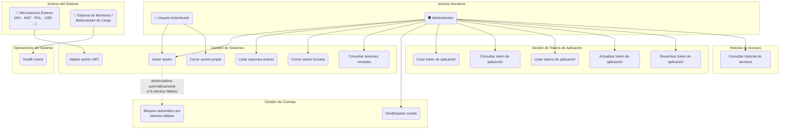

### Descripción Narrativa de Casos de Uso

**UC1 — Iniciar sesión**
Actor principal: Usuario autenticado o Administrador. El actor envía sus credenciales (username y contraseña cifrada con AES-256). El sistema valida la cuenta contra ms-usuarios, verifica la contraseña mediante bcrypt, obtiene el rol y permisos desde ms-roles, genera un JWT y persiste la sesión activa. Resultado: el actor recibe un token JWT para operar en el sistema.

**UC2 — Cerrar sesión propia**
Actor principal: Usuario autenticado. El actor solicita el cierre de su sesión activa enviando su token JWT. El sistema marca la sesión como `cerrada` en base de datos y registra el evento en el historial. Resultado: el token JWT queda invalidado y no puede ser utilizado para nuevas operaciones.

**UC3 — Validar sesión JWT**
Actor principal: Microservicio externo. El microservicio envía un token JWT de usuario más su propio token de aplicación. El sistema verifica que el token de aplicación sea válido y activo, y que el JWT corresponda a una sesión `activa`. Resultado: el microservicio recibe confirmación de validez o rechazo para continuar su operación de negocio.

**UC4 — Listar sesiones activas**
Actor principal: Administrador. El administrador solicita el listado de todas las sesiones activas del sistema, con filtro opcional por usuario. Resultado: el administrador recibe la lista de sesiones activas con sus metadatos (sin exponer el valor del token JWT).

**UC5 — Cerrar sesión forzada**
Actor principal: Administrador. El administrador identifica una sesión activa específica y solicita su cierre forzoso. El sistema invalida la sesión y registra el evento. Resultado: el usuario afectado pierde acceso inmediato al sistema.

**UC6 — Consultar sesiones cerradas**
Actor principal: Administrador. El administrador consulta el historial de sesiones cerradas de un usuario específico con filtro opcional por rango de fechas. Resultado: el administrador accede al historial para análisis forense o soporte técnico.

**UC7 — Bloqueo automático por intentos fallidos**
Actor principal: ms-autenticacion (proceso interno). Se desencadena automáticamente durante el inicio de sesión cuando el contador de intentos fallidos de un usuario alcanza 5. El sistema instruye a ms-usuarios a bloquear la cuenta y registra el evento. Resultado: la cuenta queda bloqueada hasta desbloqueo manual.

**UC8 — Desbloquear cuenta**
Actor principal: Administrador. El administrador identifica un usuario con cuenta bloqueada y solicita su desbloqueo. El sistema instruye a ms-usuarios a restaurar el estado `activo` y reiniciar el contador de intentos. Resultado: el usuario puede volver a iniciar sesión.

**UC9 — Crear token de aplicación**
Actor principal: Administrador. El administrador registra un nuevo microservicio proporcionando su nombre y descripción. El sistema genera un token de alta entropía, lo cifra con AES-256 y lo persiste. Resultado: el administrador recibe el token en texto plano —única oportunidad de visualizarlo— para su distribución al microservicio.

**UC10 — Consultar token de aplicación**
Actor principal: Administrador. El administrador solicita los metadatos de un token específico por su identificador o nombre de servicio. Resultado: el administrador recibe los metadatos del token sin que se exponga el valor cifrado.

**UC11 — Listar tokens de aplicación**
Actor principal: Administrador. El administrador solicita el listado completo de tokens de aplicación con filtro opcional por estado. Resultado: el administrador obtiene una vista de conjunto del estado de todos los tokens del sistema.

**UC12 — Actualizar token de aplicación**
Actor principal: Administrador. El administrador solicita la regeneración del valor de un token activo. El sistema genera un nuevo valor, lo cifra y reemplaza al anterior. Resultado: el administrador recibe el nuevo token en texto plano para reconfigurar el microservicio correspondiente.

**UC13 — Desactivar token de aplicación**
Actor principal: Administrador. El administrador desactiva un token de aplicación activo cambiando su estado a `inactivo`. Resultado: el microservicio propietario pierde inmediatamente la capacidad de comunicarse con otros servicios.

**UC14 — Consultar historial de accesos**
Actor principal: Administrador. El administrador consulta el historial de eventos de seguridad (inicios de sesión, cierres, intentos fallidos, bloqueos) con filtros por usuario, tipo de evento y rango de fechas. Resultado: el administrador obtiene el registro histórico de eventos para auditoría o investigación de incidentes.

**UC15 — Health check**
Actor principal: Sistema de monitoreo / balanceador de carga. El sistema externo verifica periódicamente el estado operativo de ms-autenticacion. El servicio comprueba su conectividad con la base de datos. Resultado: el sistema externo recibe confirmación del estado operativo (`healthy` / `unhealthy`) sin generar registros de auditoría.

---

## 3. Catálogo de Endpoints

### Sesiones de Usuario

| Método | Endpoint | Descripción | Requisito |
|---|---|---|---|
| `POST` | `/api/v1/sesiones` | Iniciar sesión con credenciales cifradas y obtener token JWT | AUTH-RF-001 |
| `DELETE` | `/api/v1/sesiones/me` | Cerrar la sesión propia del usuario autenticado | AUTH-RF-002 |
| `POST` | `/api/v1/sesiones/validar` | Validar token JWT desde un microservicio externo | AUTH-RF-003 |
| `GET` | `/api/v1/sesiones` | Listar todas las sesiones activas (administrador) | AUTH-RF-004 |
| `DELETE` | `/api/v1/sesiones/{sesion_id}` | Cerrar forzosamente una sesión activa (administrador) | AUTH-RF-005 |
| `GET` | `/api/v1/sesiones/cerradas` | Consultar sesiones cerradas de un usuario específico | AUTH-RS-003 |

### Gestión de Cuentas

| Método | Endpoint | Descripción | Requisito |
|---|---|---|---|
| `PATCH` | `/api/v1/cuentas/{usuario_id}/desbloquear` | Desbloquear manualmente una cuenta bloqueada (administrador) | AUTH-RS-001 |

### Tokens de Aplicación

| Método | Endpoint | Descripción | Requisito |
|---|---|---|---|
| `POST` | `/api/v1/tokens-aplicacion` | Crear un nuevo token de aplicación para un microservicio | AUTH-RF-007 |
| `GET` | `/api/v1/tokens-aplicacion` | Listar todos los tokens de aplicación con filtros opcionales | AUTH-RS-002 |
| `GET` | `/api/v1/tokens-aplicacion/{token_id}` | Consultar metadatos de un token de aplicación por ID | AUTH-RF-008 |
| `PUT` | `/api/v1/tokens-aplicacion/{token_id}` | Actualizar (regenerar) el valor de un token de aplicación | AUTH-RF-009 |
| `PATCH` | `/api/v1/tokens-aplicacion/{token_id}/desactivar` | Desactivar un token de aplicación activo | AUTH-RF-010 |

### Historial de Accesos

| Método | Endpoint | Descripción | Requisito |
|---|---|---|---|
| `GET` | `/api/v1/historial-accesos` | Consultar historial de eventos de seguridad con filtros | AUTH-RF-011 |

### Sistema

| Método | Endpoint | Descripción | Requisito |
|---|---|---|---|
| `GET` | `/api/v1/health` | Health check del servicio | AUTH-RS-004 |

---

## 4. Especificación de Endpoints

---

### 4.1 `POST /api/v1/sesiones` — Inicio de Sesión

| Campo | Detalle |
|---|---|
| **Método** | `POST` |
| **Endpoint** | `/api/v1/sesiones` |
| **Descripción** | Autentica a un usuario con sus credenciales cifradas. Si la validación es exitosa, genera un token JWT con la identidad, rol y permisos del usuario, y crea un registro de sesión activa. |
| **Requisito** | AUTH-RF-001 |
| **Autenticación** | No requiere sesión activa previa. La autenticación se realiza con las credenciales del cuerpo. |
| **Path params** | No aplica |
| **Query params** | No aplica |
| **Códigos HTTP** | `200 OK` — Inicio de sesión exitoso, retorna token JWT |
| | `400 Bad Request` — Formato de credenciales inválido (fallo de descifrado AES-256) |
| | `401 Unauthorized` — Credenciales incorrectas |
| | `403 Forbidden` — Cuenta bloqueada |
| | `503 Service Unavailable` — ms-usuarios o ms-roles no disponibles |

**Request body:**
```json
{
  "username": "admin@universidad.edu.co",
  "password": "U2FsdGVkX1+xPq7mNb3ZkLhT8vYoAeRd1cWfIgHj4K0="
}
```

> ⚠️ El campo `password` debe enviarse cifrado con AES-256 + Base64. Nunca en texto plano.

**Response exitoso — HTTP 200:**
```json
{
  "request_id": "AUTH-1740000100-a3f8b2",
  "success": true,
  "data": {
    "token": "eyJhbGciOiJIUzI1NiIsInR5cCI6IkpXVCJ9.admin_activa_001",
    "usuario_id": 1,
    "rol": "ADMINISTRADOR",
    "permisos": ["sesiones:admin", "tokens:admin", "historial:read"]
  },
  "message": "Inicio de sesión exitoso",
  "timestamp": "2026-02-20T10:00:01Z"
}
```

**Response error — HTTP 401 (credenciales inválidas):**
```json
{
  "request_id": "AUTH-1740000400-d6i1e5",
  "success": false,
  "data": null,
  "message": "Credenciales inválidas",
  "timestamp": "2026-02-20T10:00:02Z"
}
```

**Response error — HTTP 403 (cuenta bloqueada):**
```json
{
  "request_id": "AUTH-1740000600-f8k3g7",
  "success": false,
  "data": null,
  "message": "Cuenta bloqueada. Contacte al administrador.",
  "timestamp": "2026-02-20T10:00:03Z"
}
```

---

### 4.2 `DELETE /api/v1/sesiones/me` — Cierre de Sesión Propia

| Campo | Detalle |
|---|---|
| **Método** | `DELETE` |
| **Endpoint** | `/api/v1/sesiones/me` |
| **Descripción** | Cierra la sesión activa del usuario autenticado. Marca el registro de sesión como `cerrada` e invalida el token JWT para operaciones posteriores. |
| **Requisito** | AUTH-RF-002 |
| **Autenticación** | `Authorization: Bearer <token_JWT>` |
| **Path params** | No aplica |
| **Query params** | No aplica |
| **Códigos HTTP** | `200 OK` — Sesión cerrada correctamente |
| | `401 Unauthorized` — Token no proporcionado o sesión inválida |
| | `404 Not Found` — Sesión no encontrada para el token proporcionado |
| | `500 Internal Server Error` — Error al actualizar estado de sesión |

**Response exitoso — HTTP 200:**
```json
{
  "request_id": "AUTH-1740000700-g9l4h8",
  "success": true,
  "data": null,
  "message": "Sesión cerrada correctamente",
  "timestamp": "2026-02-20T11:00:00Z"
}
```

**Response error — HTTP 401 (sesión inválida):**
```json
{
  "request_id": "AUTH-1740000701-h1i2j3",
  "success": false,
  "data": null,
  "message": "Sesión inválida o expirada",
  "timestamp": "2026-02-20T11:00:01Z"
}
```

---

### 4.3 `POST /api/v1/sesiones/validar` — Validación de Sesión (Microservicios)

| Campo | Detalle |
|---|---|
| **Método** | `POST` |
| **Endpoint** | `/api/v1/sesiones/validar` |
| **Descripción** | Valida si un token JWT corresponde a una sesión activa en base de datos. Es el endpoint de mayor volumen de llamadas del sistema; todos los microservicios lo consumen antes de ejecutar cualquier operación de negocio. |
| **Requisito** | AUTH-RF-003 |
| **Autenticación** | `X-App-Token: <token_de_aplicacion_cifrado>` (token del microservicio invocante) |
| **Path params** | No aplica |
| **Query params** | No aplica |
| **Códigos HTTP** | `200 OK` — Token válido; sesión activa |
| | `401 Unauthorized` — Sesión inválida, inexistente o cerrada |
| | `403 Forbidden` — Token de aplicación inválido o inactivo |
| | `500 Internal Server Error` — Error al consultar la base de datos |

**Request body:**
```json
{
  "token": "eyJhbGciOiJIUzI1NiIsInR5cCI6IkpXVCJ9.docente_activa_002"
}
```

**Response exitoso — HTTP 200:**
```json
{
  "request_id": "INV-1740000200-b4g9c3",
  "success": true,
  "data": {
    "valido": true,
    "usuario_id": 2,
    "estado": "activa"
  },
  "message": "Sesión válida",
  "timestamp": "2026-02-20T10:15:00Z"
}
```

**Response error — HTTP 401 (sesión cerrada o inexistente):**
```json
{
  "request_id": "MAT-1740000900-k1l2m3",
  "success": false,
  "data": {
    "valido": false
  },
  "message": "Sesión inválida o inexistente",
  "timestamp": "2026-02-20T10:15:01Z"
}
```

**Response error — HTTP 403 (token de aplicación inválido):**
```json
{
  "request_id": "AUTH-1740001000-x9y8z7",
  "success": false,
  "data": null,
  "message": "Token de aplicación no autorizado",
  "timestamp": "2026-02-20T10:15:02Z"
}
```

---

### 4.4 `GET /api/v1/sesiones` — Listado de Sesiones Activas (Administrador)

| Campo | Detalle |
|---|---|
| **Método** | `GET` |
| **Endpoint** | `/api/v1/sesiones` |
| **Descripción** | Retorna el listado de todas las sesiones activas del sistema. Permite filtrar por usuario específico. Los valores de token JWT nunca se incluyen en la respuesta. |
| **Requisito** | AUTH-RF-004 |
| **Autenticación** | `Authorization: Bearer <token_JWT>` (requiere rol Administrador) |
| **Path params** | No aplica |
| **Query params** | `usuario_id` *(opcional)* — Filtrar por ID de usuario |
| | `page` *(opcional, default: 1)* — Número de página |
| | `page_size` *(opcional, default: 20)* — Registros por página |
| **Códigos HTTP** | `200 OK` — Lista retornada (puede ser vacía) |
| | `401 Unauthorized` — Sesión inválida o no proporcionada |
| | `403 Forbidden` — Permisos insuficientes |
| | `500 Internal Server Error` — Error de base de datos |

**Response exitoso — HTTP 200:**
```json
{
  "request_id": "AUTH-1740001100-m4n5o6",
  "success": true,
  "data": {
    "total": 4,
    "page": 1,
    "page_size": 20,
    "sesiones": [
      {
        "id": 1,
        "usuario_id": 1,
        "ip_address": "192.168.1.10",
        "user_agent": "Mozilla/5.0 (Windows NT 10.0; Win64; x64) Chrome/121.0",
        "estado": "activa",
        "ultima_actividad": "2026-02-20T09:55:00Z",
        "created_at": "2026-02-20T08:00:00Z"
      },
      {
        "id": 2,
        "usuario_id": 2,
        "ip_address": "10.0.0.25",
        "user_agent": "Mozilla/5.0 (Macintosh; Intel Mac OS X 14) Safari/17.0",
        "estado": "activa",
        "ultima_actividad": "2026-02-20T09:45:00Z",
        "created_at": "2026-02-20T07:00:00Z"
      }
    ]
  },
  "message": "Sesiones activas obtenidas correctamente",
  "timestamp": "2026-02-20T10:00:00Z"
}
```

**Response error — HTTP 403:**
```json
{
  "request_id": "AUTH-1740001200-p7q8r9",
  "success": false,
  "data": null,
  "message": "Permisos insuficientes",
  "timestamp": "2026-02-20T10:00:01Z"
}
```

---

### 4.5 `DELETE /api/v1/sesiones/{sesion_id}` — Cierre Forzado de Sesión (Administrador)

| Campo | Detalle |
|---|---|
| **Método** | `DELETE` |
| **Endpoint** | `/api/v1/sesiones/{sesion_id}` |
| **Descripción** | Permite a un administrador cerrar forzosamente una sesión activa específica. El token JWT del usuario afectado queda invalidado de inmediato. |
| **Requisito** | AUTH-RF-005 |
| **Autenticación** | `Authorization: Bearer <token_JWT>` (requiere rol Administrador) |
| **Path params** | `sesion_id` *(requerido)* — Identificador numérico de la sesión a cerrar |
| **Query params** | No aplica |
| **Códigos HTTP** | `200 OK` — Sesión cerrada forzosamente |
| | `401 Unauthorized` — Sesión del administrador inválida |
| | `403 Forbidden` — Permisos insuficientes |
| | `404 Not Found` — Sesión no encontrada |
| | `409 Conflict` — La sesión ya se encuentra cerrada |
| | `500 Internal Server Error` — Error de base de datos |

**Response exitoso — HTTP 200:**
```json
{
  "request_id": "AUTH-1740000800-h0m5i9",
  "success": true,
  "data": {
    "sesion_id": 7,
    "usuario_id": 5
  },
  "message": "Sesión cerrada forzosamente",
  "timestamp": "2026-02-20T10:05:00Z"
}
```

**Response error — HTTP 409 (sesión ya cerrada):**
```json
{
  "request_id": "AUTH-1740001300-s1t2u3",
  "success": false,
  "data": null,
  "message": "La sesión ya se encuentra cerrada",
  "timestamp": "2026-02-20T10:05:01Z"
}
```

---

### 4.6 `GET /api/v1/sesiones/cerradas` — Consulta de Sesiones Cerradas

| Campo | Detalle |
|---|---|
| **Método** | `GET` |
| **Endpoint** | `/api/v1/sesiones/cerradas` |
| **Descripción** | Retorna el historial de sesiones cerradas de un usuario específico. Permite filtrar por rango de fechas para análisis de seguridad o soporte técnico. Los valores de token JWT nunca se incluyen. |
| **Requisito** | AUTH-RS-003 |
| **Autenticación** | `Authorization: Bearer <token_JWT>` (requiere rol Administrador) |
| **Path params** | No aplica |
| **Query params** | `usuario_id` *(requerido)* — ID del usuario a consultar |
| | `fecha_inicio` *(opcional)* — Fecha de inicio del rango (ISO 8601: `YYYY-MM-DD`) |
| | `fecha_fin` *(opcional)* — Fecha de fin del rango (ISO 8601: `YYYY-MM-DD`) |
| | `page` *(opcional, default: 1)* |
| | `page_size` *(opcional, default: 20)* |
| **Códigos HTTP** | `200 OK` — Lista retornada (puede ser vacía) |
| | `400 Bad Request` — Parámetro `usuario_id` no proporcionado |
| | `401 Unauthorized` — Sesión inválida |
| | `403 Forbidden` — Permisos insuficientes |
| | `500 Internal Server Error` — Error de base de datos |

**Response exitoso — HTTP 200:**
```json
{
  "request_id": "AUTH-1740001400-v4w5x6",
  "success": true,
  "data": {
    "usuario_id": 1,
    "total": 1,
    "page": 1,
    "page_size": 20,
    "sesiones": [
      {
        "id": 5,
        "ip_address": "192.168.1.10",
        "user_agent": "Mozilla/5.0 (Windows NT 10.0; Win64; x64) Chrome/121.0",
        "estado": "cerrada",
        "ultima_actividad": "2026-02-19T10:00:00Z",
        "created_at": "2026-02-18T10:00:00Z",
        "updated_at": "2026-02-19T10:00:00Z"
      }
    ]
  },
  "message": "Sesiones cerradas obtenidas correctamente",
  "timestamp": "2026-02-20T10:10:00Z"
}
```

---

### 4.7 `PATCH /api/v1/cuentas/{usuario_id}/desbloquear` — Desbloqueo de Cuenta

| Campo | Detalle |
|---|---|
| **Método** | `PATCH` |
| **Endpoint** | `/api/v1/cuentas/{usuario_id}/desbloquear` |
| **Descripción** | Permite a un administrador desbloquear manualmente la cuenta de un usuario que fue bloqueada por acumulación de intentos fallidos. Restaura el estado `activo` y reinicia el contador de intentos a 0. |
| **Requisito** | AUTH-RS-001 |
| **Autenticación** | `Authorization: Bearer <token_JWT>` (requiere rol Administrador) |
| **Path params** | `usuario_id` *(requerido)* — Identificador del usuario a desbloquear |
| **Query params** | No aplica |
| **Códigos HTTP** | `200 OK` — Cuenta desbloqueada correctamente |
| | `401 Unauthorized` — Sesión del administrador inválida |
| | `403 Forbidden` — Permisos insuficientes |
| | `404 Not Found` — Usuario no encontrado |
| | `409 Conflict` — La cuenta no se encuentra bloqueada |
| | `503 Service Unavailable` — ms-usuarios no disponible |

**Response exitoso — HTTP 200:**
```json
{
  "request_id": "AUTH-1740001500-y7z8a9",
  "success": true,
  "data": {
    "usuario_id": 7,
    "estado_nuevo": "activo",
    "intentos_fallidos": 0
  },
  "message": "Cuenta desbloqueada correctamente",
  "timestamp": "2026-02-20T10:20:00Z"
}
```

**Response error — HTTP 409 (cuenta no bloqueada):**
```json
{
  "request_id": "AUTH-1740001600-b0c1d2",
  "success": false,
  "data": null,
  "message": "La cuenta no se encuentra bloqueada",
  "timestamp": "2026-02-20T10:20:01Z"
}
```

---

### 4.8 `POST /api/v1/tokens-aplicacion` — Creación de Token de Aplicación

| Campo | Detalle |
|---|---|
| **Método** | `POST` |
| **Endpoint** | `/api/v1/tokens-aplicacion` |
| **Descripción** | Registra un nuevo token de aplicación para un microservicio. El token se genera con alta entropía, se cifra con AES-256 y se retorna en texto plano **únicamente en esta respuesta**, ya que es la única oportunidad de entregarlo al administrador. |
| **Requisito** | AUTH-RF-007 |
| **Autenticación** | `Authorization: Bearer <token_JWT>` (requiere rol Administrador) |
| **Path params** | No aplica |
| **Query params** | No aplica |
| **Códigos HTTP** | `201 Created` — Token creado exitosamente |
| | `401 Unauthorized` — Sesión inválida |
| | `403 Forbidden` — Permisos insuficientes |
| | `409 Conflict` — Ya existe un token activo para el mismo servicio |
| | `500 Internal Server Error` — Error de persistencia |

**Request body:**
```json
{
  "nombre_servicio": "ms-facturacion",
  "codigo_servicio": "FAC",
  "descripcion": "Gestión de facturación y pagos universitarios"
}
```

**Response exitoso — HTTP 201:**
```json
{
  "request_id": "AUTH-1740001700-e3f4g5",
  "success": true,
  "data": {
    "id": 9,
    "nombre_servicio": "ms-facturacion",
    "codigo_servicio": "FAC",
    "descripcion": "Gestión de facturación y pagos universitarios",
    "token": "a7b2c9d4e1f8g3h6i0j5k2l9m4n7o1p8",
    "estado": "activo",
    "created_at": "2026-02-20T10:25:00Z"
  },
  "message": "Token de aplicación creado exitosamente. Guarde el valor del token, no volverá a mostrarse.",
  "timestamp": "2026-02-20T10:25:00Z"
}
```

> ⚠️ El campo `token` solo aparece en la respuesta de creación. Ningún otro endpoint lo expone.

**Response error — HTTP 409 (servicio duplicado):**
```json
{
  "request_id": "AUTH-1740001800-h6i7j8",
  "success": false,
  "data": null,
  "message": "Ya existe un token activo para este servicio",
  "timestamp": "2026-02-20T10:25:01Z"
}
```

---

### 4.9 `GET /api/v1/tokens-aplicacion` — Listado de Tokens de Aplicación

| Campo | Detalle |
|---|---|
| **Método** | `GET` |
| **Endpoint** | `/api/v1/tokens-aplicacion` |
| **Descripción** | Retorna el listado completo de tokens de aplicación con sus metadatos y estado. El valor cifrado del token nunca se expone. |
| **Requisito** | AUTH-RS-002 |
| **Autenticación** | `Authorization: Bearer <token_JWT>` (requiere rol Administrador) |
| **Path params** | No aplica |
| **Query params** | `estado` *(opcional)* — Filtrar por estado: `activo` \| `inactivo` |
| | `page` *(opcional, default: 1)* |
| | `page_size` *(opcional, default: 20)* |
| **Códigos HTTP** | `200 OK` — Lista retornada (puede ser vacía) |
| | `401 Unauthorized` — Sesión inválida |
| | `403 Forbidden` — Permisos insuficientes |
| | `500 Internal Server Error` — Error de base de datos |

**Response exitoso — HTTP 200:**
```json
{
  "request_id": "AUTH-1740001900-k9l0m1",
  "success": true,
  "data": {
    "total": 8,
    "page": 1,
    "page_size": 20,
    "tokens": [
      {
        "id": 1,
        "nombre_servicio": "ms-usuarios",
        "codigo_servicio": "USR",
        "descripcion": "Gestión de usuarios del sistema ERP universitario",
        "estado": "activo",
        "actualizado_por": 1,
        "created_at": "2025-11-22T10:00:00Z",
        "updated_at": "2025-11-22T10:00:00Z"
      },
      {
        "id": 8,
        "nombre_servicio": "ms-notificaciones",
        "codigo_servicio": "NOT",
        "descripcion": "Gestión y envío de notificaciones a usuarios",
        "estado": "inactivo",
        "actualizado_por": 1,
        "created_at": "2026-01-21T10:00:00Z",
        "updated_at": "2026-02-15T10:00:00Z"
      }
    ]
  },
  "message": "Tokens de aplicación obtenidos correctamente",
  "timestamp": "2026-02-20T10:30:00Z"
}
```

---

### 4.10 `GET /api/v1/tokens-aplicacion/{token_id}` — Consulta de Token de Aplicación

| Campo | Detalle |
|---|---|
| **Método** | `GET` |
| **Endpoint** | `/api/v1/tokens-aplicacion/{token_id}` |
| **Descripción** | Retorna los metadatos de un token de aplicación específico. El valor del token nunca se incluye en la respuesta. |
| **Requisito** | AUTH-RF-008 |
| **Autenticación** | `Authorization: Bearer <token_JWT>` (requiere rol Administrador) |
| **Path params** | `token_id` *(requerido)* — Identificador numérico del token |
| **Query params** | No aplica |
| **Códigos HTTP** | `200 OK` — Metadatos retornados correctamente |
| | `401 Unauthorized` — Sesión inválida |
| | `403 Forbidden` — Permisos insuficientes |
| | `404 Not Found` — Token no encontrado |
| | `500 Internal Server Error` — Error de base de datos |

**Response exitoso — HTTP 200:**
```json
{
  "request_id": "AUTH-1740002000-n2o3p4",
  "success": true,
  "data": {
    "id": 3,
    "nombre_servicio": "ms-inventario",
    "codigo_servicio": "INV",
    "descripcion": "Gestión de inventario y activos universitarios",
    "estado": "activo",
    "actualizado_por": 1,
    "created_at": "2025-11-27T10:00:00Z",
    "updated_at": "2025-11-27T10:00:00Z"
  },
  "message": "Token de aplicación obtenido correctamente",
  "timestamp": "2026-02-20T10:35:00Z"
}
```

**Response error — HTTP 404:**
```json
{
  "request_id": "AUTH-1740002100-q5r6s7",
  "success": false,
  "data": null,
  "message": "Token de aplicación no encontrado",
  "timestamp": "2026-02-20T10:35:01Z"
}
```

---

### 4.11 `PUT /api/v1/tokens-aplicacion/{token_id}` — Actualización de Token de Aplicación

| Campo | Detalle |
|---|---|
| **Método** | `PUT` |
| **Endpoint** | `/api/v1/tokens-aplicacion/{token_id}` |
| **Descripción** | Regenera el valor de un token de aplicación activo. El nuevo valor se cifra con AES-256 y se retorna en texto plano **únicamente en esta respuesta**. El microservicio propietario debe ser reconfigurado con el nuevo valor. |
| **Requisito** | AUTH-RF-009 |
| **Autenticación** | `Authorization: Bearer <token_JWT>` (requiere rol Administrador) |
| **Path params** | `token_id` *(requerido)* — Identificador numérico del token |
| **Query params** | No aplica |
| **Códigos HTTP** | `200 OK` — Token actualizado, nuevo valor retornado en texto plano |
| | `401 Unauthorized` — Sesión inválida |
| | `403 Forbidden` — Permisos insuficientes |
| | `404 Not Found` — Token no encontrado |
| | `409 Conflict` — No se puede actualizar un token desactivado |
| | `500 Internal Server Error` — Error de base de datos |

**Request body:**
```json
{
  "descripcion": "Gestión de inventario y activos universitarios — actualizado febrero 2026"
}
```

> `descripcion` es opcional. Si no se envía, solo se regenera el valor del token. \[Por definir si `nombre_servicio` también puede modificarse\]

**Response exitoso — HTTP 200:**
```json
{
  "request_id": "AUTH-1740002200-t8u9v0",
  "success": true,
  "data": {
    "id": 3,
    "nombre_servicio": "ms-inventario",
    "codigo_servicio": "INV",
    "descripcion": "Gestión de inventario y activos universitarios — actualizado febrero 2026",
    "token": "z9y8x7w6v5u4t3s2r1q0p9o8n7m6l5k4",
    "estado": "activo",
    "actualizado_por": 1,
    "updated_at": "2026-02-20T10:40:00Z"
  },
  "message": "Token de aplicación actualizado correctamente. Guarde el nuevo valor del token.",
  "timestamp": "2026-02-20T10:40:00Z"
}
```

---

### 4.12 `PATCH /api/v1/tokens-aplicacion/{token_id}/desactivar` — Desactivación de Token de Aplicación

| Campo | Detalle |
|---|---|
| **Método** | `PATCH` |
| **Endpoint** | `/api/v1/tokens-aplicacion/{token_id}/desactivar` |
| **Descripción** | Desactiva un token de aplicación activo cambiando su estado a `inactivo`. El microservicio propietario pierde inmediatamente la capacidad de comunicarse con otros servicios del sistema. |
| **Requisito** | AUTH-RF-010 |
| **Autenticación** | `Authorization: Bearer <token_JWT>` (requiere rol Administrador) |
| **Path params** | `token_id` *(requerido)* — Identificador numérico del token |
| **Query params** | No aplica |
| **Códigos HTTP** | `200 OK` — Token desactivado correctamente |
| | `401 Unauthorized` — Sesión inválida |
| | `403 Forbidden` — Permisos insuficientes |
| | `404 Not Found` — Token no encontrado |
| | `409 Conflict` — El token ya se encuentra inactivo |
| | `500 Internal Server Error` — Error de base de datos |

**Response exitoso — HTTP 200:**
```json
{
  "request_id": "AUTH-1740002300-w1x2y3",
  "success": true,
  "data": {
    "id": 8,
    "nombre_servicio": "ms-notificaciones",
    "estado": "inactivo",
    "actualizado_por": 1,
    "updated_at": "2026-02-20T10:45:00Z"
  },
  "message": "Token desactivado correctamente",
  "timestamp": "2026-02-20T10:45:00Z"
}
```

**Response error — HTTP 409 (ya inactivo):**
```json
{
  "request_id": "AUTH-1740002400-z4a5b6",
  "success": false,
  "data": null,
  "message": "El token ya se encuentra inactivo",
  "timestamp": "2026-02-20T10:45:01Z"
}
```

---

### 4.13 `GET /api/v1/historial-accesos` — Consulta de Historial de Accesos

| Campo | Detalle |
|---|---|
| **Método** | `GET` |
| **Endpoint** | `/api/v1/historial-accesos` |
| **Descripción** | Retorna el historial de eventos de seguridad del sistema. Permite filtrar por usuario, tipo de evento y rango de fechas. Los registros son de solo lectura; no existe operación de eliminación. |
| **Requisito** | AUTH-RF-011 |
| **Autenticación** | `Authorization: Bearer <token_JWT>` (requiere rol Administrador) |
| **Path params** | No aplica |
| **Query params** | `usuario_id` *(opcional)* — Filtrar por ID de usuario |
| | `tipo_evento` *(opcional)* — `inicio_sesion` \| `cierre_sesion` \| `intento_fallido` \| `bloqueo_cuenta` |
| | `fecha_inicio` *(opcional)* — ISO 8601: `YYYY-MM-DD` |
| | `fecha_fin` *(opcional)* — ISO 8601: `YYYY-MM-DD` |
| | `page` *(opcional, default: 1)* |
| | `page_size` *(opcional, default: 20)* |
| **Códigos HTTP** | `200 OK` — Historial retornado (puede ser vacío) |
| | `400 Bad Request` — Rango de fechas inválido |
| | `401 Unauthorized` — Sesión inválida |
| | `403 Forbidden` — Permisos insuficientes |
| | `500 Internal Server Error` — Error de base de datos |

**Response exitoso — HTTP 200:**
```json
{
  "request_id": "AUTH-1740002500-c7d8e9",
  "success": true,
  "data": {
    "total": 8,
    "page": 1,
    "page_size": 20,
    "eventos": [
      {
        "id": 1,
        "usuario_id": 1,
        "username_intentado": "admin@universidad.edu.co",
        "tipo_evento": "inicio_sesion",
        "ip_address": "192.168.1.10",
        "user_agent": "Mozilla/5.0 (Windows NT 10.0; Win64; x64) Chrome/121.0",
        "request_id": "AUTH-1740000100-a3f8b2",
        "fecha_evento": "2026-02-20T08:00:00Z"
      },
      {
        "id": 6,
        "usuario_id": 7,
        "username_intentado": "usuario.prueba@universidad.edu.co",
        "tipo_evento": "bloqueo_cuenta",
        "ip_address": "10.20.30.40",
        "user_agent": "Mozilla/5.0 (Windows NT 10.0) Firefox/122.0",
        "request_id": "AUTH-1740000600-f8k3g7",
        "fecha_evento": "2026-02-20T05:00:00Z"
      }
    ]
  },
  "message": "Historial de accesos obtenido correctamente",
  "timestamp": "2026-02-20T10:50:00Z"
}
```

**Response error — HTTP 400 (rango de fechas inválido):**
```json
{
  "request_id": "AUTH-1740002600-f0g1h2",
  "success": false,
  "data": null,
  "message": "Rango de fechas inválido: fecha_fin no puede ser anterior a fecha_inicio",
  "timestamp": "2026-02-20T10:50:01Z"
}
```

---

### 4.14 `GET /api/v1/health` — Health Check

| Campo | Detalle |
|---|---|
| **Método** | `GET` |
| **Endpoint** | `/api/v1/health` |
| **Descripción** | Endpoint ligero que verifica el estado operativo de ms-autenticacion y su conectividad con la base de datos PostgreSQL. No requiere autenticación y no genera registros de auditoría. |
| **Requisito** | AUTH-RS-004 |
| **Autenticación** | No requerida |
| **Path params** | No aplica |
| **Query params** | No aplica |
| **Códigos HTTP** | `200 OK` — Servicio operativo (`healthy`) |
| | `503 Service Unavailable` — Servicio degradado (`unhealthy`) |

**Response exitoso — HTTP 200:**
```json
{
  "estado": "healthy",
  "componentes": {
    "base_de_datos": "connected"
  },
  "timestamp": "2026-02-20T10:55:00Z"
}
```

> ℹ️ Este endpoint usa una estructura de respuesta simplificada (sin `request_id`, `success`, `data`), ya que está excluido de AUTH-RT-001, AUTH-RT-003 y AUTH-RT-004 por su naturaleza operativa.

**Response error — HTTP 503 (base de datos no disponible):**
```json
{
  "estado": "unhealthy",
  "componentes": {
    "base_de_datos": "disconnected"
  },
  "timestamp": "2026-02-20T10:55:01Z"
}
```

---

## 5. Diagramas de Secuencia Internos

---

### 5.1 `POST /api/v1/sesiones` — Inicio de Sesión (AUTH-RF-001)

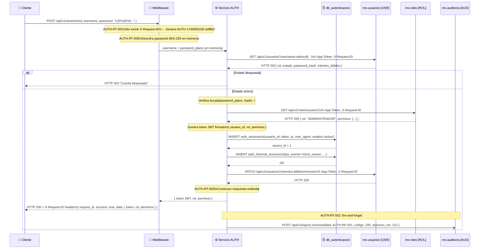

**Descripción narrativa:** El cliente envía sus credenciales cifradas. El middleware genera el Request ID y descifra la contraseña en memoria. El servicio consulta síncronamente a ms-usuarios para obtener los datos del usuario; si la cuenta está bloqueada, retorna HTTP 403 de inmediato. Si está activa, verifica la contraseña con bcrypt y consulta ms-roles para obtener el rol y permisos con los que construirá el JWT. Persiste la sesión y el evento de historial en base de datos, reinicia el contador de intentos en ms-usuarios, construye la respuesta estándar y la retorna al cliente. Finalmente despacha el log de auditoría de forma asíncrona.

---

### 5.2 `DELETE /api/v1/sesiones/me` — Cierre de Sesión Propia (AUTH-RF-002)

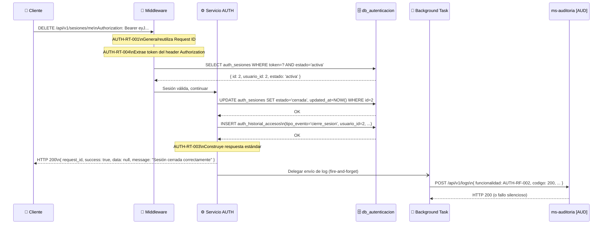

**Descripción narrativa:** El middleware extrae el JWT del header `Authorization`, verifica su existencia en `auth_sesiones` con estado `activa` (AUTH-RT-004). Si es válido, el servicio actualiza el estado de la sesión a `cerrada` en base de datos, registra el evento `cierre_sesion` en el historial, construye la respuesta estándar y la retorna al cliente. El log de auditoría se envía en background sin bloquear la respuesta.

---

### 5.3 `POST /api/v1/sesiones/validar` — Validación de Sesión (AUTH-RF-003)

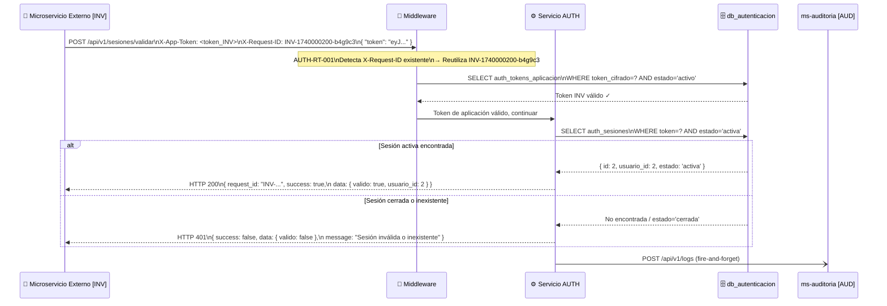

**Descripción narrativa:** El microservicio externo envía el JWT del usuario y su propio token de aplicación en el header `X-App-Token`. El middleware reutiliza el Request ID entrante (trazabilidad distribuida) y valida el token de aplicación contra `auth_tokens_aplicacion`. Si es válido, el servicio consulta `auth_sesiones` por el JWT recibido. Si existe con estado `activa`, retorna HTTP 200 con `valido: true`. Si no existe o está `cerrada`, retorna HTTP 401. La auditoría se envía de forma asíncrona en ambos casos.

---

### 5.4 `GET /api/v1/sesiones` — Listado de Sesiones Activas (AUTH-RF-004)

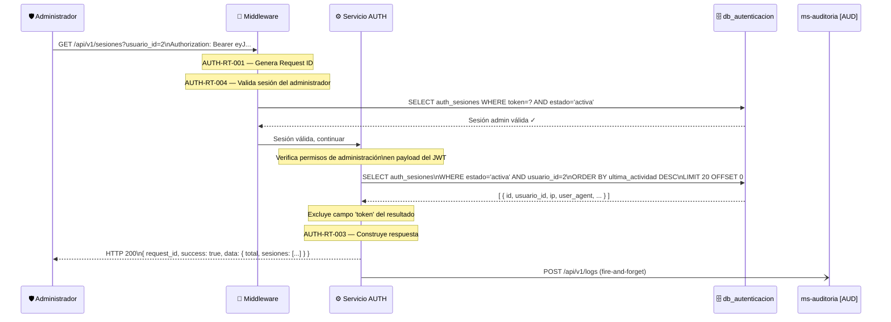

**Descripción narrativa:** El administrador solicita el listado con su JWT en el header `Authorization`. El middleware valida la sesión activa y el servicio verifica los permisos de administración desde el payload del JWT. Consulta `auth_sesiones` filtrando por estado `activa` y, si se proporcionó, por `usuario_id`. El campo `token` nunca se incluye en los resultados. La respuesta paginada se retorna según la estructura estándar y el log se envía en background.

---

### 5.5 `DELETE /api/v1/sesiones/{sesion_id}` — Cierre Forzado de Sesión (AUTH-RF-005)

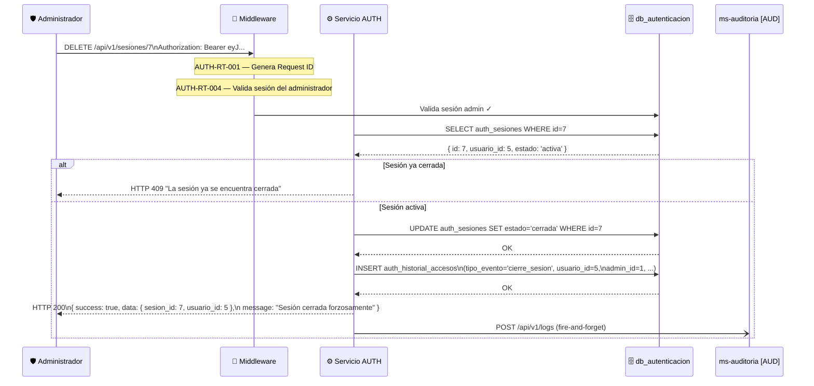

**Descripción narrativa:** El administrador identifica la sesión objetivo por su ID en la ruta. Tras validar la sesión del administrador, el servicio verifica que la sesión objetivo exista y esté `activa`; si ya está `cerrada`, retorna HTTP 409. De lo contrario, actualiza el estado a `cerrada` y registra el evento de cierre forzado en el historial incluyendo el identificador del administrador que ejecutó la acción.

---

### 5.6 `PATCH /api/v1/cuentas/{usuario_id}/desbloquear` — Desbloqueo de Cuenta (AUTH-RS-001)

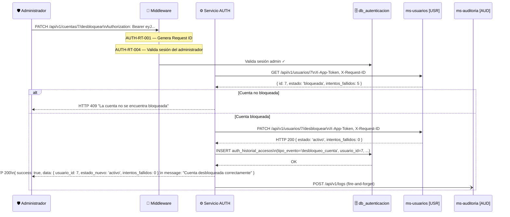

**Descripción narrativa:** El administrador solicita el desbloqueo del usuario especificado en la ruta. El servicio consulta el estado actual del usuario en ms-usuarios; si no está bloqueado, retorna HTTP 409. Si está bloqueado, instruye a ms-usuarios a restablecer el estado `activo` y reiniciar el contador de intentos, registra el evento en el historial y retorna la confirmación al administrador.

---

### 5.7 `POST /api/v1/tokens-aplicacion` — Creación de Token (AUTH-RF-007)

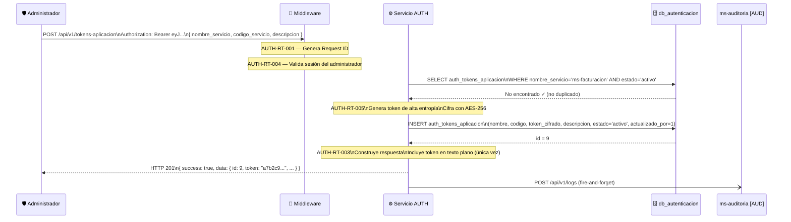

**Descripción narrativa:** El administrador envía el nombre, código y descripción del nuevo microservicio. El servicio verifica que no exista un token activo para el mismo nombre de servicio. Genera el token con alta entropía, lo cifra con AES-256 y lo persiste en `auth_tokens_aplicacion`. Retorna la respuesta con el token en texto plano, siendo esta la única oportunidad de visualizarlo; en ninguna consulta posterior el valor será accesible.

---

### 5.8 `PUT /api/v1/tokens-aplicacion/{token_id}` — Actualización de Token (AUTH-RF-009)

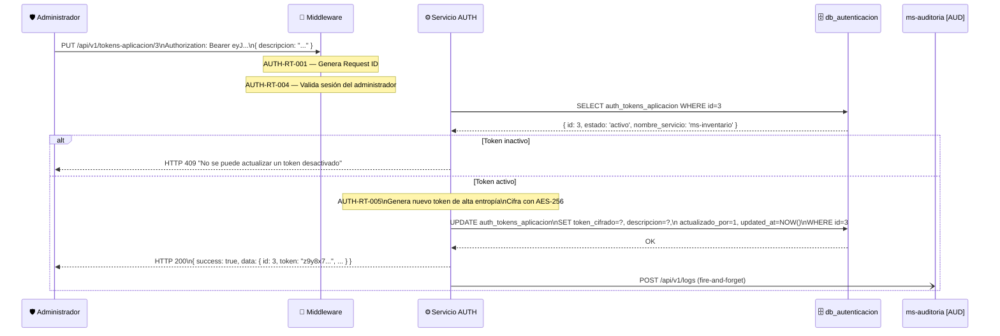

**Descripción narrativa:** El administrador solicita la regeneración del token para el ID especificado. El servicio verifica que el token exista y esté `activo`; si está `inactivo`, retorna HTTP 409. De lo contrario, genera un nuevo valor, lo cifra con AES-256 y actualiza el registro. El nuevo valor se retorna en texto plano en esta respuesta —y solo en esta— para que el administrador pueda reconfigurar el microservicio propietario.

---

### 5.9 `PATCH /api/v1/tokens-aplicacion/{token_id}/desactivar` — Desactivación de Token (AUTH-RF-010)

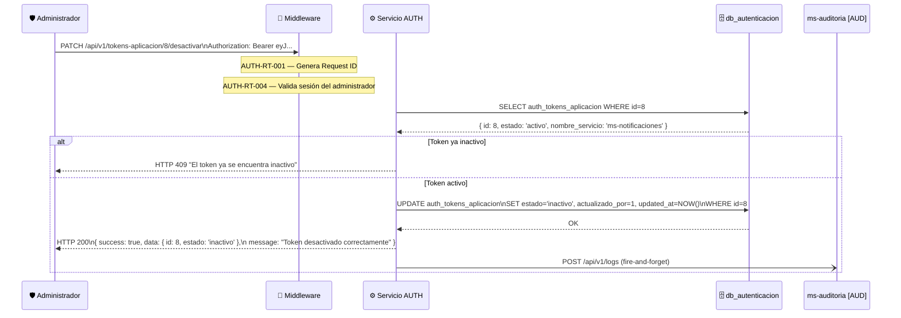

**Descripción narrativa:** El administrador solicita la desactivación del token. El servicio verifica el estado actual; si ya está `inactivo`, retorna HTTP 409. Si está `activo`, actualiza el estado a `inactivo` registrando el ID del administrador como responsable. A partir de este momento, el microservicio propietario será rechazado en todas las llamadas que requieran `X-App-Token` válido. La operación debe ejecutarse con precaución, ya que tiene impacto operativo inmediato.

---

### 5.10 `GET /api/v1/historial-accesos` — Consulta de Historial de Accesos (AUTH-RF-011)

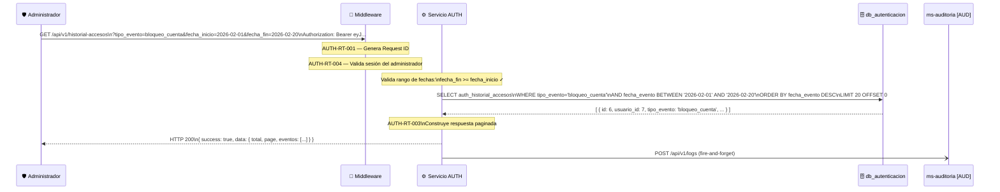

**Descripción narrativa:** El administrador consulta el historial con filtros opcionales. El servicio valida el rango de fechas (si se proporcionó) y ejecuta la consulta sobre `auth_historial_accesos` aplicando todos los filtros activos. Los registros son inmutables —no existe operación de eliminación— y se retornan paginados en orden cronológico descendente. La respuesta sigue la estructura estándar y el log de auditoría se despacha de forma asíncrona al finalizar.

---

### 5.11 `GET /api/v1/health` — Health Check (AUTH-RS-004)

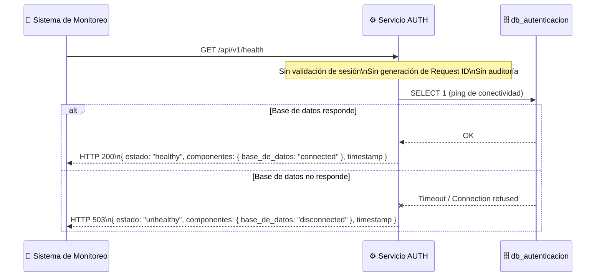

**Descripción narrativa:** Es el endpoint más simple del servicio. No requiere autenticación, no genera Request ID ni envía registros de auditoría, para evitar saturar ms-auditoria con llamadas periódicas de monitoreo. El servicio ejecuta una consulta mínima (`SELECT 1`) a PostgreSQL para verificar la conectividad con la base de datos. Retorna HTTP 200 con estado `healthy` si todo está operativo, o HTTP 503 con estado `unhealthy` e identificación del componente fallido si la base de datos no responde. Se recomienda restringir el acceso a este endpoint a la red interna del sistema \[Por definir\].

---

*Fin del documento — AUTH_Especificacion_API.md v1.0*
