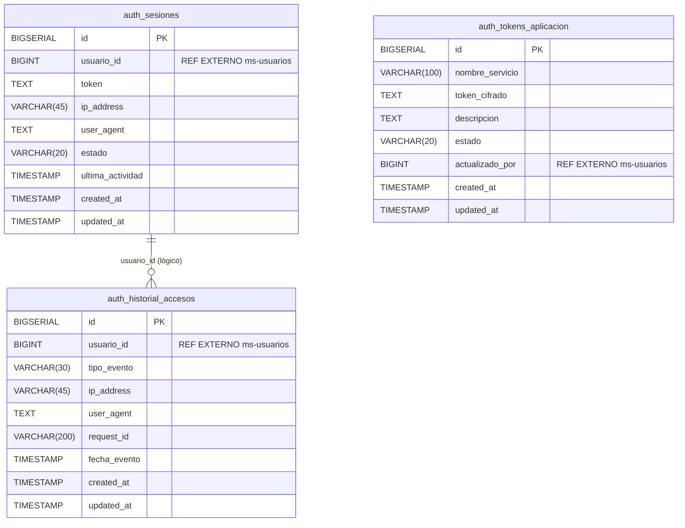

# Modelo de Datos — MS-AUTENTICACION [AUTH]

> **Generado a partir de:** MS-AUTENTICACION_Especificacion.md  
> **Fecha de generación:** Febrero 2026  
> **Versión del documento:** 1.0

---

## 1. Información General

| Campo | Detalle |
|---|---|
| **Nombre del microservicio** | ms-autenticacion |
| **Código** | AUTH |
| **Módulo** | Módulo 1 — Seguridad y Acceso |
| **Base de datos sugerida** | `db_autenticacion` |
| **Cantidad de tablas** | 3 |
| **Stack tecnológico** | FastAPI + Python + PostgreSQL |

**Resumen del dominio de datos:**  
El microservicio ms-autenticacion gestiona tres dominios de datos complementarios: las **sesiones activas** de los usuarios del sistema ERP universitario, los **tokens de aplicación** que identifican y autorizan la comunicación entre microservicios, y el **historial de accesos** que registra cada evento de seguridad ocurrido. Es el componente más crítico del sistema, ya que todos los demás microservicios dependen de él para validar sesiones antes de ejecutar cualquier operación.

---

## 2. Diagrama E-R



**Descripción narrativa del modelo:**

El modelo de datos de ms-autenticacion está compuesto por **3 entidades**, todas independientes entre sí en cuanto a claves foráneas internas (no existen FK directas entre las tablas del microservicio).

- **`auth_sesiones`** es la entidad principal del servicio. Registra cada sesión abierta por un usuario, almacenando el token JWT emitido, la IP de conexión, el cliente utilizado y el estado de la sesión (activa o cerrada). Su cardinalidad es de uno-a-muchos respecto al usuario: un usuario puede tener múltiples sesiones registradas en el tiempo.

- **`auth_tokens_aplicacion`** es una entidad de configuración/soporte que almacena los tokens cifrados con AES-256 asignados a cada microservicio del sistema, permitiendo la comunicación segura entre servicios.

- **`auth_historial_accesos`** es una entidad de auditoría inmutable que registra cada evento de seguridad (inicio de sesión, cierre, intento fallido, bloqueo). No se relaciona por FK interna con las demás tablas, ya que su propósito es mantener un registro histórico completo incluso si los registros de sesión son invalidados.

**Referencias externas (sin FK en base de datos):**
- `auth_sesiones.usuario_id` → entidad `usuario` en **ms-usuarios [USR]**
- `auth_historial_accesos.usuario_id` → entidad `usuario` en **ms-usuarios [USR]**
- `auth_tokens_aplicacion.actualizado_por` → entidad `usuario` en **ms-usuarios [USR]**

---

## 3. Diccionario de Datos

---

### Tabla: `auth_sesiones`

**Propósito:** Registra y mantiene el estado de las sesiones activas e históricas de los usuarios del sistema. Es consultada por el endpoint de validación de sesión que todos los demás microservicios consumen.

> **Referencias externas:**  
> - `usuario_id`: ID del usuario autenticado. Corresponde a la entidad `usuario` del microservicio **ms-usuarios [USR]**. No existe FK en base de datos.

| Columna | Tipo | Restricciones | Descripción |
|---|---|---|---|
| `id` | `BIGSERIAL` | PK, NOT NULL | Identificador único autoincremental de la sesión |
| `usuario_id` | `BIGINT` | NOT NULL | ID del usuario dueño de la sesión (referencia externa a ms-usuarios) |
| `token` | `TEXT` | NOT NULL, UNIQUE | Token JWT generado para la sesión |
| `ip_address` | `VARCHAR(45)` | NOT NULL | Dirección IP desde la cual se inició la sesión (soporta IPv4 e IPv6) |
| `user_agent` | `TEXT` | NULL | Información del navegador o cliente utilizado |
| `estado` | `VARCHAR(20)` | NOT NULL, DEFAULT 'activa', CHECK IN ('activa','cerrada') | Estado actual de la sesión |
| `ultima_actividad` | `TIMESTAMP` | NOT NULL, DEFAULT NOW() | Fecha y hora de la última actividad registrada en la sesión |
| `created_at` | `TIMESTAMP` | NOT NULL, DEFAULT NOW() | Fecha y hora de creación del registro (auditoría) |
| `updated_at` | `TIMESTAMP` | NOT NULL, DEFAULT NOW() | Fecha y hora de última modificación del registro (auditoría) |

---

### Tabla: `auth_tokens_aplicacion`

**Propósito:** Almacena los tokens de aplicación que identifican a cada microservicio del sistema para la comunicación entre servicios. Los valores de token se almacenan cifrados con AES-256.

> **Referencias externas:**  
> - `actualizado_por`: ID del usuario administrador que realizó la última actualización. Corresponde a la entidad `usuario` del microservicio **ms-usuarios [USR]**. No existe FK en base de datos.

| Columna | Tipo | Restricciones | Descripción |
|---|---|---|---|
| `id` | `BIGSERIAL` | PK, NOT NULL | Identificador único autoincremental del token |
| `nombre_servicio` | `VARCHAR(100)` | NOT NULL, UNIQUE | Nombre del microservicio al que pertenece el token (ej: ms-inventario) |
| `codigo_servicio` | `VARCHAR(10)` | NOT NULL, UNIQUE | Código corto del microservicio (ej: INV, PED, FAC) |
| `token_cifrado` | `TEXT` | NOT NULL | Valor del token almacenado cifrado con AES-256 |
| `descripcion` | `TEXT` | NULL | Descripción del propósito o función del microservicio |
| `estado` | `VARCHAR(20)` | NOT NULL, DEFAULT 'activo', CHECK IN ('activo','inactivo') | Estado del token de aplicación |
| `actualizado_por` | `BIGINT` | NULL | ID del usuario administrador que realizó la última actualización (referencia externa a ms-usuarios) |
| `created_at` | `TIMESTAMP` | NOT NULL, DEFAULT NOW() | Fecha y hora de creación del token (auditoría) |
| `updated_at` | `TIMESTAMP` | NOT NULL, DEFAULT NOW() | Fecha y hora de última modificación (auditoría) |

---

### Tabla: `auth_historial_accesos`

**Propósito:** Registra de forma inmutable todos los eventos de seguridad del sistema: inicios de sesión exitosos, cierres de sesión, intentos fallidos y bloqueos de cuenta. Permite auditoría y consulta histórica con filtros por usuario, tipo de evento y rango de fechas.

> **Referencias externas:**  
> - `usuario_id`: ID del usuario involucrado en el evento. Corresponde a la entidad `usuario` del microservicio **ms-usuarios [USR]**. No existe FK en base de datos. Puede ser NULL en casos donde el usuario no exista en el sistema.

| Columna | Tipo | Restricciones | Descripción |
|---|---|---|---|
| `id` | `BIGSERIAL` | PK, NOT NULL | Identificador único autoincremental del registro de acceso |
| `usuario_id` | `BIGINT` | NULL | ID del usuario involucrado en el evento (referencia externa a ms-usuarios; NULL si el usuario no existe) |
| `username_intentado` | `VARCHAR(150)` | NULL | Nombre de usuario o correo ingresado durante el evento (útil en intentos fallidos con usuario inexistente) |
| `tipo_evento` | `VARCHAR(30)` | NOT NULL, CHECK IN ('inicio_sesion','cierre_sesion','intento_fallido','bloqueo_cuenta') | Tipo del evento de acceso registrado |
| `ip_address` | `VARCHAR(45)` | NOT NULL | Dirección IP desde la cual ocurrió el evento |
| `user_agent` | `TEXT` | NULL | Información del navegador o cliente utilizado |
| `request_id` | `VARCHAR(200)` | NULL | Identificador de rastreo de la petición asociada al evento |
| `fecha_evento` | `TIMESTAMP` | NOT NULL, DEFAULT NOW() | Fecha y hora exacta en que ocurrió el evento |
| `created_at` | `TIMESTAMP` | NOT NULL, DEFAULT NOW() | Fecha y hora de creación del registro (auditoría) |
| `updated_at` | `TIMESTAMP` | NOT NULL, DEFAULT NOW() | Fecha y hora de última modificación del registro (auditoría) |

---

## 4. Relaciones y Claves Foráneas

### Relaciones Internas

> No existen claves foráneas internas entre las tablas de ms-autenticacion. Las tres entidades son independientes a nivel de base de datos. La correlación lógica entre `auth_sesiones` y `auth_historial_accesos` se realiza a nivel de aplicación mediante `usuario_id`.

| FK | Tabla origen | Columna | Tabla destino | Tipo | Nota |
|---|---|---|---|---|---|
| — | — | — | — | — | No aplica: no hay FK internas en este microservicio |

---

### Referencias Externas (sin FK real en base de datos)

| Referencia | Tabla origen | Columna | Microservicio destino | Entidad destino | Nota |
|---|---|---|---|---|---|
| REF-AUTH-01 | `auth_sesiones` | `usuario_id` | ms-usuarios [USR] | `usuario` | ID del usuario propietario de la sesión |
| REF-AUTH-02 | `auth_historial_accesos` | `usuario_id` | ms-usuarios [USR] | `usuario` | ID del usuario involucrado en el evento de acceso |
| REF-AUTH-03 | `auth_tokens_aplicacion` | `actualizado_por` | ms-usuarios [USR] | `usuario` | ID del administrador que actualizó el token |

---

## 5. Índices Sugeridos

| Índice | Tabla | Columnas | Tipo | Justificación |
|---|---|---|---|---|
| `idx_auth_sesiones_token` | `auth_sesiones` | `token` | B-tree (UNIQUE) | El endpoint de validación de sesión busca por token en cada petición entrante de todos los microservicios del sistema. Es la consulta más frecuente del servicio |
| `idx_auth_sesiones_usuario_id` | `auth_sesiones` | `usuario_id` | B-tree | Filtrado de sesiones activas por usuario (listar sesiones, cierre forzado por administrador) |
| `idx_auth_sesiones_estado` | `auth_sesiones` | `estado` | B-tree | Filtro por sesiones activas en listados y validaciones |
| `idx_auth_sesiones_usuario_estado` | `auth_sesiones` | `usuario_id, estado` | B-tree (compuesto) | Consulta combinada: sesiones activas de un usuario específico |
| `idx_auth_tokens_app_nombre` | `auth_tokens_aplicacion` | `nombre_servicio` | B-tree (UNIQUE) | Búsqueda de token por nombre de servicio durante la autenticación entre microservicios |
| `idx_auth_tokens_app_codigo` | `auth_tokens_aplicacion` | `codigo_servicio` | B-tree (UNIQUE) | Búsqueda de token por código de servicio |
| `idx_auth_tokens_app_estado` | `auth_tokens_aplicacion` | `estado` | B-tree | Filtro de tokens activos en validaciones de comunicación entre servicios |
| `idx_auth_historial_usuario_id` | `auth_historial_accesos` | `usuario_id` | B-tree | Consulta del historial de accesos filtrado por usuario |
| `idx_auth_historial_tipo_evento` | `auth_historial_accesos` | `tipo_evento` | B-tree | Filtro por tipo de evento en consultas de historial |
| `idx_auth_historial_fecha_evento` | `auth_historial_accesos` | `fecha_evento` | B-tree | Filtro por rango de fechas en consultas de historial |
| `idx_auth_historial_usuario_tipo_fecha` | `auth_historial_accesos` | `usuario_id, tipo_evento, fecha_evento` | B-tree (compuesto) | Consulta combinada de historial con múltiples filtros simultáneos |
| `idx_auth_historial_request_id` | `auth_historial_accesos` | `request_id` | B-tree | Trazabilidad: búsqueda de eventos por identificador de petición |

---

## 6. Script DDL

```sql
-- ============================================================
-- BASE DE DATOS: db_autenticacion
-- Microservicio: ms-autenticacion [AUTH]
-- Módulo: Módulo 1 — Seguridad y Acceso
-- ERP Universitario v1.0
-- ============================================================

CREATE DATABASE db_autenticacion
    WITH ENCODING = 'UTF8'
    LC_COLLATE = 'es_CO.UTF-8'
    LC_CTYPE = 'es_CO.UTF-8'
    TEMPLATE = template0;

\c db_autenticacion;

-- ============================================================
-- TABLA: auth_sesiones
-- Registra las sesiones activas e históricas de los usuarios.
-- 
-- REFERENCIAS EXTERNAS (sin FK):
--   usuario_id → ms-usuarios [USR].usuario.id
-- ============================================================
CREATE TABLE auth_sesiones (
    id              BIGSERIAL       PRIMARY KEY,
    -- REF EXTERNA: ms-usuarios [USR] → tabla usuario
    usuario_id      BIGINT          NOT NULL,
    token           TEXT            NOT NULL UNIQUE,
    ip_address      VARCHAR(45)     NOT NULL,
    user_agent      TEXT,
    estado          VARCHAR(20)     NOT NULL DEFAULT 'activa'
                        CONSTRAINT chk_auth_sesiones_estado
                        CHECK (estado IN ('activa', 'cerrada')),
    ultima_actividad TIMESTAMP      NOT NULL DEFAULT NOW(),
    created_at      TIMESTAMP       NOT NULL DEFAULT NOW(),
    updated_at      TIMESTAMP       NOT NULL DEFAULT NOW()
);

COMMENT ON TABLE  auth_sesiones                  IS 'Sesiones activas e históricas de usuarios del sistema ERP universitario';
COMMENT ON COLUMN auth_sesiones.usuario_id       IS 'REF EXTERNA: ID del usuario — ms-usuarios [USR]';
COMMENT ON COLUMN auth_sesiones.token            IS 'Token JWT generado para la sesión';
COMMENT ON COLUMN auth_sesiones.ip_address       IS 'Dirección IP de conexión (soporta IPv4/IPv6)';
COMMENT ON COLUMN auth_sesiones.user_agent       IS 'Información del navegador o cliente';
COMMENT ON COLUMN auth_sesiones.estado           IS 'Estado de la sesión: activa | cerrada';
COMMENT ON COLUMN auth_sesiones.ultima_actividad IS 'Fecha y hora de la última actividad registrada';

-- ============================================================
-- TABLA: auth_tokens_aplicacion
-- Almacena los tokens de aplicación de cada microservicio
-- para la comunicación segura entre servicios (AES-256).
--
-- REFERENCIAS EXTERNAS (sin FK):
--   actualizado_por → ms-usuarios [USR].usuario.id
-- ============================================================
CREATE TABLE auth_tokens_aplicacion (
    id               BIGSERIAL     PRIMARY KEY,
    nombre_servicio  VARCHAR(100)  NOT NULL UNIQUE,
    codigo_servicio  VARCHAR(10)   NOT NULL UNIQUE,
    -- Valor almacenado cifrado con AES-256
    token_cifrado    TEXT          NOT NULL,
    descripcion      TEXT,
    estado           VARCHAR(20)   NOT NULL DEFAULT 'activo'
                         CONSTRAINT chk_auth_tokens_estado
                         CHECK (estado IN ('activo', 'inactivo')),
    -- REF EXTERNA: ms-usuarios [USR] → tabla usuario (administrador)
    actualizado_por  BIGINT,
    created_at       TIMESTAMP     NOT NULL DEFAULT NOW(),
    updated_at       TIMESTAMP     NOT NULL DEFAULT NOW()
);

COMMENT ON TABLE  auth_tokens_aplicacion                IS 'Tokens de aplicación para comunicación entre microservicios (cifrados AES-256)';
COMMENT ON COLUMN auth_tokens_aplicacion.token_cifrado  IS 'Token almacenado cifrado con AES-256. Nunca se almacena en texto plano';
COMMENT ON COLUMN auth_tokens_aplicacion.actualizado_por IS 'REF EXTERNA: ID del administrador — ms-usuarios [USR]';
COMMENT ON COLUMN auth_tokens_aplicacion.estado         IS 'Estado del token: activo | inactivo';

-- ============================================================
-- TABLA: auth_historial_accesos
-- Registro inmutable de eventos de seguridad del sistema.
--
-- REFERENCIAS EXTERNAS (sin FK):
--   usuario_id → ms-usuarios [USR].usuario.id
-- ============================================================
CREATE TABLE auth_historial_accesos (
    id                  BIGSERIAL     PRIMARY KEY,
    -- REF EXTERNA: ms-usuarios [USR] → tabla usuario (puede ser NULL si el usuario no existe)
    usuario_id          BIGINT,
    username_intentado  VARCHAR(150),
    tipo_evento         VARCHAR(30)   NOT NULL
                            CONSTRAINT chk_auth_historial_tipo_evento
                            CHECK (tipo_evento IN (
                                'inicio_sesion',
                                'cierre_sesion',
                                'intento_fallido',
                                'bloqueo_cuenta'
                            )),
    ip_address          VARCHAR(45)   NOT NULL,
    user_agent          TEXT,
    request_id          VARCHAR(200),
    fecha_evento        TIMESTAMP     NOT NULL DEFAULT NOW(),
    created_at          TIMESTAMP     NOT NULL DEFAULT NOW(),
    updated_at          TIMESTAMP     NOT NULL DEFAULT NOW()
);

COMMENT ON TABLE  auth_historial_accesos                    IS 'Historial inmutable de eventos de acceso y seguridad del sistema';
COMMENT ON COLUMN auth_historial_accesos.usuario_id         IS 'REF EXTERNA: ID del usuario involucrado — ms-usuarios [USR]. NULL si el usuario no existe';
COMMENT ON COLUMN auth_historial_accesos.username_intentado IS 'Usuario o correo ingresado (útil en intentos fallidos con usuario inexistente)';
COMMENT ON COLUMN auth_historial_accesos.tipo_evento        IS 'Tipo de evento: inicio_sesion | cierre_sesion | intento_fallido | bloqueo_cuenta';
COMMENT ON COLUMN auth_historial_accesos.request_id         IS 'Identificador de rastreo de la petición (trazabilidad distribuida)';

-- ============================================================
-- ÍNDICES
-- ============================================================

-- auth_sesiones
CREATE UNIQUE INDEX idx_auth_sesiones_token
    ON auth_sesiones (token);

CREATE INDEX idx_auth_sesiones_usuario_id
    ON auth_sesiones (usuario_id);

CREATE INDEX idx_auth_sesiones_estado
    ON auth_sesiones (estado);

CREATE INDEX idx_auth_sesiones_usuario_estado
    ON auth_sesiones (usuario_id, estado);

-- auth_tokens_aplicacion
CREATE UNIQUE INDEX idx_auth_tokens_app_nombre
    ON auth_tokens_aplicacion (nombre_servicio);

CREATE UNIQUE INDEX idx_auth_tokens_app_codigo
    ON auth_tokens_aplicacion (codigo_servicio);

CREATE INDEX idx_auth_tokens_app_estado
    ON auth_tokens_aplicacion (estado);

-- auth_historial_accesos
CREATE INDEX idx_auth_historial_usuario_id
    ON auth_historial_accesos (usuario_id);

CREATE INDEX idx_auth_historial_tipo_evento
    ON auth_historial_accesos (tipo_evento);

CREATE INDEX idx_auth_historial_fecha_evento
    ON auth_historial_accesos (fecha_evento);

CREATE INDEX idx_auth_historial_usuario_tipo_fecha
    ON auth_historial_accesos (usuario_id, tipo_evento, fecha_evento);

CREATE INDEX idx_auth_historial_request_id
    ON auth_historial_accesos (request_id);
```

---

## 7. Datos Semilla

```sql
-- ============================================================
-- DATOS SEMILLA — MS-AUTENTICACION [AUTH]
-- 
-- IDs de referencia externa utilizados:
--   usuario_id: 1..10    → ms-usuarios [USR] (usuarios del sistema)
--   usuario_id: 1        → usuario admin principal
--   usuario_id: 2        → usuario docente
--   usuario_id: 3        → usuario estudiante
--   usuario_id: 4..7     → usuarios adicionales del sistema
--   actualizado_por: 1   → admin principal (ms-usuarios [USR])
-- ============================================================

-- ============================================================
-- auth_tokens_aplicacion
-- Tokens de aplicación para los microservicios del sistema ERP
-- Valores de token son placeholders cifrados con AES-256 (simulados)
-- ============================================================
INSERT INTO auth_tokens_aplicacion
    (nombre_servicio, codigo_servicio, token_cifrado, descripcion, estado, actualizado_por, created_at, updated_at)
VALUES
-- REF EXTERNA actualizado_por=1 → admin principal en ms-usuarios [USR]
('ms-usuarios',        'USR', 'U2FsdGVkX1+xPq7mNb3ZkLhT8vYoAeRd1cWfIgHj4K0=', 'Gestión de usuarios del sistema ERP universitario',                    'activo',   1, NOW() - INTERVAL '90 days', NOW() - INTERVAL '90 days'),
('ms-roles',           'ROL', 'U2FsdGVkX1+aQr8nOc4AlMiU9wZpBfSe2dXgJhKk5L1=', 'Gestión de roles y permisos del sistema',                              'activo',   1, NOW() - INTERVAL '90 days', NOW() - INTERVAL '90 days'),
('ms-inventario',      'INV', 'U2FsdGVkX1+bRs9oSd5BmNjV0xAqCgTf3eYhKiLl6M2=', 'Gestión de inventario y activos universitarios',                       'activo',   1, NOW() - INTERVAL '85 days', NOW() - INTERVAL '85 days'),
('ms-espacios',        'ESP', 'U2FsdGVkX1+cSt0pTe6CnOkW1yBrDhUg4fZiLjMm7N3=', 'Gestión de espacios físicos y aulas',                                  'activo',   1, NOW() - INTERVAL '85 days', NOW() - INTERVAL '85 days'),
('ms-reservas',        'RES', 'U2FsdGVkX1+dTu1qUf7DoPl X2zCsEiVh5gAjMkNn8O4=', 'Gestión de reservas de espacios y recursos',                          'activo',   1, NOW() - INTERVAL '80 days', NOW() - INTERVAL '80 days'),
('ms-matriculas',      'MAT', 'U2FsdGVkX1+eUv2rVg8EpQmY3AaDtFjWi6hBkNlOo9P5=', 'Gestión de matrículas y procesos académicos',                         'activo',   1, NOW() - INTERVAL '80 days', NOW() - INTERVAL '80 days'),
('ms-auditoria',       'AUD', 'U2FsdGVkX1+fVw3sWh9FqRnZ4BbEuGkXj7iClOMPp0Q6=', 'Servicio central de auditoría y trazabilidad del sistema',             'activo',   1, NOW() - INTERVAL '90 days', NOW() - INTERVAL '90 days'),
('ms-notificaciones',  'NOT', 'U2FsdGVkX1+gXy4tXi0GrSoA5CcFvHlYk8jDmPNQq1R7=', 'Gestión y envío de notificaciones a usuarios',                         'inactivo', 1, NOW() - INTERVAL '30 days', NOW() - INTERVAL '5 days');

-- ============================================================
-- auth_sesiones
-- Sesiones en diferentes estados del flujo de negocio
-- ============================================================
INSERT INTO auth_sesiones
    (usuario_id, token, ip_address, user_agent, estado, ultima_actividad, created_at, updated_at)
VALUES
-- Sesión activa — admin (REF usuario_id=1 → ms-usuarios [USR])
(1, 'eyJhbGciOiJIUzI1NiIsInR5cCI6IkpXVCJ9.admin_activa_001', '192.168.1.10',  'Mozilla/5.0 (Windows NT 10.0; Win64; x64) Chrome/121.0', 'activa',  NOW() - INTERVAL '5 minutes',  NOW() - INTERVAL '2 hours', NOW() - INTERVAL '5 minutes'),

-- Sesión activa — docente (REF usuario_id=2 → ms-usuarios [USR])
(2, 'eyJhbGciOiJIUzI1NiIsInR5cCI6IkpXVCJ9.docente_activa_002', '10.0.0.25',  'Mozilla/5.0 (Macintosh; Intel Mac OS X 14) Safari/17.0', 'activa',  NOW() - INTERVAL '15 minutes', NOW() - INTERVAL '3 hours', NOW() - INTERVAL '15 minutes'),

-- Sesión activa — estudiante (REF usuario_id=3 → ms-usuarios [USR])
(3, 'eyJhbGciOiJIUzI1NiIsInR5cCI6IkpXVCJ9.estudiante_activa_003', '172.16.0.5', 'Mozilla/5.0 (Linux; Android 14) Mobile Chrome/121.0', 'activa', NOW() - INTERVAL '1 hour',    NOW() - INTERVAL '1 hour',  NOW() - INTERVAL '1 hour'),

-- Sesión activa — usuario adicional (REF usuario_id=4 → ms-usuarios [USR])
(4, 'eyJhbGciOiJIUzI1NiIsInR5cCI6IkpXVCJ9.user4_activa_004', '192.168.1.55', 'Mozilla/5.0 (Windows NT 10.0) Firefox/122.0', 'activa', NOW() - INTERVAL '30 minutes', NOW() - INTERVAL '4 hours', NOW() - INTERVAL '30 minutes'),

-- Sesión cerrada — admin (cierre normal) (REF usuario_id=1 → ms-usuarios [USR])
(1, 'eyJhbGciOiJIUzI1NiIsInR5cCI6IkpXVCJ9.admin_cerrada_005', '192.168.1.10', 'Mozilla/5.0 (Windows NT 10.0; Win64; x64) Chrome/121.0', 'cerrada', NOW() - INTERVAL '1 day',    NOW() - INTERVAL '2 days', NOW() - INTERVAL '1 day'),

-- Sesión cerrada — docente (cierre normal) (REF usuario_id=2 → ms-usuarios [USR])
(2, 'eyJhbGciOiJIUzI1NiIsInR5cCI6IkpXVCJ9.docente_cerrada_006', '10.0.0.30', 'Mozilla/5.0 (X11; Linux x86_64) Chrome/121.0', 'cerrada', NOW() - INTERVAL '2 days',   NOW() - INTERVAL '2 days', NOW() - INTERVAL '2 days'),

-- Sesión cerrada — forzada por administrador (REF usuario_id=5 → ms-usuarios [USR])
(5, 'eyJhbGciOiJIUzI1NiIsInR5cCI6IkpXVCJ9.user5_forzada_007', '203.0.113.99', 'Mozilla/5.0 (iPhone; CPU iPhone OS 17) Mobile Safari/17.0', 'cerrada', NOW() - INTERVAL '3 days', NOW() - INTERVAL '5 days', NOW() - INTERVAL '3 days'),

-- Sesión cerrada — usuario adicional (REF usuario_id=6 → ms-usuarios [USR])
(6, 'eyJhbGciOiJIUzI1NiIsInR5cCI6IkpXVCJ9.user6_cerrada_008', '10.10.5.22',  'Mozilla/5.0 (Windows NT 10.0) Edge/121.0', 'cerrada', NOW() - INTERVAL '7 days',   NOW() - INTERVAL '7 days', NOW() - INTERVAL '7 days');

-- ============================================================
-- auth_historial_accesos
-- Eventos de seguridad cubriendo todos los tipos posibles
-- ============================================================
INSERT INTO auth_historial_accesos
    (usuario_id, username_intentado, tipo_evento, ip_address, user_agent, request_id, fecha_evento, created_at, updated_at)
VALUES

-- Inicio de sesión exitoso — admin (REF usuario_id=1 → ms-usuarios [USR])
(1, 'admin@universidad.edu.co', 'inicio_sesion', '192.168.1.10', 'Mozilla/5.0 (Windows NT 10.0; Win64; x64) Chrome/121.0',
 'AUTH-1740000100-a3f8b2', NOW() - INTERVAL '2 hours',  NOW() - INTERVAL '2 hours',  NOW() - INTERVAL '2 hours'),

-- Inicio de sesión exitoso — docente (REF usuario_id=2 → ms-usuarios [USR])
(2, 'docente.garcia@universidad.edu.co', 'inicio_sesion', '10.0.0.25', 'Mozilla/5.0 (Macintosh; Intel Mac OS X 14) Safari/17.0',
 'AUTH-1740000200-b4g9c3', NOW() - INTERVAL '3 hours',  NOW() - INTERVAL '3 hours',  NOW() - INTERVAL '3 hours'),

-- Inicio de sesión exitoso — estudiante (REF usuario_id=3 → ms-usuarios [USR])
(3, 'est.lopez@universidad.edu.co', 'inicio_sesion', '172.16.0.5', 'Mozilla/5.0 (Linux; Android 14) Mobile Chrome/121.0',
 'AUTH-1740000300-c5h0d4', NOW() - INTERVAL '1 hour',   NOW() - INTERVAL '1 hour',   NOW() - INTERVAL '1 hour'),

-- Intento fallido — usuario inexistente (usuario_id NULL)
(NULL, 'intruso@hackers.com', 'intento_fallido', '198.51.100.42', 'curl/7.81.0',
 'AUTH-1740000400-d6i1e5', NOW() - INTERVAL '4 hours',  NOW() - INTERVAL '4 hours',  NOW() - INTERVAL '4 hours'),

-- Intento fallido — usuario existente con contraseña incorrecta (REF usuario_id=7 → ms-usuarios [USR])
(7, 'usuario.prueba@universidad.edu.co', 'intento_fallido', '10.20.30.40', 'Mozilla/5.0 (Windows NT 10.0) Firefox/122.0',
 'AUTH-1740000500-e7j2f6', NOW() - INTERVAL '6 hours',  NOW() - INTERVAL '6 hours',  NOW() - INTERVAL '6 hours'),

-- Bloqueo de cuenta tras 5 intentos fallidos (REF usuario_id=7 → ms-usuarios [USR])
(7, 'usuario.prueba@universidad.edu.co', 'bloqueo_cuenta', '10.20.30.40', 'Mozilla/5.0 (Windows NT 10.0) Firefox/122.0',
 'AUTH-1740000600-f8k3g7', NOW() - INTERVAL '5 hours',  NOW() - INTERVAL '5 hours',  NOW() - INTERVAL '5 hours'),

-- Cierre de sesión — docente (REF usuario_id=2 → ms-usuarios [USR])
(2, 'docente.garcia@universidad.edu.co', 'cierre_sesion', '10.0.0.30', 'Mozilla/5.0 (X11; Linux x86_64) Chrome/121.0',
 'AUTH-1740000700-g9l4h8', NOW() - INTERVAL '2 days',   NOW() - INTERVAL '2 days',   NOW() - INTERVAL '2 days'),

-- Cierre de sesión forzado por administrador (REF usuario_id=5 → ms-usuarios [USR])
(5, 'ext.contratista@proveedor.com', 'cierre_sesion', '203.0.113.99', 'Mozilla/5.0 (iPhone; CPU iPhone OS 17) Mobile Safari/17.0',
 'AUTH-1740000800-h0m5i9', NOW() - INTERVAL '3 days',   NOW() - INTERVAL '3 days',   NOW() - INTERVAL '3 days');
```

---

*Fin del documento — Modelo de Datos MS-AUTENTICACION [AUTH] v1.0*
