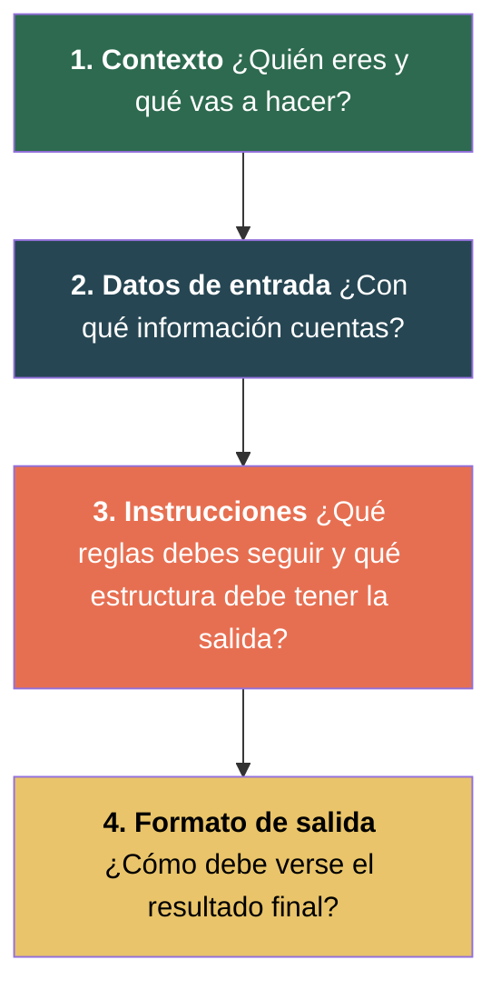
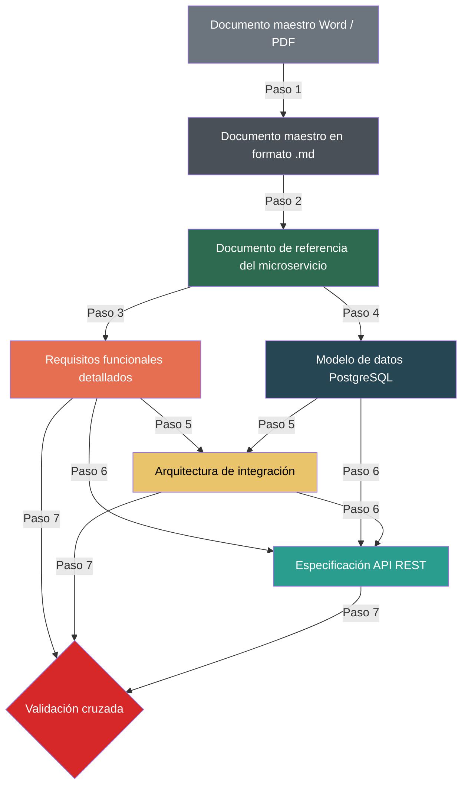
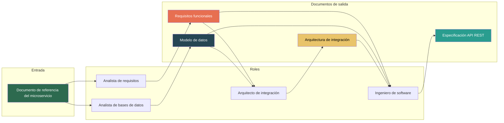
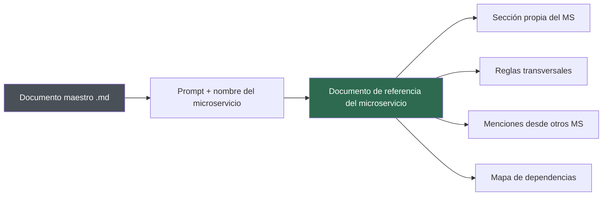
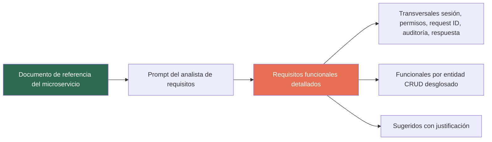
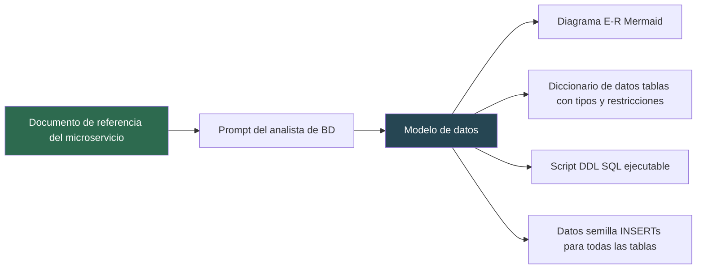
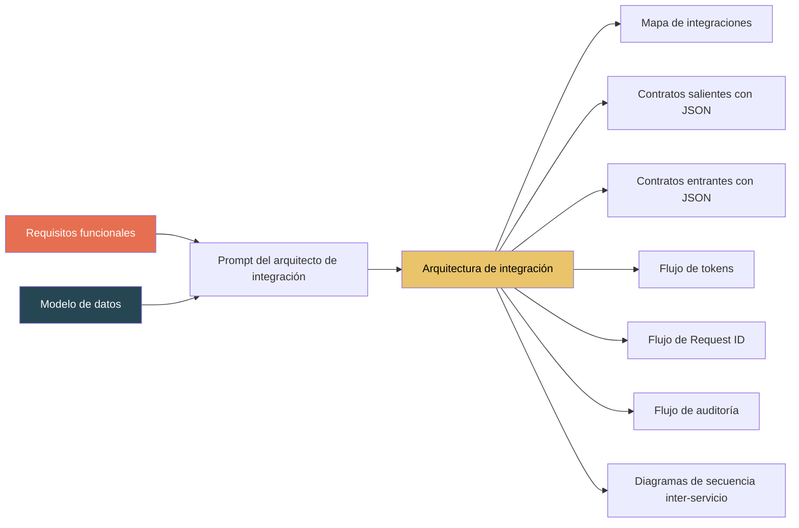
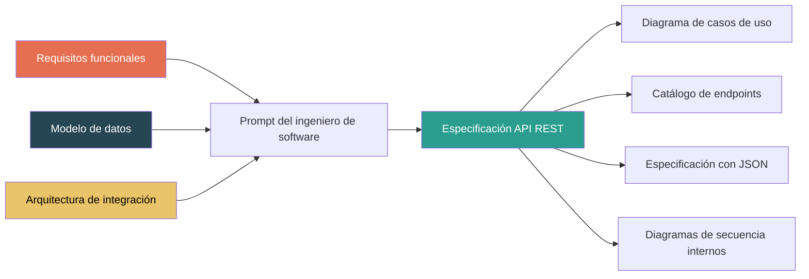
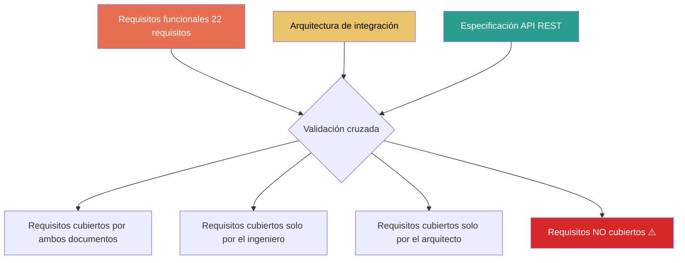

# Guía de Generación de Documentación de Microservicios con Asistencia de IA

---

## Tabla de Contenido

1. [Introducción](#1-introducción)
2. [¿Qué es un prompt?](#2-qué-es-un-prompt)
3. [¿Qué es la ingeniería de prompts?](#3-qué-es-la-ingeniería-de-prompts)
4. [Estructura de los prompts de esta guía](#4-estructura-de-los-prompts-de-esta-guía)
5. [Consejos para escribir buenos prompts](#5-consejos-para-escribir-buenos-prompts)
6. [Visión general del flujo de trabajo](#6-visión-general-del-flujo-de-trabajo)
7. [Roles y documentos del flujo](#7-roles-y-documentos-del-flujo)
8. [Paso 1 — Conversión del documento fuente a Markdown](#paso-1--conversión-del-documento-fuente-a-markdown)
9. [Paso 2 — Extracción de información por microservicio](#paso-2--extracción-de-información-por-microservicio)
10. [Paso 3 — Generación de requisitos funcionales](#paso-3--generación-de-requisitos-funcionales)
11. [Paso 4 — Diseño del modelo de datos](#paso-4--diseño-del-modelo-de-datos)
12. [Paso 5 — Arquitectura de integración](#paso-5--arquitectura-de-integración)
13. [Paso 6 — Especificación de la API REST](#paso-6--especificación-de-la-api-rest)
14. [Paso 7 — Validación cruzada](#paso-7--validación-cruzada)
15. [Notas y recomendaciones sobre el uso de IA](#notas-y-recomendaciones-sobre-el-uso-de-ia)
16. [Disclaimer — Descargo de responsabilidades](#disclaimer--descargo-de-responsabilidades)

---

## 1. Introducción

Esta guía describe un flujo de trabajo paso a paso para transformar un documento general de arquitectura de un sistema basado en microservicios en documentación técnica detallada por cada microservicio, utilizando inteligencia artificial como herramienta de asistencia.

El flujo parte de un único documento maestro (como un documento de requisitos funcionales del sistema completo) y produce, para cada microservicio, cuatro documentos especializados que cubren los roles clave de un equipo de desarrollo:

- **Analista de requisitos** → Requisitos funcionales detallados
- **Analista de bases de datos** → Modelo de datos completo en PostgreSQL
- **Arquitecto de integración** → Contratos de comunicación entre servicios
- **Ingeniero de software** → Especificación de la API REST con diagramas

Cada paso incluye un prompt diseñado para ser reutilizable con cualquier microservicio del sistema.

---

## 2. ¿Qué es un Prompt?

Un **prompt** es una instrucción o conjunto de instrucciones escritas que se le dan a un modelo de inteligencia artificial para que realice una tarea específica. Es la forma en que nos comunicamos con la IA: le decimos qué queremos, cómo lo queremos y qué restricciones debe seguir.

Pensemos en una analogía: si contratas a un profesional para realizar un trabajo, no le dices simplemente "hazlo". Le explicas quién eres, le describes el contexto del proyecto, le entregas los materiales, le explicas qué necesitas y le indicas en qué formato quieres la entrega. Un prompt funciona exactamente igual.

### Ejemplo: prompt malo vs. prompt bueno

**Prompt malo:**

```
Hazme los requisitos del microservicio de gastos
```

Este prompt no da contexto, no indica el formato, no define qué nivel de detalle se espera, no explica qué información tiene disponible ni qué estructura debe seguir la salida. El resultado será genérico e impredecible.

**Prompt bueno:**

```
Eres un analista de requisitos de software especializado en sistemas 
basados en microservicios. 

A partir del documento de referencia adjunto del microservicio ms-gastos, 
genera los requisitos funcionales detallados organizados en tres categorías: 
transversales, funcionales por entidad y sugeridos.

Cada requisito debe presentarse como una tabla con: código, nombre, 
descripción, actores, precondiciones, secuencia normal, secuencia alterna, 
excepciones, postcondiciones y comentarios.

Genera un archivo .md bien formateado.
```

La diferencia entre un resultado mediocre y uno profesional está casi siempre en la calidad del prompt. Un buen prompt no requiere conocimientos de programación, pero sí requiere claridad sobre lo que se necesita.

---

## 3. ¿Qué es la Ingeniería de Prompts?

La **ingeniería de prompts** (Prompt Engineering) es la disciplina de diseñar, estructurar y optimizar las instrucciones que se le dan a un modelo de IA para obtener los mejores resultados posibles.

No es simplemente "escribir una pregunta". Es un proceso deliberado que involucra:

- **Definir el rol de la IA:** Indicarle en qué se especializa para que adopte el tono, vocabulario y enfoque adecuado. Un "analista de bases de datos especializado en PostgreSQL" producirá un resultado diferente a un "asistente general".

- **Estructurar la información:** Organizar las instrucciones en secciones claras para que la IA no tenga que inferir qué se espera. Mientras más claro sea el prompt, menos espacio hay para interpretaciones incorrectas.

- **Especificar el formato de salida:** Indicar exactamente cómo debe verse el resultado: tablas, diagramas, bloques de código, archivos `.md`, etc. Sin esta especificación, la IA elige un formato que puede no ser el deseado.

- **Establecer restricciones:** Definir qué debe y qué no debe hacer la IA. Por ejemplo: "No inventes información que no esté en el documento" o "Si no puedes determinar algo, indica [Por definir]".

- **Iterar y refinar:** Rara vez el primer prompt produce el resultado perfecto. La ingeniería de prompts implica probar, evaluar el resultado, ajustar las instrucciones y volver a ejecutar.

### ¿Por qué importa en un contexto profesional?

En el desarrollo de software, la documentación debe ser precisa, consistente y completa. Un prompt mal diseñado puede generar documentación que parece correcta pero contiene errores sutiles, omisiones o inconsistencias. La ingeniería de prompts reduce ese riesgo al dar instrucciones explícitas y verificables.

Además, un prompt bien diseñado es **reutilizable**: se puede aplicar a cualquier microservicio del sistema obteniendo resultados con la misma estructura y nivel de detalle, lo que garantiza consistencia entre equipos.

---

## 4. Estructura de los Prompts de esta Guía

Todos los prompts de esta guía siguen una estructura de 4 secciones. Esta estructura no es arbitraria: cada sección cumple un propósito específico que mejora la calidad del resultado.



### Sección 1: Contexto

```
# Contexto

Eres un analista de bases de datos especializado en PostgreSQL y 
sistemas basados en microservicios. Tu tarea es diseñar el modelo 
de datos completo para un microservicio.
```

**¿Para qué sirve?** Le indica a la IA qué rol profesional debe asumir. Esto condiciona el vocabulario, el nivel técnico, el enfoque y las decisiones que tomará. Un "arquitecto de integración" producirá un documento muy diferente a un "ingeniero de software", aunque ambos reciban los mismos datos de entrada.

**¿Por qué es importante?** Sin contexto, la IA responde de forma genérica. Con contexto, se enfoca en el dominio correcto y usa las convenciones profesionales apropiadas.

### Sección 2: Datos de entrada

```
# Datos de entrada

El usuario te proporcionará:
- Un documento de referencia de un microservicio (archivo .md) que 
  contiene: extracción textual, información general, reglas de negocio, 
  entidades y datos, funcionalidades requeridas, dependencias y consumidores.
```

**¿Para qué sirve?** Le dice a la IA qué información va a recibir y en qué formato. Esto le permite saber qué buscar y de dónde extraer los datos.

**¿Por qué es importante?** Si la IA no sabe qué documentos tiene disponibles, puede inventar información o ignorar datos relevantes. Al listar explícitamente las fuentes, se asegura que trabaje solo con lo proporcionado.

### Sección 3: Instrucciones

```
# Instrucciones

Analiza el documento de referencia completo y genera el diseño del 
modelo de datos siguiendo estas reglas:

## Principios de diseño
- Cada microservicio tiene su propia base de datos independiente.
- Las referencias a entidades de otros microservicios se almacenan 
  solo como IDs.
...

## Estructura del documento de salida
### 1. Información General
...
### 2. Diagrama E-R
...
```

**¿Para qué sirve?** Define las reglas que la IA debe seguir y la estructura exacta del documento que debe generar. Es la sección más larga y detallada porque es donde se concentra la mayor parte del conocimiento del dominio.

**¿Por qué es importante?** Sin instrucciones claras, la IA toma decisiones arbitrarias sobre estructura, nivel de detalle y convenciones. Las instrucciones eliminan la ambigüedad y garantizan que el resultado siga un estándar predefinido.

Esta sección típicamente se divide en dos partes:
- **Principios o reglas:** Las decisiones de diseño que deben respetarse (ej: "usar snake_case", "aplicar soft delete").
- **Estructura del documento:** Las secciones que debe tener la salida, en qué orden y con qué contenido.

### Sección 4: Formato de salida

```
# Formato de salida

- Genera un archivo `.md` bien formateado.
- El diagrama Mermaid debe estar dentro de un bloque de código 
  con el lenguaje `mermaid`.
- El script DDL debe estar dentro de un bloque de código con 
  el lenguaje `sql`.
- Si alguna información no puede determinarse, indicarlo como: 
  "[Por definir]".
```

**¿Para qué sirve?** Define el formato técnico del archivo resultante: tipo de archivo, cómo formatear los bloques de código, cómo manejar la información faltante, etc.

**¿Por qué es importante?** Un documento puede tener contenido excelente pero ser inutilizable si el formato es incorrecto. Esta sección garantiza que el resultado sea un archivo profesional que se puede entregar directamente al equipo.

---

## 5. Consejos para Escribir Buenos Prompts

Estos consejos aplican tanto para los prompts de esta guía como para cualquier interacción con IA en un contexto profesional.

### 5.1 Sé específico, no ambiguo

| En lugar de... | Escribe... |
|---|---|
| "Hazme una tabla" | "Genera una tabla con columnas: Columna, Tipo, Restricciones, Descripción" |
| "Agrega diagramas" | "Genera un diagrama de secuencia en formato Mermaid que muestre los actores, las llamadas HTTP y las respuestas" |
| "Documenta las relaciones" | "Documenta las relaciones internas (FK entre tablas del mismo microservicio) y las referencias externas (IDs hacia otros microservicios) en tablas separadas" |

### 5.2 Da ejemplos cuando el formato es importante

Si necesitas que la salida siga una estructura particular, incluye un ejemplo en el prompt. Los ejemplos eliminan la ambigüedad mejor que cualquier explicación:

```
Cada requisito debe presentarse como una tabla con este formato:

| | | |
|---|---|---|
| **Código** | GAS-RF-001 | |
| **Nombre** | Validar sesión activa | |
| **Secuencia normal** | 1 | Recibir la petición con token JWT |
| | 2 | Enviar token a ms-autenticacion |
```

### 5.3 Define qué hacer con lo que no se sabe

Siempre incluye una instrucción para manejar la información faltante. Sin esto, la IA puede inventar datos para "completar" el documento:

```
Si alguna información no puede determinarse a partir del documento 
de referencia, indicarlo como: "[Por definir]".
```

### 5.4 Usa restricciones negativas

Decirle a la IA qué NO debe hacer es tan importante como decirle qué debe hacer:

```
- No inventes información que no esté en el documento.
- No resumas ni parafrasees. El texto debe ser idéntico al original.
- No se crean FK entre bases de datos distintas.
```

### 5.5 Divide problemas complejos en pasos

Un prompt que intenta hacer todo a la vez produce resultados inferiores a una cadena de prompts enfocados. Por eso esta guía tiene 7 pasos en lugar de un solo prompt gigante. Cada paso resuelve un problema específico y su resultado alimenta al siguiente.

### 5.6 Itera sin miedo

Si el resultado no es el esperado:
- No descarte todo y empiece de cero.
- Identifique qué parte del resultado es incorrecta.
- Pida a la IA que corrija solo esa parte con instrucciones específicas.
- Si el problema es recurrente, ajuste el prompt original para las próximas ejecuciones.

### 5.7 Valida siempre el resultado

La IA puede producir documentos que se ven profesionales y completos pero contienen errores. Siempre:
- Cruce los documentos generados contra las fuentes originales.
- Verifique que los datos sean coherentes entre documentos (IDs, nombres, estructuras).
- Use el Paso 7 (validación cruzada) para detectar faltantes.

---

## 6. Visión General del Flujo de Trabajo

El siguiente diagrama muestra la secuencia completa de pasos, los documentos que se generan y cómo se alimentan entre sí:



**Lectura del diagrama:**
- El documento maestro se convierte a Markdown (Paso 1) y luego se extrae la información de un microservicio específico (Paso 2).
- El documento de referencia alimenta al analista de requisitos (Paso 3) y al analista de BD (Paso 4) en paralelo.
- La arquitectura de integración (Paso 5) se construye a partir de los requisitos y el modelo de datos.
- La especificación de la API (Paso 6) se construye a partir de los tres documentos anteriores.
- Finalmente se valida que la suma de documentos cubra todos los requisitos (Paso 7).

---

## 7. Roles y Documentos del Flujo

El siguiente diagrama muestra la relación entre los roles del equipo y los documentos que producen:



**Cobertura por rol:**

| Rol | Alcance | Cubre |
|---|---|---|
| **Analista de requisitos** | Qué debe hacer el sistema | 100% de los requisitos |
| **Analista de BD** | Cómo se almacenan los datos | Tablas, relaciones, DDL, datos semilla |
| **Arquitecto de integración** | Cómo se comunican los servicios | Solo los requisitos que involucran otros microservicios |
| **Ingeniero de software** | Cómo se expone la funcionalidad | 100% de los endpoints (usuario + inter-servicio) |

---

## Paso 1 — Conversión del Documento Fuente a Markdown

### Descripción

Antes de comenzar el trabajo con IA, es necesario convertir el documento maestro del sistema (Word, PDF u otro formato) a Markdown (`.md`). Este paso es fundamental porque el formato Markdown es más eficiente para el procesamiento por modelos de lenguaje.

### Prompt

```
Convierte el archivo a un archivo .md
```

### Instrucciones de uso

1. Cargar el archivo original (Word, PDF) en la conversación con la IA.
2. Usar el prompt indicado.
3. Descargar el archivo `.md` resultante.
4. Verificar visualmente que el contenido se haya convertido correctamente, especialmente tablas, listas y secciones.

### Ventajas

- **Reducción de tokens:** El formato `.md` es significativamente más liviano que Word o PDF, lo que reduce el consumo de tokens en las conversaciones con IA y permite procesar documentos más extensos sin superar los límites de contexto.
- **Formato nativo para IA:** Los modelos de lenguaje procesan Markdown de forma más precisa que formatos binarios, lo que mejora la calidad de las respuestas.
- **Portabilidad:** El archivo `.md` se puede versionar en Git, compartir fácilmente y renderizar en múltiples plataformas.
- **Reutilización:** El mismo archivo `.md` se usa como entrada en todos los pasos posteriores.

### Desventajas

- **Pérdida de formato complejo:** Elementos como imágenes incrustadas, encabezados/pie de página institucionales, marcas de agua y formato avanzado de tablas pueden perderse en la conversión.
- **Requiere verificación manual:** Es necesario revisar que la conversión sea fiel al original, especialmente en tablas con celdas combinadas o formato condicional.

---

## Paso 2 — Extracción de Información por Microservicio

### Descripción

A partir del documento maestro en Markdown, se extrae y organiza toda la información relevante para un microservicio específico. Este paso es crucial porque el documento maestro contiene información de todos los microservicios del sistema, y cada rol necesita trabajar solo con la información de su microservicio.

El documento de referencia resultante se convierte en la **fuente única de verdad** para los pasos posteriores.

### Diagrama de entradas y salidas



### Prompt

```
# Contexto

Eres un analista de software especializado en arquitectura de microservicios. Tu tarea es extraer y organizar la información relevante para un microservicio específico a partir de un documento de requisitos funcionales.

# Datos de entrada

El usuario te proporcionará:
- Un documento de requisitos funcionales (puede ser PDF, texto o markdown)
- El nombre o código del microservicio del cual se desea extraer la información

# Instrucciones

Analiza el documento completo y genera un documento con la siguiente estructura, extrayendo únicamente la información que aplica al microservicio solicitado.

### Estructura del documento de salida

#### 1. Extracción Textual
Copia sin modificar todos los fragmentos del documento original que sean relevantes para el microservicio solicitado. Esto incluye:
- La sección completa del microservicio (propósito, información que gestiona, requisitos funcionales, dependencias)
- Cualquier mención del microservicio en otras secciones del documento (reglas generales, mapas de dependencias, notas, etc.)
- Fragmentos de otros microservicios que hagan referencia directa al microservicio solicitado

No resumas ni parafrasees. El texto debe ser idéntico al original. Separa cada fragmento indicando la sección de origen.

#### 2. Información General
Escribe un resumen breve y claro que incluya:
- Nombre y código del microservicio
- Módulo al que pertenece
- Propósito en 2-3 oraciones
- Rol que cumple dentro del sistema general

#### 3. Reglas de Negocio
Lista todas las reglas que el microservicio debe cumplir. Incluye:
- Reglas transversales del sistema que le aplican (validaciones de sesión, permisos, cifrado, trazabilidad, auditoría, formato de respuesta, etc.)
- Reglas específicas del microservicio (validaciones, restricciones, condiciones, umbrales)
- Reglas que provienen de su relación con otros microservicios (ej: "antes de aprobar un gasto, debe validar saldo en presupuesto")

Presenta cada regla de forma individual y clara.

#### 4. Entidades y Datos
Para cada entidad que el microservicio gestiona:
- Nombre de la entidad
- Descripción de su propósito
- Lista completa de atributos requeridos según el documento (sin modificar)

Mantén el texto original del documento para la descripción de cada entidad.

#### 5. Funcionalidades Requeridas
Copia sin modificar la lista completa de requisitos funcionales del microservicio tal como aparece en el documento original. No agregues, elimines ni reescribas ningún punto.

#### 6. Dependencias (de quién dependo)
Lista cada microservicio del cual el microservicio solicitado consume datos o servicios:
- Nombre del microservicio del que depende
- Qué información o funcionalidad consume de él
- En qué momento o contexto se realiza la consulta

#### 7. Consumidores (quién depende de mí)
Lista cada microservicio que consume datos o servicios del microservicio solicitado:
- Nombre del microservicio consumidor
- Qué información o funcionalidad consume
- En qué momento o contexto realiza la consulta

Para construir esta sección, revisa las dependencias declaradas por todos los demás microservicios en el documento y el mapa de dependencias si existe.

# Formato de salida

- Genera un archivo `.md` bien formateado y listo para entregar al equipo de desarrollo.
- Si una sección no tiene información aplicable, escríbela con el texto: "No se encontró información relevante en el documento."
- No inventes información que no esté en el documento.
- Los textos marcados como "sin modificar" deben ser copias exactas del original.
- Usa encabezados, tablas y listas donde corresponda para facilitar la lectura.
```

### Instrucciones de uso

1. Cargar el documento maestro `.md` (generado en el Paso 1) en la conversación.
2. Indicar el nombre o código del microservicio deseado (ej: "ms-gastos [GAS]").
3. Ejecutar el prompt.
4. Verificar que el documento resultante contenga todas las menciones del microservicio en el documento original, incluyendo las que aparecen en secciones de otros microservicios.

### Ventajas

- **Foco:** Elimina el ruido de otros microservicios, permitiendo que cada rol trabaje solo con lo relevante.
- **Trazabilidad:** La sección de extracción textual preserva el texto original para auditoría.
- **Visión 360°:** Captura no solo la sección propia del microservicio, sino también todas las menciones desde otros microservicios (dependencias inversas, reglas compartidas).
- **Reutilizable:** El mismo documento de referencia alimenta a los 4 roles.

### Desventajas

- **Dependiente de la calidad del documento maestro:** Si el documento original está incompleto o ambiguo, el documento de referencia heredará esas deficiencias.
- **Requiere revisión humana:** Es posible que la IA omita menciones indirectas del microservicio en secciones no obvias del documento.

---

## Paso 3 — Generación de Requisitos Funcionales

### Descripción

El analista de requisitos toma el documento de referencia y genera los requisitos funcionales detallados del microservicio. Cada funcionalidad se desglosa en un requisito individual con secuencia normal, secuencias alternas, excepciones, precondiciones y postcondiciones.

Los requisitos se organizan en tres categorías: transversales (aplican a todo), funcionales por entidad (explícitos del documento) y sugeridos (inferidos del contexto).

### Diagrama de entradas y salidas



### Prompt

```
# Contexto

Eres un analista de requisitos de software especializado en sistemas basados en microservicios. Tu tarea es generar los requisitos funcionales detallados para un microservicio a partir de su documento de referencia.

# Datos de entrada

El usuario te proporcionará:
- Un documento de referencia de un microservicio (archivo .md) que contiene: extracción textual, información general, reglas de negocio, entidades y datos, funcionalidades requeridas, dependencias y consumidores.

# Instrucciones

Analiza el documento de referencia completo y genera los requisitos funcionales detallados siguiendo estas reglas:

## Desglose de requisitos
- Cada funcionalidad CRUD debe desglosarse en requisitos individuales (uno para crear, uno para consultar, uno para actualizar, etc.).
- Las reglas de negocio transversales (validación de sesión, validación de permisos, trazabilidad, auditoría, estructura de respuesta) deben generarse como requisitos transversales independientes al inicio del documento.
- Las reglas de negocio específicas que se reutilizan en múltiples flujos (ej: "validar saldo presupuestal") también deben generarse como requisitos independientes.
- Los demás requisitos deben referenciar a los requisitos transversales y reutilizables en su secuencia normal en lugar de repetir los pasos completos (ej: "Ejecutar [ID del requisito transversal]").

## Categorización
Organizar los requisitos en las siguientes categorías, en este orden:

### Categoría 1: Requisitos Transversales
Requisitos que aplican a todas las operaciones del microservicio: validación de sesión, validación de permisos, generación de request ID, auditoría, estructura de respuesta estándar.

### Categoría 2: Requisitos Funcionales por Entidad
Requisitos explícitos del documento, agrupados por la entidad a la que pertenecen.

### Categoría 3: Requisitos Sugeridos
Requisitos que no están escritos explícitamente en el documento pero se deducen del contexto, las entidades, las dependencias o las buenas prácticas del sistema. Cada sugerencia debe incluir una justificación breve de por qué se considera necesaria.

## Referencia cruzada de dependencias
En los pasos de la secuencia normal donde se consulta otro microservicio, indicar explícitamente:
- Nombre y código del servicio que se invoca
- Qué operación o dato se solicita
- Qué se espera recibir como respuesta

## Estructura de cada requisito

Cada requisito debe presentarse como una única tabla con 3 columnas, siguiendo este formato:

| | | |
|---|---|---|
| **Código** | [CÓDIGO_MICRO]-RF-[000] | |
| **Nombre** | Nombre corto y descriptivo | |
| **Descripción** | Resumen del propósito en 1-2 oraciones | |
| **Actores** | Roles o sistemas que participan | |
| | | |
| **Precondición** | Primera precondición | |
| | Segunda precondición | |
| | | |
| | **Paso** | **Descripción** |
| **Secuencia normal** | 1 | Primer paso del flujo |
| | 2 | Segundo paso del flujo |
| | | |
| **Secuencia alterna** | 1A | Camino alterno del paso 1 |
| | 2A | Camino alterno del paso 2 |
| | | |
| **Excepciones** | E1 | Primera excepción técnica |
| | E2 | Segunda excepción técnica |
| | | |
| **Postcondición** | Primera postcondición | |
| | Segunda postcondición | |
| | | |
| **Comentarios** | Notas adicionales o decisiones pendientes | |

Reglas de la tabla:
- El título de sección (columna 1) aparece solo en la primera fila de cada grupo.
- Las filas siguientes del mismo grupo dejan la columna 1 vacía.
- Las secciones con un solo valor usan columnas 1 y 2 (columna 3 vacía).
- Las secciones de secuencias y excepciones usan las 3 columnas: sección, paso/código, descripción.
- Si alguna información no puede determinarse a partir del documento de referencia, indicarlo como: "[Por definir]".

# Formato de salida

- Genera un archivo `.md` bien formateado y listo para entregar al equipo de desarrollo.
- Incluir al inicio del documento un encabezado con el nombre y código del microservicio, y una tabla de contenido organizada por categorías con los IDs y nombres de todos los requisitos generados.
- Cada categoría debe tener un encabezado claro que la identifique.
- Cada requisito debe estar claramente separado del siguiente.
- Los requisitos sugeridos deben incluir una línea de justificación antes de la tabla.
- Si alguna información no puede determinarse, indicarlo como: "[Por definir]".
```

### Instrucciones de uso

1. Cargar el documento de referencia del microservicio (generado en el Paso 2).
2. Ejecutar el prompt.
3. Verificar que todas las funcionalidades del documento de referencia tengan al menos un requisito asociado.
4. Revisar que los requisitos sugeridos tengan sentido para el contexto del microservicio.
5. Validar que las dependencias inter-servicio estén documentadas en las secuencias normales.

### Ventajas

- **Desglose completo:** Cada operación CRUD se convierte en un requisito individual, eliminando ambigüedad.
- **Requisitos transversales reutilizables:** Se definen una vez y se referencian por ID, evitando repetición y garantizando consistencia.
- **Requisitos sugeridos con justificación:** La IA puede identificar funcionalidades faltantes que un humano podría pasar por alto.
- **Formato estándar:** La estructura de tabla facilita la revisión y aprobación por parte del equipo.

### Desventajas

- **Volumen:** Para microservicios complejos, el documento puede ser extenso (20+ requisitos).
- **Requiere validación del dominio:** La IA puede sugerir requisitos que no aplican al contexto institucional específico.
- **Dependencias inferidas:** Las dependencias con otros microservicios se documentan desde la perspectiva de este microservicio; el equipo del otro microservicio debe validar.

---

## Paso 4 — Diseño del Modelo de Datos

### Descripción

El analista de bases de datos toma el documento de referencia y diseña el modelo de datos completo en PostgreSQL. Incluye el diagrama entidad-relación, el diccionario de datos, el script DDL ejecutable y datos semilla para todas las tablas.

### Diagrama de entradas y salidas



### Prompt

```
# Contexto

Eres un analista de bases de datos especializado en PostgreSQL y sistemas basados en microservicios. Tu tarea es diseñar el modelo de datos completo para un microservicio a partir de su documento de referencia.

# Datos de entrada

El usuario te proporcionará:
- Un documento de referencia de un microservicio (archivo .md) que contiene: extracción textual, información general, reglas de negocio, entidades y datos, funcionalidades requeridas, dependencias y consumidores.

# Instrucciones

Analiza el documento de referencia completo y genera el diseño del modelo de datos siguiendo estas reglas:

## Principios de diseño
- Cada microservicio tiene su propia base de datos independiente (database-per-service).
- Las referencias a entidades de otros microservicios se almacenan solo como IDs (no se crean FK entre bases de datos distintas). Documentar estas referencias externas claramente.
- Aplicar eliminación lógica (soft delete) en todas las entidades principales: usar columna de estado en lugar de borrar registros.
- Todas las tablas deben incluir campos de auditoría: `created_at` y `updated_at`.
- Usar convenciones de nomenclatura PostgreSQL: snake_case para tablas y columnas, prefijo del microservicio para las tablas (ej: `gas_gastos`, `gas_categorias`).
- Los tipos de datos deben ser los más apropiados de PostgreSQL (VARCHAR, TEXT, NUMERIC, INTEGER, BIGINT, BOOLEAN, TIMESTAMP, JSONB, etc.).
- Aplicar restricciones CHECK donde el documento defina valores permitidos (ej: estados, tipos).

## Estructura del documento de salida

### 1. Información General
Resumen breve que incluya:
- Nombre y código del microservicio
- Módulo al que pertenece
- Nombre de la base de datos sugerido
- Cantidad de tablas del modelo
- Resumen del dominio de datos en 2-3 oraciones

### 2. Diagrama E-R
Diagrama entidad-relación en formato Mermaid que muestre:
- Todas las entidades (tablas) con sus atributos clave (PK, FK)
- Las relaciones entre entidades con cardinalidad
- Las referencias externas a otros microservicios marcadas claramente

Incluir después del diagrama una descripción narrativa que explique: cuántas entidades tiene el modelo, cómo se relacionan entre sí, cuáles son las entidades principales vs. las de soporte, y qué referencias externas existen hacia otros microservicios.

### 3. Diccionario de Datos
Para cada tabla, presentar una tabla con las siguientes columnas:

| Columna | Tipo | Restricciones | Descripción |
|---|---|---|---|
| nombre_columna | tipo_postgresql | PK, FK, NOT NULL, UNIQUE, DEFAULT, CHECK | Descripción breve |

Incluir antes de cada tabla:
- Nombre de la tabla
- Descripción de su propósito
- Notas sobre referencias externas (IDs que apuntan a otros microservicios)

### 4. Relaciones y Claves Foráneas
Tabla resumen de todas las relaciones:

| FK | Tabla origen | Columna | Tabla destino | Tipo | Nota |
|---|---|---|---|---|---|
| Nombre de la FK | tabla_origen | columna_fk | tabla_destino | 1:N, N:M, 1:1 | Observación |

Separar en dos grupos:
- **Relaciones internas:** FK entre tablas del mismo microservicio
- **Referencias externas:** IDs que apuntan a entidades de otros microservicios (sin FK real en base de datos)

### 5. Índices Sugeridos
Lista de índices recomendados basados en:
- Los filtros de búsqueda mencionados en los requisitos funcionales
- Las consultas frecuentes inferidas del documento
- Las columnas de estado y fecha que se usan en filtros

Para cada índice indicar:

| Índice | Tabla | Columnas | Tipo | Justificación |
|---|---|---|---|---|
| nombre_indice | tabla | columna(s) | B-tree, GIN, etc. | Por qué se recomienda |

### 6. Script DDL
Script SQL completo y ejecutable en PostgreSQL que incluya:
- Creación de la base de datos (CREATE DATABASE)
- Creación de todas las tablas con sus columnas, tipos, restricciones y valores por defecto
- Todas las claves primarias y foráneas internas
- Todas las restricciones CHECK
- Todos los índices sugeridos
- Comentarios en el script que identifiquen las referencias externas

El script debe estar ordenado respetando las dependencias entre tablas (las tablas referenciadas se crean primero).

### 7. Datos Semilla
Scripts INSERT para poblar todas las tablas del modelo con datos de prueba representativos que permitan probar el microservicio desde el primer momento.

Para cada tabla generar:
- Mínimo 8 registros que cubran los diferentes estados y variaciones posibles de la entidad.
- Datos coherentes entre tablas (las FK internas deben apuntar a registros existentes).
- Las referencias externas (IDs de otros microservicios) deben usar IDs ficticios documentados con un comentario que indique a qué entidad y microservicio corresponden.
- Los registros deben representar diferentes escenarios del flujo de negocio (ej: registros en cada estado posible, con y sin campos opcionales).

Si el documento menciona datos semilla específicos (roles, categorías, configuraciones), incluirlos como parte de los inserts.

# Formato de salida

- Genera un archivo `.md` bien formateado y listo para entregar al equipo de desarrollo.
- El diagrama Mermaid debe estar dentro de un bloque de código con el lenguaje `mermaid`.
- El script DDL debe estar dentro de un bloque de código con el lenguaje `sql`.
- Los datos semilla deben estar dentro de un bloque de código con el lenguaje `sql`.
- Si alguna información no puede determinarse a partir del documento de referencia, indicarlo como: "[Por definir]".
- Usa tablas, encabezados y separadores para facilitar la lectura.
```

### Instrucciones de uso

1. Cargar el documento de referencia del microservicio (generado en el Paso 2).
2. Ejecutar el prompt.
3. Verificar que todas las entidades del documento de referencia tengan una tabla correspondiente.
4. Validar que las referencias externas estén documentadas como comentarios (sin FK real).
5. Probar el script DDL en un entorno PostgreSQL local.
6. Verificar que los datos semilla sean coherentes entre tablas y cubran todos los estados posibles.

### Ventajas

- **Listo para ejecutar:** El script DDL se puede correr directamente en PostgreSQL.
- **Datos semilla completos:** El microservicio se puede probar desde el primer momento sin necesidad de crear datos manualmente.
- **Referencias externas claras:** Documenta explícitamente qué IDs apuntan a otros microservicios, evitando confusión con las FK internas.
- **Diagrama renderizable:** El diagrama E-R en Mermaid se puede visualizar en cualquier plataforma que soporte Markdown.

### Desventajas

- **Tipos de datos genéricos:** La IA puede no elegir el tipo PostgreSQL más óptimo para cada caso (ej: usar VARCHAR donde TEXT es más apropiado o viceversa).
- **Índices básicos:** Los índices sugeridos se basan en inferencia; un DBA experimentado podría optimizarlos basándose en patrones de carga reales.
- **Datos semilla ficticios:** Los IDs de referencias externas son ficticios y deben coordinarse con los equipos de los otros microservicios.

---

## Paso 5 — Arquitectura de Integración

### Descripción

El arquitecto de integración toma los requisitos funcionales y el modelo de datos para diseñar los contratos de comunicación entre el microservicio y todos los servicios con los que interactúa. Cubre tanto las llamadas salientes (servicios que consume) como las entrantes (servicios que lo consumen), junto con los flujos de seguridad, trazabilidad y auditoría.

Este documento es el contrato que deben respetar todos los equipos involucrados en la comunicación inter-servicio.

### Diagrama de entradas y salidas



### Prompt

```
# Contexto

Eres un arquitecto de integración especializado en sistemas distribuidos basados en microservicios. Tu tarea es diseñar los contratos de comunicación, flujos de integración y configuración de seguridad inter-servicio para un microservicio específico.

# Datos de entrada

El usuario te proporcionará:
- Un documento de requisitos funcionales del microservicio (archivo .md) con los requisitos detallados organizados por categorías.
- Un documento de modelo de datos del microservicio (archivo .md) con el diccionario de datos, relaciones y referencias externas.

# Instrucciones

Analiza los documentos y genera el diseño completo de integración del microservicio siguiendo estas reglas:

## Principios de integración
- Toda comunicación entre microservicios es REST (HTTP/JSON).
- Cada petición entre servicios debe incluir el token de aplicación cifrado en la cabecera.
- El Request ID debe propagarse en toda la cadena de comunicación.
- La comunicación con el servicio de auditoría es asíncrona (fire-and-forget).
- Las referencias externas del modelo de datos identifican qué servicios se consultan y qué datos se necesitan.
- Los requisitos funcionales identifican en qué momento del flujo se realizan las llamadas.

## Estructura del documento de salida

### 1. Información General
Resumen breve que incluya:
- Nombre y código del microservicio
- Módulo al que pertenece
- Cantidad de servicios con los que se integra
- Resumen de las integraciones en 2-3 oraciones

### 2. Mapa de Integraciones
Diagrama en formato Mermaid que muestre:
- El microservicio central
- Todos los servicios con los que se comunica (salientes y entrantes)
- La dirección de la comunicación (quién llama a quién)
- Etiquetas que indiquen qué dato o funcionalidad se intercambia
- Diferenciación visual entre comunicación síncrona y asíncrona

Incluir después del diagrama una descripción narrativa que explique: con cuántos servicios se integra, cuáles son comunicaciones síncronas vs. asíncronas, cuáles son las dependencias críticas (sin las cuales el microservicio no puede operar) y cuáles son opcionales.

### 3. Contratos de Comunicación Saliente
Por cada microservicio que se consume, documentar cada operación como una tabla con:

| Campo | Detalle |
|---|---|
| **Servicio destino** | Nombre y código del microservicio |
| **Operación** | Nombre descriptivo de la operación |
| **Método HTTP** | GET, POST, PUT, DELETE |
| **Endpoint sugerido** | Ruta del endpoint |
| **Headers requeridos** | Cabeceras obligatorias (token de aplicación, request ID, content-type) |
| **Timeout sugerido** | Tiempo máximo de espera recomendado |
| **Requisito relacionado** | ID del requisito funcional que origina esta llamada |

Seguido de un ejemplo JSON de request y un ejemplo JSON de response exitoso y de error, dentro de bloques de código.

### 4. Contratos de Comunicación Entrante
Por cada microservicio que consume datos del microservicio actual, documentar cada operación con la misma estructura de tabla:

| Campo | Detalle |
|---|---|
| **Servicio origen** | Nombre y código del microservicio que llama |
| **Operación** | Nombre descriptivo de la operación |
| **Método HTTP** | GET, POST, PUT, DELETE |
| **Endpoint expuesto** | Ruta del endpoint que se expone |
| **Headers requeridos** | Cabeceras que debe enviar el consumidor |
| **Requisito relacionado** | ID del requisito funcional que atiende esta operación |

Seguido de un ejemplo JSON de request y un ejemplo JSON de response exitoso y de error, dentro de bloques de código.

### 5. Configuración de Tokens de Aplicación
Documentar:
- Token propio del microservicio: nombre, descripción, formato de almacenamiento
- Tokens de otros servicios que necesita: lista con nombre del servicio, propósito, cómo se usa en la cabecera
- Formato de transmisión del token en las peticiones
- Diagrama Mermaid del flujo de validación de token entre servicios, acompañado de una descripción narrativa que explique cómo se cifra, transmite y valida el token en una petición saliente y en una petición entrante

### 6. Flujo de Request ID
Documentar:
- Formato del Request ID del microservicio
- Reglas de generación y reutilización
- Diagrama Mermaid que muestre la propagación del Request ID a través de una cadena de llamadas que involucre al menos 3 servicios, acompañado de una descripción narrativa que explique en qué momento se genera, cuándo se reutiliza uno existente y cómo se incluye en la respuesta

### 7. Flujo de Auditoría
Documentar:
- Estructura completa del log JSON con ejemplo concreto dentro de un bloque de código
- Momento en que se genera (antes o después de la respuesta)
- Comportamiento ante fallos del servicio de auditoría
- Diagrama Mermaid del flujo asíncrono de envío de logs, acompañado de una descripción narrativa que explique en qué momento se construye el log, cómo se envía sin bloquear la respuesta al usuario y qué ocurre si el servicio de auditoría no está disponible

### 8. Diagramas de Secuencia
Generar diagramas de secuencia en formato Mermaid para los flujos que involucren comunicación con múltiples servicios. Como mínimo:
- El flujo más complejo del microservicio (el que involucra más servicios)
- Un flujo de consulta típico
- El flujo de auditoría asíncrona

Cada diagrama debe mostrar:
- Los actores y servicios participantes
- Las llamadas HTTP con método y endpoint
- Las respuestas con código HTTP
- La propagación del Request ID
- Los puntos de validación (sesión, permisos)
- El envío asíncrono del log de auditoría

Cada diagrama debe ir acompañado de una descripción narrativa breve que explique el flujo paso a paso: qué actores participan, qué validaciones se ejecutan, qué servicios se invocan, qué datos se intercambian y cuál es el resultado final.

# Formato de salida

- Genera un archivo `.md` bien formateado y listo para entregar al equipo de desarrollo.
- Todos los diagramas deben estar en formato Mermaid dentro de bloques de código con el lenguaje `mermaid`.
- Todas las estructuras JSON de ejemplo (request, response exitoso, response error) deben estar dentro de bloques de código con el lenguaje `json`.
- Usa tablas para los contratos de comunicación.
- Si alguna información no puede determinarse a partir de los documentos de entrada, indicarlo como: "[Por definir]".
```

### Instrucciones de uso

1. Cargar el documento de requisitos funcionales (Paso 3) y el modelo de datos (Paso 4).
2. Ejecutar el prompt.
3. Verificar que todas las referencias externas del modelo de datos tengan un contrato saliente correspondiente.
4. Validar que los diagramas de secuencia sean coherentes con los requisitos funcionales.
5. Compartir los contratos con los equipos de los microservicios consumidos para validación mutua.

### Ventajas

- **Contratos concretos:** Cada comunicación tiene método, endpoint, headers, JSON de ejemplo y códigos de error definidos.
- **Diagramas de secuencia inter-servicio:** Permiten visualizar cadenas de llamadas complejas que involucran múltiples servicios.
- **Seguridad documentada:** Los flujos de tokens y cifrado quedan formalizados.
- **Trazabilidad visual:** El flujo de Request ID muestra cómo se propaga el identificador a través de toda la cadena.

### Desventajas

- **Alcance limitado a integraciones:** No cubre los endpoints internos del microservicio (los que el usuario consume directamente). Eso es responsabilidad del ingeniero de software (Paso 6).
- **Endpoints sugeridos:** Los endpoints de otros microservicios son sugerencias; los equipos responsables de esos servicios deben validarlos y pueden ajustarlos.
- **Requiere coordinación:** Los contratos son acuerdos entre equipos; un cambio en un contrato afecta a ambas partes.

---

## Paso 6 — Especificación de la API REST

### Descripción

El ingeniero de software toma los tres documentos anteriores (requisitos, modelo de datos y arquitectura de integración) y genera la especificación completa de la API REST del microservicio. Este documento cubre todos los endpoints que el microservicio expone, tanto al usuario final como a otros servicios.

Incluye el catálogo de endpoints, la especificación detallada con ejemplos JSON, diagramas de casos de uso y diagramas de secuencia internos que muestran el flujo completo dentro del microservicio.

### Diagrama de entradas y salidas



### Prompt

```
# Contexto

Eres un ingeniero de software especializado en diseño de APIs REST para sistemas basados en microservicios. Tu tarea es generar la especificación completa de la API REST de un microservicio, incluyendo todos los endpoints que expone al usuario y a otros servicios.

# Datos de entrada

El usuario te proporcionará:
- Un documento de requisitos funcionales del microservicio (archivo .md) con los requisitos detallados organizados por categorías.
- Un documento de modelo de datos del microservicio (archivo .md) con el diccionario de datos, relaciones y referencias externas.
- Un documento de arquitectura de integración del microservicio (archivo .md) con los contratos de comunicación, flujos de integración y diagramas de secuencia inter-servicio.

# Instrucciones

Analiza los tres documentos y genera la especificación completa de la API REST del microservicio siguiendo estas reglas:

## Principios de diseño de la API
- Convención RESTful: usar sustantivos en plural para recursos, verbos HTTP para acciones.
- Versionado de API en la ruta: `/api/v1/`.
- Toda respuesta sigue la estructura estándar definida en los requisitos transversales (request_id, success, data, message, timestamp).
- Los endpoints de listado deben soportar paginación y filtros como query parameters.
- Los endpoints que pertenecen a un recurso hijo se anidan bajo el recurso padre (ej: `/gastos/{id}/novedades`).
- Todo endpoint requiere las cabeceras de autenticación y trazabilidad definidas en la arquitectura de integración.

## Estructura del documento de salida

### 1. Información General
Resumen breve que incluya:
- Nombre y código del microservicio
- Módulo al que pertenece
- Base URL sugerida
- Cantidad total de endpoints
- Resumen de la API en 2-3 oraciones

### 2. Diagrama de Casos de Uso
Diagrama en formato Mermaid que muestre:
- Los actores que interactúan con el microservicio (usuarios por rol y otros microservicios)
- Todas las funcionalidades agrupadas por entidad
- Las relaciones entre actores y funcionalidades

Incluir después del diagrama una descripción narrativa de cada caso de uso: quién es el actor, qué quiere lograr, cuál es el flujo principal y cuál es el resultado esperado.

### 3. Catálogo de Endpoints
Tabla completa con todos los endpoints del microservicio:

| Método | Endpoint | Descripción | Requisito |
|---|---|---|---|
| GET/POST/PUT/DELETE | Ruta completa | Descripción breve | ID del requisito funcional |

Organizar la tabla agrupada por entidad o recurso.

### 4. Especificación de Endpoints
Para cada endpoint, documentar con la siguiente estructura:

#### Encabezado
Método HTTP + ruta + nombre descriptivo

#### Tabla de especificación

| Campo | Detalle |
|---|---|
| **Método** | GET, POST, PUT, DELETE |
| **Endpoint** | Ruta completa |
| **Descripción** | Propósito del endpoint en 1-2 oraciones |
| **Requisito** | ID del requisito funcional relacionado |
| **Autenticación** | Headers requeridos |
| **Path params** | Parámetros en la ruta (si aplica) |
| **Query params** | Parámetros de consulta (si aplica) |
| **Códigos HTTP** | Lista de códigos posibles con su significado |

#### Ejemplos JSON
Incluir bloques de código JSON para:
- **Request body** (si aplica): ejemplo concreto con datos representativos
- **Response exitoso**: ejemplo con código HTTP y cuerpo completo siguiendo la estructura estándar
- **Response error**: al menos un ejemplo de error representativo con código HTTP y cuerpo

Los datos de los ejemplos JSON deben ser coherentes con los datos semilla del modelo de datos.

### 5. Diagramas de Secuencia Internos
Para cada endpoint, generar un diagrama de secuencia en formato Mermaid que muestre el flujo interno completo:
- El usuario o servicio que inicia la petición
- Los middlewares o validaciones transversales (sesión, permisos, request ID)
- Las consultas a la base de datos
- Las llamadas a otros microservicios (si aplica)
- La construcción de la respuesta
- El envío asíncrono del log de auditoría

Cada diagrama debe ir acompañado de una descripción narrativa breve que explique el flujo paso a paso.

# Formato de salida

- Genera un archivo `.md` bien formateado y listo para entregar al equipo de desarrollo.
- Todos los diagramas deben estar en formato Mermaid dentro de bloques de código con el lenguaje `mermaid`.
- Todas las estructuras JSON de ejemplo deben estar dentro de bloques de código con el lenguaje `json`.
- Usa tablas para el catálogo y las especificaciones.
- Si alguna información no puede determinarse a partir de los documentos de entrada, indicarlo como: "[Por definir]".
```

### Instrucciones de uso

1. Cargar los tres documentos: requisitos funcionales (Paso 3), modelo de datos (Paso 4) y arquitectura de integración (Paso 5).
2. Ejecutar el prompt.
3. Verificar que el catálogo de endpoints cubra todos los requisitos funcionales (usar la validación del Paso 7).
4. Validar que los ejemplos JSON sean coherentes con los datos semilla del modelo de datos.
5. Verificar que los diagramas de secuencia internos sean consistentes con los diagramas inter-servicio del arquitecto.

### Ventajas

- **Cobertura completa:** Documenta el 100% de los endpoints del microservicio (los 14 internos + los expuestos a otros servicios).
- **Ejemplos concretos:** Los JSON de request y response permiten al equipo entender exactamente qué enviar y qué esperar.
- **Diagramas de secuencia internos:** Muestran el flujo completo dentro del microservicio, complementando los diagramas inter-servicio del arquitecto.
- **Casos de uso narrativos:** Cada funcionalidad tiene una descripción en lenguaje natural que facilita la comprensión.

### Desventajas

- **Documento extenso:** Para microservicios con muchos endpoints, el documento puede ser largo. Considerar dividirlo por entidad si es necesario.
- **No incluye código:** El documento especifica el "qué" pero no el "cómo". La implementación queda en manos del equipo de desarrollo.
- **Diagramas pueden divergir:** Si se modifican los requisitos después de generar este documento, los diagramas pueden quedar desactualizados.

---

## Paso 7 — Validación Cruzada

### Descripción

El paso final consiste en validar que la suma de los documentos del arquitecto de integración y el ingeniero de software cubra el 100% de los requisitos funcionales. Esta validación cruza cada requisito contra ambos documentos para identificar faltantes.

### Diagrama del proceso de validación



### Prompt

```
Tengo los siguientes documentos de un microservicio:
1. Requisitos funcionales (adjunto)
2. Arquitectura de integración (adjunto)
3. Especificación de API REST (adjunto)

Cruza cada requisito funcional contra los documentos del arquitecto de integración y del ingeniero de software. Para cada requisito indica:
- Si está cubierto en el documento del arquitecto (sí/no y dónde)
- Si está cubierto en el documento del ingeniero (sí/no y dónde)
- Estado general (completo, parcial, faltante)

Presenta el resultado en una tabla resumen y un análisis de cobertura al final.
```

### Instrucciones de uso

1. Cargar los tres documentos en la conversación.
2. Ejecutar el prompt.
3. Revisar la tabla de cobertura: los requisitos marcados como "faltante" deben ser investigados.
4. Recordar que es esperado que el arquitecto no cubra los requisitos internos (operaciones que no involucran otros microservicios).

### Resultado esperado

| Documento | Cobertura esperada |
|---|---|
| **Ingeniero de software** | 100% de los requisitos |
| **Arquitecto de integración** | Solo los requisitos que involucran comunicación con otros microservicios |

### Ventajas

- **Detección de faltantes:** Identifica requisitos que no fueron cubiertos por ningún documento.
- **Trazabilidad completa:** Permite verificar que nada se perdió en la cadena de transformación.

### Desventajas

- **Requiere los tres documentos:** No se puede ejecutar hasta que los pasos 3, 5 y 6 estén completos.
- **Validación formal, no semántica:** Verifica presencia pero no profundidad. Un requisito puede estar "cubierto" en el catálogo pero con especificación incompleta.

---

## Notas y Recomendaciones sobre el Uso de IA

### Buenas prácticas

1. **Una conversación por paso:** Iniciar una conversación nueva para cada paso del flujo. Esto evita confusión de contexto y maximiza la calidad de cada documento.

2. **Revisar siempre antes de avanzar:** Cada documento generado debe ser revisado por un humano con conocimiento del dominio antes de usarlo como entrada del siguiente paso. Los errores se propagan y amplifican en la cadena.

3. **Iterar, no conformarse:** Si un documento generado no cumple con las expectativas, iterar con la IA pidiendo correcciones específicas en lugar de aceptar un resultado mediocre.

4. **Verificar coherencia entre documentos:** Los datos semilla del modelo de datos deben coincidir con los ejemplos JSON de la especificación de API. Los IDs de requisitos deben coincidir en todos los documentos.

5. **Usar el formato Markdown:** Todos los documentos intermedios y finales se generan en Markdown porque es el formato más eficiente para la IA y se renderiza correctamente en la mayoría de plataformas.

6. **Documentar decisiones pendientes:** Los prompts están diseñados para marcar como "[Por definir]" cualquier información que no se pueda determinar. Estos marcadores deben ser resueltos por el equipo humano.

7. **Adaptar los prompts al contexto:** Los prompts son genéricos y reutilizables. Si el proyecto tiene convenciones específicas (nomenclatura, patrones, herramientas), se deben agregar al prompt como instrucciones adicionales.

### Limitaciones conocidas

1. **Límite de contexto:** Los modelos de IA tienen un límite de tokens por conversación. Para documentos maestros muy extensos, puede ser necesario dividir el documento antes del Paso 2.

2. **Consistencia entre ejecuciones:** Ejecutar el mismo prompt dos veces puede producir resultados ligeramente diferentes. Si se necesita consistencia, guardar y reutilizar los documentos generados.

3. **Conocimiento del dominio:** La IA genera documentación técnicamente correcta pero puede no conocer las reglas de negocio específicas de la institución. La validación humana del dominio es imprescindible.

4. **Diagramas Mermaid:** Algunos diagramas complejos pueden no renderizar correctamente en todas las plataformas. Verificar la visualización en la plataforma objetivo.

5. **Datos semilla genéricos:** Los datos de prueba generados son representativos pero ficticios. Para pruebas de integración entre microservicios, los equipos deben coordinar los IDs de referencias externas.

### Cuándo NO usar este flujo

- Para microservicios triviales (una sola entidad, sin dependencias), generar la documentación manualmente puede ser más rápido.
- Si el documento maestro no existe o está muy incompleto, la calidad de los documentos generados será baja. Es mejor invertir tiempo en completar el documento maestro primero.
- Para documentación de sistemas legados sin arquitectura de microservicios, los prompts no aplican directamente.

---

## Disclaimer — Descargo de Responsabilidades

### Sobre los documentos generados

Los documentos producidos mediante este flujo de trabajo son **borradores asistidos por inteligencia artificial** que requieren revisión, validación y aprobación por parte de profesionales calificados antes de ser considerados documentación oficial del proyecto.

### Sobre la precisión

La inteligencia artificial puede:
- Generar información que parezca correcta pero contenga errores técnicos, lógicos o de dominio.
- Omitir información relevante que estaba presente en el documento fuente.
- Sugerir requisitos, índices, endpoints o estructuras que no aplican al contexto específico del proyecto.
- Producir resultados diferentes ante el mismo prompt en diferentes ejecuciones.

### Sobre la responsabilidad

- **El equipo de desarrollo es responsable** de validar, corregir y aprobar toda la documentación antes de su uso en implementación.
- **El docente o líder técnico es responsable** de verificar que los documentos cumplan con los estándares del proyecto y la institución.
- **La IA es una herramienta de asistencia**, no un sustituto del criterio profesional. Las decisiones de diseño, arquitectura e implementación deben ser tomadas por el equipo humano.

### Sobre la propiedad intelectual

Los prompts de esta guía son plantillas reutilizables diseñadas para uso educativo. Los documentos generados a partir de estos prompts son propiedad del equipo o institución que los produce. La IA no retiene ni almacena los documentos generados en conversaciones individuales.

### Sobre la seguridad

No incluir en los prompts ni en los documentos fuente:
- Contraseñas reales, tokens de producción o credenciales de acceso.
- Información personal sensible de estudiantes, docentes o personal.
- Datos de producción de sistemas en funcionamiento.

Los datos semilla y ejemplos JSON deben ser siempre ficticios y representativos, nunca datos reales.