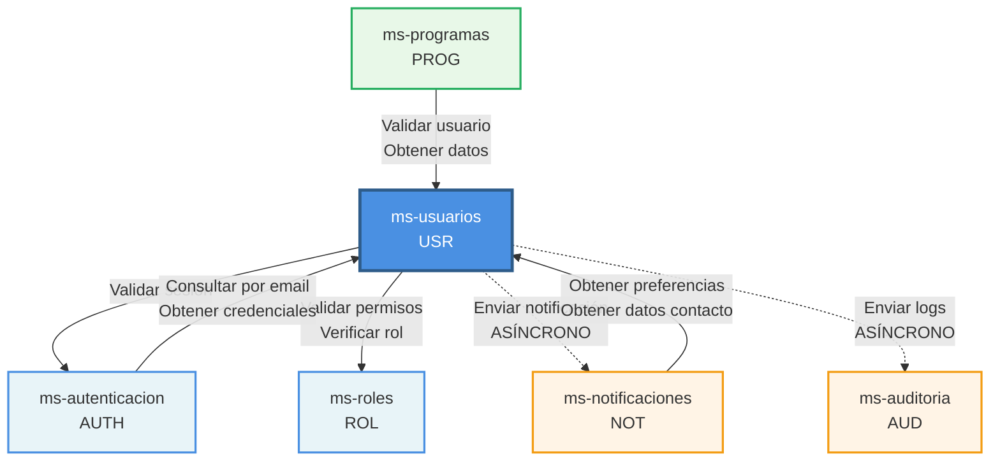
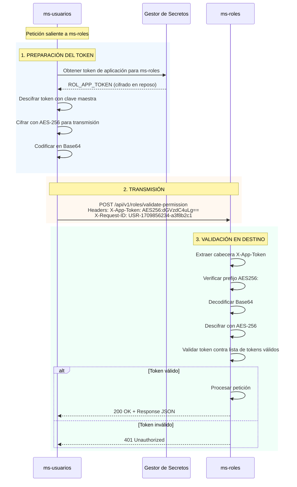
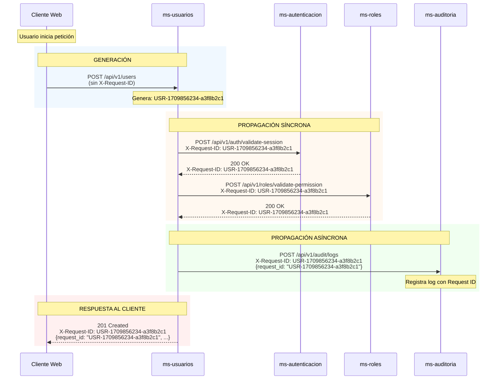
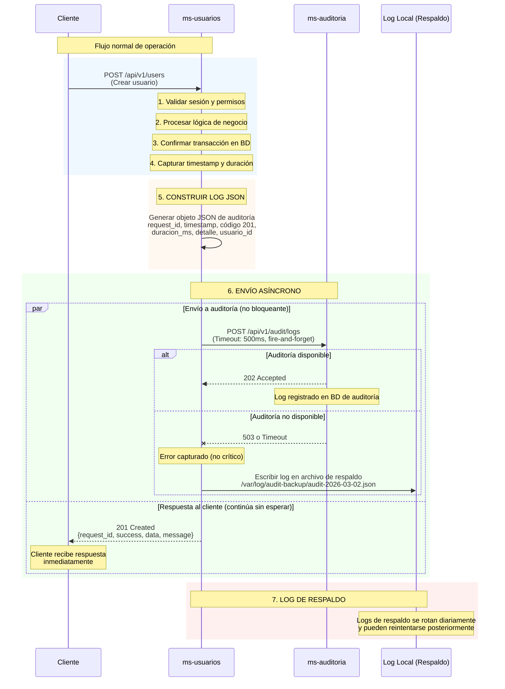
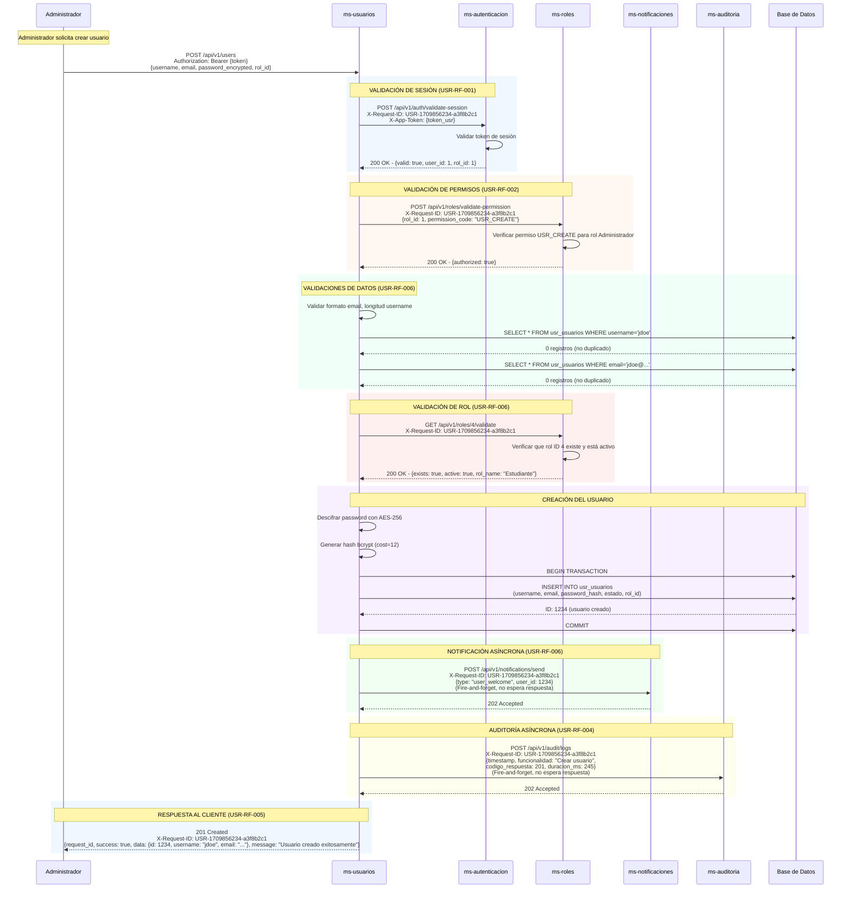
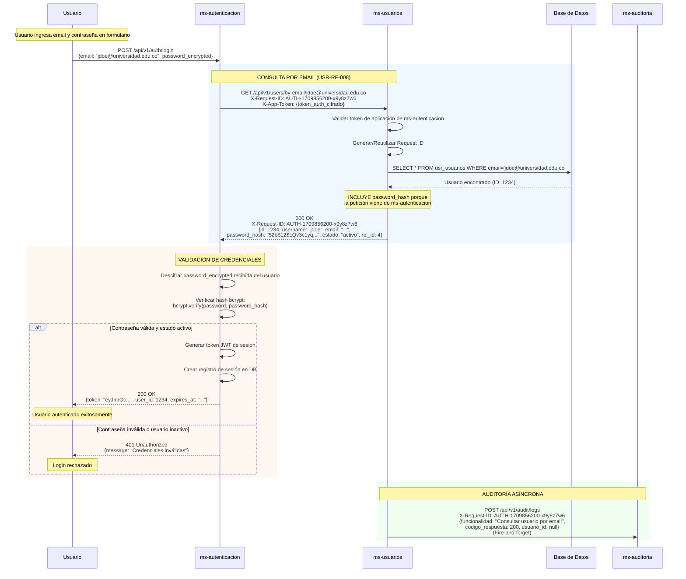
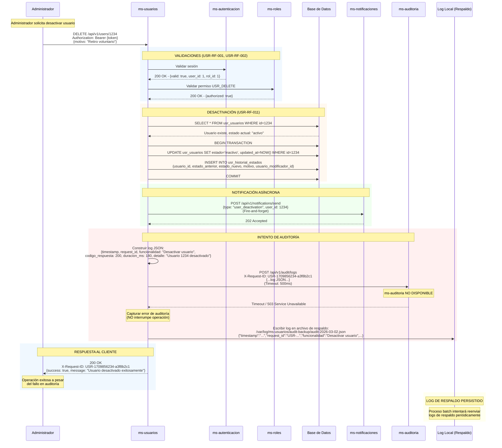

# Diseño de Integración: ms-usuarios [USR]

## Documento de Contratos de Comunicación y Configuración de Seguridad Inter-servicio

| Campo | Detalle |
|-------|---------|
| **Microservicio** | ms-usuarios [USR] |
| **Módulo** | Módulo 1 — Seguridad y Acceso |
| **Versión** | 1.0 |
| **Fecha** | Marzo 2026 |
| **Documentos origen** | ms-usuarios_requisitos_funcionales_detallados.md v1.0<br>ms-usuarios_modelo_datos.md v1.0 |

---

## Tabla de Contenido

1. [Información General](#1-información-general)
2. [Mapa de Integraciones](#2-mapa-de-integraciones)
3. [Contratos de Comunicación Saliente](#3-contratos-de-comunicación-saliente)
4. [Contratos de Comunicación Entrante](#4-contratos-de-comunicación-entrante)
5. [Configuración de Tokens de Aplicación](#5-configuración-de-tokens-de-aplicación)
6. [Flujo de Request ID](#6-flujo-de-request-id)
7. [Flujo de Auditoría](#7-flujo-de-auditoría)
8. [Diagramas de Secuencia](#8-diagramas-de-secuencia)

---

## 1. Información General

### Resumen Ejecutivo

- **Nombre del microservicio:** ms-usuarios
- **Código:** USR
- **Módulo:** Módulo 1 — Seguridad y Acceso
- **Cantidad de servicios integrados:** 7 servicios (4 salientes, 3 entrantes)

**Descripción de integraciones:**

El microservicio ms-usuarios actúa como hub central de información de usuarios del sistema ERP universitario. Se integra con 4 servicios externos de forma saliente para validación de sesiones (ms-autenticacion), autorización (ms-roles), notificaciones (ms-notificaciones) y auditoría (ms-auditoria). A su vez, expone servicios críticos consumidos por 3 microservicios que requieren datos de usuarios: ms-autenticacion para validación de credenciales durante login, ms-programas para validación de coordinadores, y ms-notificaciones para obtener preferencias y datos de contacto. Todas las comunicaciones síncronas utilizan REST/HTTP con JSON, mientras que las comunicaciones con ms-auditoria y ms-notificaciones son asíncronas (fire-and-forget).

---

## 2. Mapa de Integraciones

### Diagrama de Comunicación



### Descripción Narrativa del Mapa de Integraciones

El microservicio ms-usuarios se integra con **7 servicios en total**, distribuidos en 4 servicios salientes (que consume) y 3 servicios entrantes (que lo consumen).

**Integraciones salientes (que ms-usuarios consume):**

1. **ms-autenticacion [AUTH]** - Comunicación **síncrona**: Valida sesiones de usuario antes de procesar cualquier petición (requisito transversal crítico).

2. **ms-roles [ROL]** - Comunicación **síncrona**: Valida permisos por funcionalidad después de validar sesión, y verifica existencia de roles al crear/actualizar usuarios.

3. **ms-notificaciones [NOT]** - Comunicación **asíncrona**: Envía notificaciones cuando se crean, activan, desactivan o suspenden usuarios, o cuando se cambia contraseña.

4. **ms-auditoria [AUD]** - Comunicación **asíncrona**: Registra todas las operaciones del sistema en formato JSON para trazabilidad (fire-and-forget).

**Integraciones entrantes (servicios que consumen ms-usuarios):**

1. **ms-autenticacion [AUTH]** - Comunicación **síncrona**: Consulta usuarios por email para obtener credenciales (incluido password_hash) durante el proceso de login.

2. **ms-programas [PROG]** - Comunicación **síncrona**: Valida existencia de usuarios y obtiene información de coordinadores de programa.

3. **ms-notificaciones [NOT]** - Comunicación **síncrona**: Consulta preferencias de notificación y datos de contacto para envío de notificaciones respetando las preferencias del usuario.

**Dependencias críticas:** Sin ms-autenticacion o ms-roles, el microservicio no puede operar ya que son requisitos transversales obligatorios para validación de sesión y permisos. Sin embargo, puede operar sin ms-notificaciones o ms-auditoria (operaciones asíncronas no críticas).

**Dependencias opcionales:** Las comunicaciones con ms-notificaciones y ms-auditoria son asíncronas y no bloquean el flujo principal. Si estos servicios no están disponibles, ms-usuarios continúa operando normalmente, registrando errores de forma local.

---

## 3. Contratos de Comunicación Saliente

Servicios externos que ms-usuarios consume.

---

### 3.1 ms-autenticacion [AUTH]

#### Operación 1: Validar sesión de usuario

| Campo | Detalle |
|---|---|
| **Servicio destino** | ms-autenticacion [AUTH] |
| **Operación** | Validar token de sesión activa |
| **Método HTTP** | POST |
| **Endpoint sugerido** | `/api/v1/auth/validate-session` |
| **Headers requeridos** | `Authorization: Bearer {token_sesion_usuario}`<br>`X-Request-ID: {request_id}`<br>`X-App-Token: {token_aplicacion_usr_cifrado}`<br>`Content-Type: application/json` |
| **Timeout sugerido** | 3000 ms (3 segundos) |
| **Requisito relacionado** | USR-RF-001 - Validación de sesión de usuario |

**Request JSON:**

```json
{
  "token": "eyJhbGciOiJIUzI1NiIsInR5cCI6IkpXVCJ9...",
  "request_id": "USR-1709856234-a3f8b2c1"
}
```

**Response exitoso (200 OK):**

```json
{
  "request_id": "USR-1709856234-a3f8b2c1",
  "success": true,
  "data": {
    "valid": true,
    "user_id": 1234,
    "username": "jdoe",
    "rol_id": 3,
    "session_expires_at": "2026-03-02T18:30:00Z"
  },
  "message": "Sesión válida",
  "timestamp": "2026-03-02T10:30:45Z"
}
```

**Response error (401 Unauthorized):**

```json
{
  "request_id": "USR-1709856234-a3f8b2c1",
  "success": false,
  "data": null,
  "message": "Sesión no válida o expirada",
  "timestamp": "2026-03-02T10:30:45Z"
}
```

---

### 3.2 ms-roles [ROL]

#### Operación 1: Validar permiso de usuario para funcionalidad

| Campo | Detalle |
|---|---|
| **Servicio destino** | ms-roles [ROL] |
| **Operación** | Verificar si un rol tiene permiso para ejecutar una funcionalidad |
| **Método HTTP** | POST |
| **Endpoint sugerido** | `/api/v1/roles/validate-permission` |
| **Headers requeridos** | `Authorization: Bearer {token_sesion_usuario}`<br>`X-Request-ID: {request_id}`<br>`X-App-Token: {token_aplicacion_usr_cifrado}`<br>`Content-Type: application/json` |
| **Timeout sugerido** | 3000 ms (3 segundos) |
| **Requisito relacionado** | USR-RF-002 - Validación de permisos por funcionalidad |

**Request JSON:**

```json
{
  "rol_id": 3,
  "permission_code": "USR_CREATE",
  "request_id": "USR-1709856234-a3f8b2c1"
}
```

**Response exitoso (200 OK):**

```json
{
  "request_id": "USR-1709856234-a3f8b2c1",
  "success": true,
  "data": {
    "authorized": true,
    "rol_name": "Administrador",
    "permission_name": "Crear usuarios"
  },
  "message": "El rol tiene autorización",
  "timestamp": "2026-03-02T10:30:45Z"
}
```

**Response error (403 Forbidden):**

```json
{
  "request_id": "USR-1709856234-a3f8b2c1",
  "success": false,
  "data": {
    "authorized": false
  },
  "message": "El rol no tiene permiso para esta operación",
  "timestamp": "2026-03-02T10:30:45Z"
}
```

---

#### Operación 2: Verificar existencia y validez de rol

| Campo | Detalle |
|---|---|
| **Servicio destino** | ms-roles [ROL] |
| **Operación** | Validar que un rol existe y está activo |
| **Método HTTP** | GET |
| **Endpoint sugerido** | `/api/v1/roles/{rol_id}/validate` |
| **Headers requeridos** | `Authorization: Bearer {token_sesion_usuario}`<br>`X-Request-ID: {request_id}`<br>`X-App-Token: {token_aplicacion_usr_cifrado}`<br>`Content-Type: application/json` |
| **Timeout sugerido** | 2000 ms (2 segundos) |
| **Requisito relacionado** | USR-RF-006 - Crear nuevo usuario<br>USR-RF-010 - Actualizar datos básicos del usuario |

**Request JSON:**

No aplica para GET (parámetros en URL).

**Response exitoso (200 OK):**

```json
{
  "request_id": "USR-1709856234-a3f8b2c1",
  "success": true,
  "data": {
    "exists": true,
    "active": true,
    "rol_id": 3,
    "rol_name": "Docente",
    "rol_description": "Rol para profesores de la universidad"
  },
  "message": "Rol válido",
  "timestamp": "2026-03-02T10:30:45Z"
}
```

**Response error (404 Not Found):**

```json
{
  "request_id": "USR-1709856234-a3f8b2c1",
  "success": false,
  "data": {
    "exists": false,
    "active": false
  },
  "message": "El rol especificado no existe o está inactivo",
  "timestamp": "2026-03-02T10:30:45Z"
}
```

---

### 3.3 ms-notificaciones [NOT]

#### Operación 1: Enviar notificación de bienvenida

| Campo | Detalle |
|---|---|
| **Servicio destino** | ms-notificaciones [NOT] |
| **Operación** | Enviar notificación de bienvenida a nuevo usuario (ASÍNCRONO) |
| **Método HTTP** | POST |
| **Endpoint sugerido** | `/api/v1/notifications/send` |
| **Headers requeridos** | `X-Request-ID: {request_id}`<br>`X-App-Token: {token_aplicacion_usr_cifrado}`<br>`Content-Type: application/json` |
| **Timeout sugerido** | 1000 ms (1 segundo) - No crítico, fire-and-forget |
| **Requisito relacionado** | USR-RF-006 - Crear nuevo usuario |

**Request JSON:**

```json
{
  "notification_type": "user_welcome",
  "user_id": 1234,
  "priority": "normal",
  "template_code": "WELCOME_USER",
  "data": {
    "username": "jdoe",
    "email": "jdoe@universidad.edu.co",
    "full_name": "John Doe"
  },
  "request_id": "USR-1709856234-a3f8b2c1"
}
```

**Response exitoso (202 Accepted):**

```json
{
  "request_id": "USR-1709856234-a3f8b2c1",
  "success": true,
  "data": {
    "notification_id": "NOT-1709856240-b4c9d3e2",
    "status": "queued"
  },
  "message": "Notificación encolada para envío",
  "timestamp": "2026-03-02T10:30:45Z"
}
```

**Response error (503 Service Unavailable):**

```json
{
  "request_id": "USR-1709856234-a3f8b2c1",
  "success": false,
  "data": null,
  "message": "Servicio de notificaciones temporalmente no disponible",
  "timestamp": "2026-03-02T10:30:45Z"
}
```

**Nota:** Este es un servicio asíncrono. Si falla, ms-usuarios continúa operando normalmente y registra el error localmente.

---

#### Operación 2: Enviar notificación de cambio de estado

| Campo | Detalle |
|---|---|
| **Servicio destino** | ms-notificaciones [NOT] |
| **Operación** | Enviar notificación de desactivación/suspensión/reactivación (ASÍNCRONO) |
| **Método HTTP** | POST |
| **Endpoint sugerido** | `/api/v1/notifications/send` |
| **Headers requeridos** | `X-Request-ID: {request_id}`<br>`X-App-Token: {token_aplicacion_usr_cifrado}`<br>`Content-Type: application/json` |
| **Timeout sugerido** | 1000 ms (1 segundo) - No crítico, fire-and-forget |
| **Requisito relacionado** | USR-RF-011 - Desactivar usuario<br>USR-RF-015 - Cambiar estado de usuario<br>USR-RF-020 - Reactivar usuario |

**Request JSON:**

```json
{
  "notification_type": "user_state_change",
  "user_id": 1234,
  "priority": "high",
  "template_code": "USER_SUSPENDED",
  "data": {
    "username": "jdoe",
    "email": "jdoe@universidad.edu.co",
    "new_state": "suspendido",
    "reason": "Incumplimiento del código de conducta estudiantil"
  },
  "request_id": "USR-1709856234-a3f8b2c1"
}
```

**Response exitoso (202 Accepted):**

```json
{
  "request_id": "USR-1709856234-a3f8b2c1",
  "success": true,
  "data": {
    "notification_id": "NOT-1709856240-b4c9d3e2",
    "status": "queued"
  },
  "message": "Notificación encolada para envío",
  "timestamp": "2026-03-02T10:30:45Z"
}
```

---

#### Operación 3: Enviar notificación de cambio de contraseña

| Campo | Detalle |
|---|---|
| **Servicio destino** | ms-notificaciones [NOT] |
| **Operación** | Enviar notificación de seguridad por cambio de contraseña (ASÍNCRONO) |
| **Método HTTP** | POST |
| **Endpoint sugerido** | `/api/v1/notifications/send` |
| **Headers requeridos** | `X-Request-ID: {request_id}`<br>`X-App-Token: {token_aplicacion_usr_cifrado}`<br>`Content-Type: application/json` |
| **Timeout sugerido** | 1000 ms (1 segundo) - No crítico, fire-and-forget |
| **Requisito relacionado** | USR-RF-022 - Actualizar contraseña de usuario |

**Request JSON:**

```json
{
  "notification_type": "user_security_alert",
  "user_id": 1234,
  "priority": "high",
  "template_code": "PASSWORD_CHANGED",
  "data": {
    "username": "jdoe",
    "email": "jdoe@universidad.edu.co",
    "change_timestamp": "2026-03-02T10:30:45Z",
    "ip_address": "192.168.1.100"
  },
  "request_id": "USR-1709856234-a3f8b2c1"
}
```

**Response exitoso (202 Accepted):**

```json
{
  "request_id": "USR-1709856234-a3f8b2c1",
  "success": true,
  "data": {
    "notification_id": "NOT-1709856240-b4c9d3e2",
    "status": "queued"
  },
  "message": "Notificación encolada para envío",
  "timestamp": "2026-03-02T10:30:45Z"
}
```

---

### 3.4 ms-auditoria [AUD]

#### Operación 1: Enviar log de operación

| Campo | Detalle |
|---|---|
| **Servicio destino** | ms-auditoria [AUD] |
| **Operación** | Registrar log de auditoría de operación (ASÍNCRONO) |
| **Método HTTP** | POST |
| **Endpoint sugerido** | `/api/v1/audit/logs` |
| **Headers requeridos** | `X-Request-ID: {request_id}`<br>`X-App-Token: {token_aplicacion_usr_cifrado}`<br>`Content-Type: application/json` |
| **Timeout sugerido** | 500 ms (0.5 segundos) - No crítico, fire-and-forget |
| **Requisito relacionado** | USR-RF-004 - Registro de auditoría y logs en formato JSON |

**Request JSON:**

```json
{
  "timestamp": "2026-03-02T10:30:45.123Z",
  "request_id": "USR-1709856234-a3f8b2c1",
  "microservicio": "ms-usuarios",
  "funcionalidad": "Crear usuario",
  "metodo": "POST",
  "endpoint": "/api/v1/users",
  "codigo_respuesta": 201,
  "duracion_ms": 245,
  "usuario_id": 1,
  "usuario_username": "admin.sistema",
  "usuario_rol": "Administrador",
  "detalle": "Usuario 'jdoe' creado exitosamente con rol Estudiante",
  "ip_address": "192.168.1.100",
  "user_agent": "Mozilla/5.0 (Windows NT 10.0; Win64; x64) AppleWebKit/537.36"
}
```

**Response exitoso (202 Accepted):**

```json
{
  "request_id": "USR-1709856234-a3f8b2c1",
  "success": true,
  "data": {
    "log_id": "AUD-1709856240-c5d0e4f3",
    "status": "queued"
  },
  "message": "Log registrado exitosamente",
  "timestamp": "2026-03-02T10:30:45Z"
}
```

**Response error (503 Service Unavailable):**

```json
{
  "request_id": "USR-1709856234-a3f8b2c1",
  "success": false,
  "data": null,
  "message": "Servicio de auditoría temporalmente no disponible",
  "timestamp": "2026-03-02T10:30:45Z"
}
```

**Nota:** Este es un servicio asíncrono fire-and-forget. Si falla, ms-usuarios registra el log localmente en archivo de respaldo y continúa operando normalmente.

---

## 4. Contratos de Comunicación Entrante

Servicios que ms-usuarios expone para consumo de otros microservicios.

---

### 4.1 Consumido por ms-autenticacion [AUTH]

#### Operación 1: Consultar usuario por email (incluye password_hash)

| Campo | Detalle |
|---|---|
| **Servicio origen** | ms-autenticacion [AUTH] |
| **Operación** | Obtener usuario y credenciales por correo electrónico para validación de login |
| **Método HTTP** | GET |
| **Endpoint expuesto** | `/api/v1/users/by-email/{email}` |
| **Headers requeridos** | `X-Request-ID: {request_id}`<br>`X-App-Token: {token_aplicacion_auth_cifrado}`<br>`Content-Type: application/json` |
| **Requisito relacionado** | USR-RF-008 - Consultar usuario por correo electrónico |

**Request JSON:**

No aplica para GET (parámetros en URL).

**Response exitoso (200 OK):**

```json
{
  "request_id": "AUTH-1709856234-x9y8z7w6",
  "success": true,
  "data": {
    "id": 1234,
    "username": "jdoe",
    "email": "jdoe@universidad.edu.co",
    "password_hash": "$2b$12$LQv3c1yqBWVHxkd0LHAkCOYz6TcN5hIHNQ4Wp/KKXy5aFCEUcHPqK",
    "estado": "activo",
    "rol_id": 4,
    "created_at": "2026-01-15T08:00:00Z",
    "updated_at": "2026-03-01T10:15:30Z"
  },
  "message": "Usuario encontrado",
  "timestamp": "2026-03-02T10:30:45Z"
}
```

**Response error (404 Not Found):**

```json
{
  "request_id": "AUTH-1709856234-x9y8z7w6",
  "success": false,
  "data": null,
  "message": "Usuario no encontrado",
  "timestamp": "2026-03-02T10:30:45Z"
}
```

**Nota importante:** Este endpoint SOLO incluye el campo `password_hash` cuando la petición proviene de ms-autenticacion (validado mediante token de aplicación). Para cualquier otro consumidor, el password_hash se excluye de la respuesta.

---

### 4.2 Consumido por ms-programas [PROG]

#### Operación 1: Validar existencia de usuario

| Campo | Detalle |
|---|---|
| **Servicio origen** | ms-programas [PROG] |
| **Operación** | Verificar si un usuario existe y obtener su estado |
| **Método HTTP** | GET |
| **Endpoint expuesto** | `/api/v1/users/{user_id}/validate` |
| **Headers requeridos** | `X-Request-ID: {request_id}`<br>`X-App-Token: {token_aplicacion_prog_cifrado}`<br>`Content-Type: application/json` |
| **Requisito relacionado** | USR-RF-021 - Validar existencia de usuario (servicio interno) |

**Request JSON:**

No aplica para GET (parámetros en URL).

**Response exitoso (200 OK):**

```json
{
  "request_id": "PROG-1709856234-p1q2r3s4",
  "success": true,
  "data": {
    "existe": true,
    "estado": "activo",
    "user_id": 1234,
    "username": "jdoe",
    "full_name": "John Doe"
  },
  "message": "Usuario válido",
  "timestamp": "2026-03-02T10:30:45Z"
}
```

**Response cuando no existe (200 OK):**

```json
{
  "request_id": "PROG-1709856234-p1q2r3s4",
  "success": true,
  "data": {
    "existe": false
  },
  "message": "Usuario no encontrado",
  "timestamp": "2026-03-02T10:30:45Z"
}
```

**Nota:** Este endpoint retorna 200 OK incluso cuando el usuario no existe. El campo `existe` en el data indica el resultado de la validación.

---

#### Operación 2: Obtener datos básicos de usuario

| Campo | Detalle |
|---|---|
| **Servicio origen** | ms-programas [PROG] |
| **Operación** | Obtener información básica de un usuario |
| **Método HTTP** | GET |
| **Endpoint expuesto** | `/api/v1/users/{user_id}` |
| **Headers requeridos** | `X-Request-ID: {request_id}`<br>`X-App-Token: {token_aplicacion_prog_cifrado}`<br>`Content-Type: application/json` |
| **Requisito relacionado** | USR-RF-007 - Consultar usuario por identificador |

**Request JSON:**

No aplica para GET (parámetros en URL).

**Response exitoso (200 OK):**

```json
{
  "request_id": "PROG-1709856234-p1q2r3s4",
  "success": true,
  "data": {
    "id": 1234,
    "username": "jdoe",
    "email": "jdoe@universidad.edu.co",
    "estado": "activo",
    "rol_id": 4,
    "created_at": "2026-01-15T08:00:00Z",
    "updated_at": "2026-03-01T10:15:30Z"
  },
  "message": "Usuario encontrado",
  "timestamp": "2026-03-02T10:30:45Z"
}
```

**Response error (404 Not Found):**

```json
{
  "request_id": "PROG-1709856234-p1q2r3s4",
  "success": false,
  "data": null,
  "message": "Usuario no encontrado",
  "timestamp": "2026-03-02T10:30:45Z"
}
```

---

### 4.3 Consumido por ms-notificaciones [NOT]

#### Operación 1: Consultar preferencias de notificación

| Campo | Detalle |
|---|---|
| **Servicio origen** | ms-notificaciones [NOT] |
| **Operación** | Obtener preferencias de notificación de un usuario |
| **Método HTTP** | GET |
| **Endpoint expuesto** | `/api/v1/users/{user_id}/notification-preferences` |
| **Headers requeridos** | `X-Request-ID: {request_id}`<br>`X-App-Token: {token_aplicacion_not_cifrado}`<br>`Content-Type: application/json` |
| **Requisito relacionado** | USR-RF-018 - Consultar preferencias de notificación del usuario |

**Request JSON:**

No aplica para GET (parámetros en URL).

**Response exitoso (200 OK):**

```json
{
  "request_id": "NOT-1709856234-n5o6p7q8",
  "success": true,
  "data": {
    "user_id": 1234,
    "notif_email": true,
    "notif_sms": false,
    "notif_push": true,
    "canal_preferido": "email",
    "horario_no_molestar_inicio": "23:00:00",
    "horario_no_molestar_fin": "07:00:00"
  },
  "message": "Preferencias de notificación obtenidas",
  "timestamp": "2026-03-02T10:30:45Z"
}
```

**Response con preferencias por defecto (200 OK):**

```json
{
  "request_id": "NOT-1709856234-n5o6p7q8",
  "success": true,
  "data": {
    "user_id": 1234,
    "notif_email": true,
    "notif_sms": false,
    "notif_push": true,
    "canal_preferido": "email",
    "horario_no_molestar_inicio": null,
    "horario_no_molestar_fin": null
  },
  "message": "Preferencias por defecto (usuario sin configuración personalizada)",
  "timestamp": "2026-03-02T10:30:45Z"
}
```

---

#### Operación 2: Obtener datos de contacto de usuario

| Campo | Detalle |
|---|---|
| **Servicio origen** | ms-notificaciones [NOT] |
| **Operación** | Obtener perfil extendido con datos de contacto |
| **Método HTTP** | GET |
| **Endpoint expuesto** | `/api/v1/users/{user_id}/profile` |
| **Headers requeridos** | `X-Request-ID: {request_id}`<br>`X-App-Token: {token_aplicacion_not_cifrado}`<br>`Content-Type: application/json` |
| **Requisito relacionado** | USR-RF-013 - Consultar perfil extendido de usuario |

**Request JSON:**

No aplica para GET (parámetros en URL).

**Response exitoso (200 OK):**

```json
{
  "request_id": "NOT-1709856234-n5o6p7q8",
  "success": true,
  "data": {
    "user_id": 1234,
    "tipo_documento": {
      "id": 1,
      "codigo": "CC",
      "nombre": "Cédula de Ciudadanía"
    },
    "numero_documento": "1001234567",
    "primer_nombre": "John",
    "segundo_nombre": "Michael",
    "primer_apellido": "Doe",
    "segundo_apellido": "Smith",
    "fecha_nacimiento": "1995-05-15",
    "genero": "masculino",
    "direccion_residencia": "Calle 100 # 15-20, Apto 301",
    "ciudad": "Bogotá",
    "departamento": "Cundinamarca",
    "telefono_fijo": "6013456789",
    "telefono_movil": "3101234567",
    "contacto_emergencia_nombre": "Jane Doe",
    "contacto_emergencia_telefono": "3109876543",
    "email": "jdoe@universidad.edu.co"
  },
  "message": "Perfil de usuario obtenido",
  "timestamp": "2026-03-02T10:30:45Z"
}
```

**Response error (404 Not Found):**

```json
{
  "request_id": "NOT-1709856234-n5o6p7q8",
  "success": false,
  "data": null,
  "message": "Perfil no encontrado para el usuario especificado",
  "timestamp": "2026-03-02T10:30:45Z"
}
```

---

## 5. Configuración de Tokens de Aplicación

### Token Propio del Microservicio

| Campo | Detalle |
|---|---|
| **Nombre del token** | `USR_APP_TOKEN` |
| **Descripción** | Token de aplicación único que identifica a ms-usuarios ante otros microservicios |
| **Formato de almacenamiento** | Cifrado con AES-256, almacenado en variable de entorno o gestor de secretos (ej: Azure Key Vault, AWS Secrets Manager) |
| **Longitud sugerida** | 256 bits (32 bytes) codificado en Base64 = 44 caracteres |
| **Rotación** | Manual por administrador del sistema (no expira automáticamente) |
| **Uso** | Se incluye en la cabecera `X-App-Token` de todas las peticiones salientes a otros servicios |

**Ejemplo de token cifrado (Base64):**
```
X-App-Token: AES256:dGVzdF90b2tlbl9tc191c3Vhcmlvc19jaWZyYWRvX2Jhc2U2NA==
```

---

### Tokens de Otros Servicios que ms-usuarios Necesita

| Servicio | Propósito | Nombre variable | Uso en cabecera |
|----------|-----------|-----------------|-----------------|
| ms-autenticacion [AUTH] | Validar sesiones y autenticar peticiones a AUTH | `AUTH_APP_TOKEN` | `X-App-Token: {token_cifrado}` |
| ms-roles [ROL] | Validar permisos y verificar existencia de roles | `ROL_APP_TOKEN` | `X-App-Token: {token_cifrado}` |
| ms-notificaciones [NOT] | Enviar notificaciones asíncronas | `NOT_APP_TOKEN` | `X-App-Token: {token_cifrado}` |
| ms-auditoria [AUD] | Enviar logs de auditoría | `AUD_APP_TOKEN` | `X-App-Token: {token_cifrado}` |

---

### Formato de Transmisión de Token

Los tokens de aplicación se transmiten cifrados en la cabecera HTTP `X-App-Token` con el siguiente formato:

```
X-App-Token: AES256:{token_base64_cifrado}
```

**Proceso de cifrado:**
1. El token original se cifra con AES-256 usando una clave maestra compartida entre servicios
2. El resultado del cifrado se codifica en Base64
3. Se antepone el prefijo `AES256:` para indicar el algoritmo de cifrado
4. Se transmite en la cabecera HTTP

**Proceso de descifrado (en el servicio receptor):**
1. El servicio extrae el valor de la cabecera `X-App-Token`
2. Verifica que el prefijo sea `AES256:`
3. Extrae la porción Base64 después del prefijo
4. Decodifica de Base64 a bytes
5. Descifra con AES-256 usando la clave maestra
6. Valida el token descifrado contra su lista de tokens válidos

---

### Diagrama de Flujo de Validación de Token



### Descripción del Flujo de Validación de Token

**Flujo de petición saliente (ms-usuarios → ms-roles):**

1. **Preparación del token:** ms-usuarios obtiene el token de aplicación de ms-roles desde el gestor de secretos (almacenado cifrado). Lo descifra localmente con la clave maestra, luego lo cifra nuevamente con AES-256 para transmisión segura y lo codifica en Base64, agregando el prefijo `AES256:`.

2. **Transmisión:** El token cifrado se incluye en la cabecera `X-App-Token` de la petición HTTP junto con el Request ID para trazabilidad.

3. **Validación en destino:** ms-roles recibe la petición, extrae la cabecera `X-App-Token`, verifica el prefijo, decodifica Base64, descifra con AES-256 usando la clave maestra compartida y valida el token descifrado contra su lista de tokens de aplicación autorizados. Si es válido, procesa la petición; si no, retorna 401 Unauthorized.

**Flujo de petición entrante (ms-autenticacion → ms-usuarios):**

El proceso es similar pero invertido: ms-autenticacion prepara su token de aplicación, lo envía cifrado a ms-usuarios, y ms-usuarios lo valida antes de procesar la petición y retornar los datos solicitados (como el usuario con password_hash para validación de login).

---

## 6. Flujo de Request ID

### Formato del Request ID

El Request ID de ms-usuarios sigue el formato estándar del sistema:

```
USR-{timestamp}-{aleatorio8}
```

**Componentes:**
- **Prefijo:** `USR` (código del microservicio)
- **Timestamp:** Unix timestamp en segundos desde epoch (1709856234)
- **Aleatorio:** Identificador alfanumérico de 8 caracteres (a3f8b2c1)

**Ejemplo:** `USR-1709856234-a3f8b2c1`

---

### Reglas de Generación y Reutilización

| Escenario | Acción |
|-----------|--------|
| **Petición HTTP entrante sin Request ID** | ms-usuarios genera un nuevo Request ID con formato `USR-{timestamp}-{aleatorio8}` |
| **Petición HTTP entrante CON Request ID** | ms-usuarios reutiliza el Request ID existente (proviene de otro microservicio) |
| **Llamada a microservicio externo** | ms-usuarios propaga el Request ID actual en la cabecera `X-Request-ID` |
| **Respuesta HTTP al cliente** | ms-usuarios incluye el Request ID en cabecera `X-Request-ID` y en el cuerpo JSON (`request_id` field) |
| **Registro de log de auditoría** | ms-usuarios incluye el Request ID en el log JSON enviado a ms-auditoria |

---

### Diagrama de Propagación de Request ID



### Descripción del Flujo de Request ID

**1. Generación del Request ID:**
Cuando un cliente web realiza una petición HTTP a ms-usuarios sin incluir la cabecera `X-Request-ID`, el microservicio genera automáticamente un nuevo identificador único con el formato `USR-{timestamp}-{aleatorio8}`. Este identificador se asocia a toda la cadena de procesamiento.

**2. Propagación síncrona a servicios dependientes:**
ms-usuarios incluye el Request ID en la cabecera `X-Request-ID` de todas las llamadas síncronas a servicios externos (ms-autenticacion para validar sesión y ms-roles para validar permisos). Cada servicio procesa la petición, realiza su lógica de negocio y devuelve la respuesta incluyendo el mismo Request ID en la cabecera, manteniendo la trazabilidad de la petición a través de múltiples servicios.

**3. Propagación asíncrona a auditoría:**
Al finalizar el procesamiento, ms-usuarios construye un log JSON que incluye el Request ID tanto en la cabecera HTTP como en el cuerpo del mensaje, enviándolo de forma asíncrona a ms-auditoria. Esto permite correlacionar los logs de auditoría con las peticiones originales sin bloquear la respuesta al usuario.

**4. Respuesta al cliente:**
Finalmente, ms-usuarios retorna la respuesta al cliente incluyendo el Request ID tanto en la cabecera HTTP `X-Request-ID` como en el campo `request_id` del cuerpo JSON. Esto permite al cliente rastrear su petición en caso de problemas o para propósitos de debugging.

**Reutilización de Request ID existente:**
Si la petición inicial proviene de otro microservicio (por ejemplo, ms-autenticacion consultando un usuario por email), la petición ya incluirá un Request ID (ej: `AUTH-1709856200-x9y8z7w6`). En este caso, ms-usuarios no genera uno nuevo, sino que reutiliza el ID recibido para toda la cadena de procesamiento, garantizando trazabilidad completa desde el servicio origen hasta todos los servicios involucrados.

---

## 7. Flujo de Auditoría

### Estructura del Log JSON

Todos los logs de auditoría enviados a ms-auditoria siguen la siguiente estructura estándar:

```json
{
  "timestamp": "2026-03-02T10:30:45.123Z",
  "request_id": "USR-1709856234-a3f8b2c1",
  "microservicio": "ms-usuarios",
  "funcionalidad": "Crear nuevo usuario",
  "metodo": "POST",
  "endpoint": "/api/v1/users",
  "codigo_respuesta": 201,
  "duracion_ms": 245,
  "usuario_id": 1,
  "usuario_username": "admin.sistema",
  "usuario_rol": "Administrador",
  "detalle": "Usuario 'jdoe' (ID: 1234) creado exitosamente con rol Estudiante (ID: 4). Email: jdoe@universidad.edu.co",
  "ip_address": "192.168.1.100",
  "user_agent": "Mozilla/5.0 (Windows NT 10.0; Win64; x64) AppleWebKit/537.36 (KHTML, like Gecko) Chrome/120.0.0.0 Safari/537.36",
  "metadata": {
    "nuevo_usuario_id": 1234,
    "nuevo_usuario_username": "jdoe",
    "nuevo_usuario_rol_id": 4
  }
}
```

**Campos obligatorios:**
- `timestamp`: Fecha y hora ISO 8601 en UTC con milisegundos
- `request_id`: Identificador de rastreo de la petición
- `microservicio`: Nombre del microservicio que genera el log
- `funcionalidad`: Descripción de la operación ejecutada
- `metodo`: Método HTTP (GET, POST, PUT, DELETE)
- `endpoint`: Ruta del endpoint invocado
- `codigo_respuesta`: Código HTTP de la respuesta (200, 201, 400, 401, 403, 404, 500, 503)
- `duracion_ms`: Duración total de la operación en milisegundos
- `usuario_id`: ID del usuario que realizó la operación (null si es comunicación inter-servicio)
- `detalle`: Descripción textual de lo que ocurrió

**Campos opcionales:**
- `usuario_username`: Nombre de usuario (para logs legibles)
- `usuario_rol`: Nombre del rol del usuario
- `ip_address`: Dirección IP del cliente
- `user_agent`: User agent del navegador/cliente
- `metadata`: Objeto JSON con datos adicionales específicos de la operación

---

### Momento de Generación del Log

| Evento | Momento de generación | Observaciones |
|--------|----------------------|---------------|
| **Operación exitosa** | Inmediatamente después de confirmar la operación en BD y antes de enviar respuesta al cliente | Se captura el código 200/201 y el tiempo total |
| **Operación fallida** | Inmediatamente después de detectar el error y antes de enviar respuesta de error | Se captura el código 400/401/403/404/500/503 y el detalle del error |
| **Validación fallida** | Después de la validación (sesión, permisos, datos) | Se registra el intento no autorizado o datos inválidos |
| **Error técnico** | Después de capturar la excepción y antes de enviar error 500 | Se incluye información del error en el campo detalle |

**Regla general:** El log se genera DESPUÉS de completar el procesamiento (exitoso o fallido) pero ANTES de enviar la respuesta HTTP al cliente. El envío del log a ms-auditoria es asíncrono y no bloquea la respuesta.

---

### Comportamiento ante Fallos del Servicio de Auditoría

| Escenario | Comportamiento de ms-usuarios |
|-----------|-------------------------------|
| **ms-auditoria no responde (timeout)** | Registra el log localmente en archivo de respaldo en formato JSON. Continúa operando normalmente y envía respuesta al cliente. |
| **ms-auditoria retorna error 503** | Registra el log localmente en archivo de respaldo. Continúa operando normalmente. |
| **Error de red al invocar ms-auditoria** | Captura la excepción, registra el log localmente. Continúa operando normalmente. |
| **Construcción del log falla** | Genera un log simplificado con campos mínimos (timestamp, request_id, error). Lo registra localmente. Continúa operando normalmente. |

**Importante:** El fallo del servicio de auditoría NUNCA debe interrumpir la operación de ms-usuarios ni afectar la respuesta al cliente. Los logs de respaldo locales deben rotarse periódicamente para evitar consumo excesivo de disco.

**Ubicación sugerida de logs de respaldo:**
```
/var/log/ms-usuarios/audit-backup/audit-{fecha}.json
```

**Formato de logs de respaldo (una línea JSON por log):**
```json
{"timestamp":"2026-03-02T10:30:45.123Z","request_id":"USR-1709856234-a3f8b2c1","microservicio":"ms-usuarios","funcionalidad":"Crear usuario","metodo":"POST","codigo_respuesta":201,"usuario_id":1,"detalle":"Usuario creado exitosamente"}
{"timestamp":"2026-03-02T10:31:12.456Z","request_id":"USR-1709856235-b4f9c3d2","microservicio":"ms-usuarios","funcionalidad":"Consultar usuario","metodo":"GET","codigo_respuesta":200,"usuario_id":5,"detalle":"Usuario consultado por ID"}
```

---

### Diagrama de Flujo Asíncrono de Envío de Logs



### Descripción del Flujo Asíncrono de Auditoría

**1. Procesamiento de la operación:**
Cuando ms-usuarios recibe una petición (por ejemplo, crear un nuevo usuario), primero valida la sesión y permisos, ejecuta la lógica de negocio (inserción en base de datos), confirma la transacción y captura los datos necesarios para el log: timestamp de inicio y fin, código de respuesta, duración en milisegundos y detalles de la operación.

**2. Construcción del log JSON:**
Después de confirmar el éxito o fallo de la operación pero ANTES de enviar la respuesta al cliente, ms-usuarios construye el objeto JSON completo del log de auditoría con toda la información requerida: timestamp, request_id, funcionalidad, método HTTP, código de respuesta, duración, usuario que realiza la operación, IP, detalle descriptivo y metadata adicional.

**3. Envío asíncrono sin bloqueo:**
ms-usuarios inicia el envío del log a ms-auditoria de forma asíncrona en un thread separado (fire-and-forget) con un timeout corto de 500ms. Simultáneamente y SIN ESPERAR la respuesta de ms-auditoria, envía inmediatamente la respuesta HTTP al cliente (201 Created en caso de éxito). Esto garantiza que el proceso de auditoría no afecta el tiempo de respuesta percibido por el usuario.

**4. Manejo de fallos de auditoría:**
Si ms-auditoria responde exitosamente (202 Accepted), el log se registra en la base de datos de auditoría y el flujo finaliza. Si ms-auditoria no está disponible (503), no responde (timeout) o hay error de red, ms-usuarios captura la excepción, la registra en logs de aplicación y escribe el log JSON en un archivo local de respaldo con formato JSONL (una línea por log). El cliente y la operación NO se ven afectados en absoluto.

**5. Rotación y reintento de logs de respaldo:**
Los logs almacenados localmente en archivos de respaldo se rotan diariamente (ej: `audit-2026-03-02.json`, `audit-2026-03-03.json`). Un proceso batch programado puede leer estos archivos periódicamente y reintentar el envío a ms-auditoria cuando esté disponible, garantizando que ningún log de auditoría se pierda definitivamente.

---

## 8. Diagramas de Secuencia

### 8.1 Flujo Complejo: Crear Nuevo Usuario (Flujo con Mayor Integración)

Este es el flujo más complejo del microservicio, involucrando 5 servicios externos.



### Descripción del Flujo de Creación de Usuario

**Actores participantes:** Administrador (cliente), ms-usuarios, ms-autenticacion, ms-roles, ms-notificaciones, ms-auditoria y Base de Datos PostgreSQL.

**Validaciones ejecutadas:** La operación comienza con la validación de sesión consultando ms-autenticacion para confirmar que el token Bearer es válido y obtener el user_id y rol_id del usuario autenticado. Luego se valida con ms-roles que el rol del usuario tiene el permiso `USR_CREATE` para crear usuarios. ms-usuarios valida el formato del email, longitud del username y realiza consultas a la base de datos para verificar que ni el username ni el email estén duplicados. Finalmente, se valida con ms-roles que el rol_id que se asignará al nuevo usuario existe y está activo.

**Servicios invocados:** Se invocan 2 servicios de forma **síncrona crítica** (ms-autenticacion para sesión y ms-roles para permisos y validación de rol), y 2 servicios de forma **asíncrona no bloqueante** (ms-notificaciones para enviar email de bienvenida y ms-auditoria para registrar la operación).

**Datos intercambiados:** Entre ms-usuarios y ms-autenticacion se intercambia el token de sesión y se recibe el user_id y rol_id del usuario autenticado. Entre ms-usuarios y ms-roles se envía el rol_id y código de permiso, recibiendo confirmación de autorización y validez del rol. Entre ms-usuarios y ms-notificaciones se envía el tipo de notificación, user_id del nuevo usuario y datos para el template. Entre ms-usuarios y ms-auditoria se envía el log completo en JSON con timestamp, request_id, funcionalidad, código de respuesta y duración.

**Resultado final:** Si todas las validaciones son exitosas, se descifra la contraseña recibida (cifrada con AES-256), se genera un hash bcrypt con factor de costo 12, se inserta el registro en la tabla usr_usuarios con estado "activo", se envían las notificaciones y logs de forma asíncrona, y finalmente se retorna al administrador una respuesta 201 Created con los datos del usuario creado (excluyendo el password_hash), incluyendo el request_id en cabecera y cuerpo JSON para trazabilidad completa. Todo el flujo tarda aproximadamente 245ms.

---

### 8.2 Flujo de Consulta: Validación de Credenciales para Login

Este flujo es consumido por ms-autenticacion durante el proceso de inicio de sesión.



### Descripción del Flujo de Validación de Credenciales

**Actores participantes:** Usuario final (cliente web), ms-autenticacion, ms-usuarios, Base de Datos y ms-auditoria.

**Validaciones ejecutadas:** ms-usuarios valida el token de aplicación en la cabecera `X-App-Token` para confirmar que la petición proviene de ms-autenticacion (único servicio autorizado a recibir el password_hash). Luego consulta la base de datos filtrando por email. Si el usuario existe, ms-autenticacion valida la contraseña descifrada contra el hash bcrypt almacenado y verifica que el estado del usuario sea "activo".

**Servicios invocados:** El usuario invoca ms-autenticacion, que a su vez invoca ms-usuarios de forma **síncrona**. ms-usuarios invoca ms-auditoria de forma **asíncrona** para registrar la consulta.

**Datos intercambiados:** El usuario envía email y contraseña cifrada a ms-autenticacion. ms-autenticacion solicita a ms-usuarios el registro completo del usuario por email. ms-usuarios retorna TODOS los campos del usuario incluyendo el `password_hash` (exclusivamente para ms-autenticacion). ms-autenticacion valida las credenciales y retorna un token JWT al usuario o un error 401.

**Resultado final:** Si las credenciales son válidas y el usuario está activo, ms-autenticacion genera un token JWT de sesión con tiempo de expiración y lo retorna al usuario, quien puede usarlo en peticiones subsecuentes. Si las credenciales son inválidas o el usuario está inactivo/suspendido, se retorna 401 Unauthorized. La consulta a ms-usuarios se registra en auditoría con el request_id original que proviene de ms-autenticacion, manteniendo la trazabilidad completa del flujo de login. Todo el flujo tarda aproximadamente 150ms.

---

### 8.3 Flujo de Auditoría Asíncrona: Desactivar Usuario

Este flujo muestra cómo funciona la auditoría asíncrona ante fallos del servicio de auditoría.



### Descripción del Flujo de Auditoría con Fallback

**Actores participantes:** Administrador, ms-usuarios, ms-autenticacion, ms-roles, Base de Datos, ms-notificaciones, ms-auditoria y sistema de archivos local (log de respaldo).

**Validaciones ejecutadas:** Validación estándar de sesión con ms-autenticacion y validación de permiso `USR_DELETE` con ms-roles. Validación de que el usuario a desactivar existe y no está ya en estado "inactivo". Validación de que se proporciona un motivo obligatorio para la desactivación.

**Servicios invocados:** Validaciones síncronas con ms-autenticacion y ms-roles. Notificación asíncrona a ms-notificaciones (exitosa). Intento de auditoría asíncrona a ms-auditoria (falla por servicio no disponible).

**Datos intercambiados:** Tokens de sesión y aplicación, validaciones de permiso, actualización de estado en base de datos con registro en historial, envío de notificación al usuario desactivado, y construcción de log completo en JSON con todos los detalles de la operación (timestamp, request_id, funcionalidad, código 200, duración 180ms, detalle descriptivo, usuario que realiza la acción).

**Resultado final:** A pesar de que ms-auditoria no está disponible y retorna timeout o 503, ms-usuarios completa exitosamente la operación de desactivación: actualiza el estado del usuario a "inactivo" en la base de datos, registra el cambio en el historial con el motivo proporcionado, envía la notificación al usuario, y retorna 200 OK al administrador. El log de auditoría que no pudo enviarse se escribe en un archivo local de respaldo en formato JSONL (`/var/log/ms-usuarios/audit-backup/audit-2026-03-02.json`). Un proceso batch programado leerá periódicamente estos archivos de respaldo e intentará reenviar los logs a ms-auditoria cuando esté disponible nuevamente, garantizando que ningún evento de auditoría se pierda permanentemente. El cliente no percibe ningún impacto por el fallo del servicio de auditoría.

---

## Conclusiones

Este documento define completamente la estrategia de integración del microservicio ms-usuarios con los demás componentes del sistema ERP universitário. Las principales características del diseño de integración son:

**Seguridad:** Todas las comunicaciones inter-servicio utilizan tokens de aplicación cifrados con AES-256, garantizando autenticación y autorización entre microservicios.

**Trazabilidad:** El Request ID se propaga a través de toda la cadena de llamadas, permitiendo rastrear peticiones complejas que atraviesan múltiples servicios.

**Resiliencia:** Las comunicaciones asíncronas (notificaciones y auditoría) utilizan el patrón fire-and-forget con fallback a almacenamiento local, garantizando que fallos en servicios no críticos no afecten la disponibilidad del sistema.

**Estandarización:** Todos los contratos siguen la misma estructura de respuesta estándar con request_id, success, data, message y timestamp, facilitando el consumo por parte de clientes y otros microservicios.

**Observabilidad:** Los logs de auditoría en formato JSON estructurado permiten análisis, alertas y trazabilidad completa de todas las operaciones del sistema.

El próximo paso en el desarrollo es la implementación de estos contratos en el código del microservicio, configuración de los tokens de aplicación en el gestor de secretos, y pruebas de integración end-to-end con los servicios dependientes.

---

**Fin del documento**
