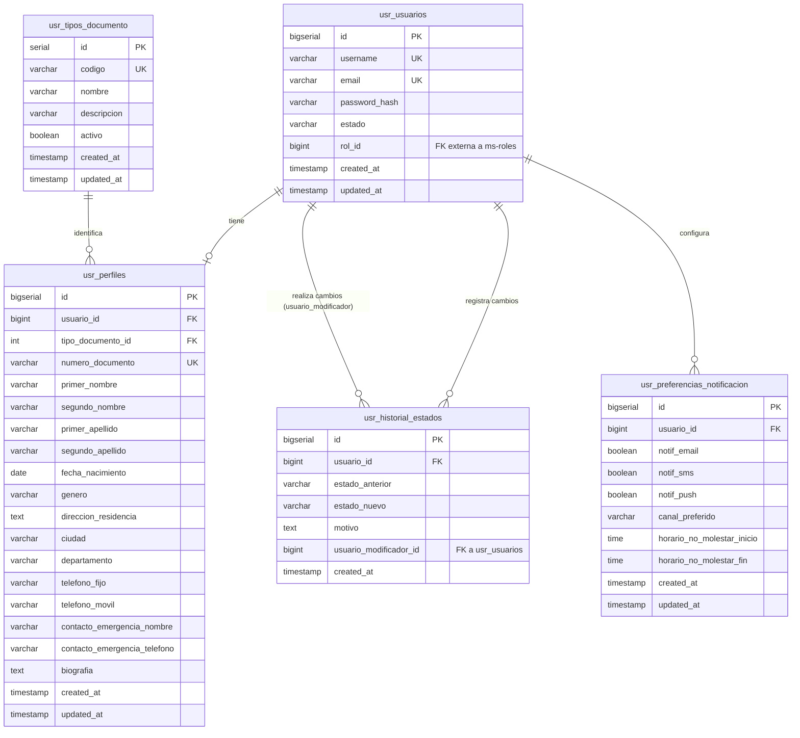

# Modelo de Datos: ms-usuarios [USR]

## Diseño de Base de Datos PostgreSQL

| Campo | Detalle |
|-------|---------|
| **Microservicio** | ms-usuarios [USR] |
| **Módulo** | Módulo 1 — Seguridad y Acceso |
| **Base de datos** | db_usuarios |
| **Versión** | 1.0 |
| **Fecha** | Marzo 2026 |

---

## Índice

1. [Información General](#1-información-general)
2. [Diagrama E-R](#2-diagrama-e-r)
3. [Diccionario de Datos](#3-diccionario-de-datos)
4. [Relaciones y Claves Foráneas](#4-relaciones-y-claves-foráneas)
5. [Índices Sugeridos](#5-índices-sugeridos)
6. [Script DDL](#6-script-ddl)
7. [Datos Semilla](#7-datos-semilla)

---

## 1. Información General

### Resumen del Modelo

- **Microservicio:** ms-usuarios [USR]
- **Módulo:** Módulo 1 — Seguridad y Acceso
- **Base de datos sugerida:** `db_usuarios`
- **Cantidad de tablas:** 5 tablas principales

### Dominio de Datos

El modelo de datos de ms-usuarios gestiona de forma completa y centralizada toda la información relacionada con los usuarios del sistema ERP universitario. Incluye credenciales de acceso, datos personales extendidos, información de contacto, historial de cambios de estado para trazabilidad y preferencias de usuario. El diseño implementa eliminación lógica mediante estados, asegura trazabilidad completa con auditoría temporal y mantiene referencias externas a otros microservicios (como ms-roles) únicamente mediante identificadores, siguiendo el patrón database-per-service de arquitecturas basadas en microservicios.

---

## 2. Diagrama E-R



### Descripción del Diagrama

El modelo de datos consta de **5 entidades principales**:

**Entidades principales:**
- **usr_usuarios:** Entidad central que almacena las credenciales de acceso y el estado de cada usuario del sistema. Contiene información crítica como username, email, password hash y estado (activo, inactivo, suspendido).
- **usr_perfiles:** Almacena información personal y de contacto extendida de cada usuario. Tiene una relación 1:1 con usr_usuarios y contiene datos como nombres completos, fecha de nacimiento, género, dirección, teléfonos y contacto de emergencia.

**Entidades de soporte:**
- **usr_historial_estados:** Registra cada cambio de estado de un usuario para propósitos de auditoría y trazabilidad. Cada registro incluye el estado anterior, el nuevo estado, el motivo del cambio y quién lo realizó.
- **usr_preferencias_notificacion:** Almacena las preferencias de notificación de cada usuario (email, SMS, push) y su canal preferido, permitiendo a ms-notificaciones enviar comunicaciones según las preferencias configuradas.
- **usr_tipos_documento:** Catálogo de tipos de documentos de identidad (CC, TI, CE, Pasaporte, etc.) utilizado por usr_perfiles.

**Relaciones entre entidades:**
- usr_usuarios tiene una relación 1:1 con usr_perfiles (un usuario tiene un perfil extendido)
- usr_usuarios tiene una relación 1:N con usr_historial_estados (un usuario puede tener múltiples cambios de estado)
- usr_usuarios tiene una relación 1:1 con usr_preferencias_notificacion (un usuario tiene una configuración de preferencias)
- usr_historial_estados tiene una auto-referencia a usr_usuarios para registrar quién realizó el cambio
- usr_tipos_documento tiene una relación 1:N con usr_perfiles (un tipo de documento puede ser usado por múltiples perfiles)

**Referencias externas a otros microservicios:**
- **usr_usuarios.rol_id:** Almacena el ID del rol asignado al usuario. Este ID corresponde a un registro en la tabla de roles del microservicio ms-roles [ROL]. No se crea una clave foránea real en la base de datos, solo se almacena el identificador para mantener la independencia entre microservicios.

---

## 3. Diccionario de Datos

### Tabla: usr_usuarios

**Propósito:** Almacenar las credenciales de acceso y el estado de cada usuario del sistema.

**Notas:** 
- El campo `rol_id` es una referencia externa al microservicio ms-roles [ROL]. No existe FK real en base de datos.
- La contraseña se almacena como hash bcrypt con factor de costo mínimo de 12.
- El estado determina si el usuario puede acceder al sistema.

| Columna | Tipo | Restricciones | Descripción |
|---------|------|---------------|-------------|
| id | BIGSERIAL | PK | Identificador único del usuario |
| username | VARCHAR(100) | NOT NULL, UNIQUE | Nombre de usuario único para inicio de sesión |
| email | VARCHAR(255) | NOT NULL, UNIQUE | Dirección de correo electrónico única |
| password_hash | VARCHAR(255) | NOT NULL | Hash bcrypt de la contraseña del usuario |
| estado | VARCHAR(20) | NOT NULL, CHECK, DEFAULT 'activo' | Estado del usuario: activo, inactivo, suspendido |
| rol_id | BIGINT | NOT NULL | ID del rol asignado (referencia externa a ms-roles) |
| created_at | TIMESTAMP | NOT NULL, DEFAULT CURRENT_TIMESTAMP | Fecha y hora de registro del usuario |
| updated_at | TIMESTAMP | NOT NULL, DEFAULT CURRENT_TIMESTAMP | Fecha y hora de la última actualización |

---

### Tabla: usr_perfiles

**Propósito:** Almacenar información personal y de contacto extendida de cada usuario.

**Notas:**
- Tiene una relación 1:1 con usr_usuarios.
- El número de documento debe ser único en el sistema.
- Algunos campos son opcionales (segundo_nombre, telefono_fijo, biografia).

| Columna | Tipo | Restricciones | Descripción |
|---------|------|---------------|-------------|
| id | BIGSERIAL | PK | Identificador único del perfil |
| usuario_id | BIGINT | NOT NULL, UNIQUE, FK | ID del usuario al que pertenece el perfil |
| tipo_documento_id | INT | NOT NULL, FK | ID del tipo de documento de identidad |
| numero_documento | VARCHAR(50) | NOT NULL, UNIQUE | Número de documento de identidad único |
| primer_nombre | VARCHAR(100) | NOT NULL | Primer nombre del usuario |
| segundo_nombre | VARCHAR(100) | NULL | Segundo nombre del usuario (opcional) |
| primer_apellido | VARCHAR(100) | NOT NULL | Primer apellido del usuario |
| segundo_apellido | VARCHAR(100) | NULL | Segundo apellido del usuario (opcional) |
| fecha_nacimiento | DATE | NOT NULL | Fecha de nacimiento del usuario |
| genero | VARCHAR(20) | NOT NULL, CHECK | Género del usuario: masculino, femenino, otro, prefiero_no_decir |
| direccion_residencia | TEXT | NOT NULL | Dirección completa de residencia |
| ciudad | VARCHAR(100) | NOT NULL | Ciudad de residencia |
| departamento | VARCHAR(100) | NOT NULL | Departamento/Estado de residencia |
| telefono_fijo | VARCHAR(20) | NULL | Número de teléfono fijo (opcional) |
| telefono_movil | VARCHAR(20) | NOT NULL | Número de teléfono móvil |
| contacto_emergencia_nombre | VARCHAR(200) | NOT NULL | Nombre completo del contacto de emergencia |
| contacto_emergencia_telefono | VARCHAR(20) | NOT NULL | Teléfono del contacto de emergencia |
| biografia | TEXT | NULL | Biografía o descripción personal (opcional) |
| created_at | TIMESTAMP | NOT NULL, DEFAULT CURRENT_TIMESTAMP | Fecha y hora de creación del perfil |
| updated_at | TIMESTAMP | NOT NULL, DEFAULT CURRENT_TIMESTAMP | Fecha y hora de última actualización del perfil |

---

### Tabla: usr_historial_estados

**Propósito:** Registrar cada cambio de estado de un usuario para auditoría y trazabilidad.

**Notas:**
- Cada cambio de estado genera un nuevo registro en esta tabla.
- El campo `usuario_modificador_id` es una auto-referencia a usr_usuarios que indica quién realizó el cambio.
- El motivo del cambio es obligatorio para mantener trazabilidad completa.

| Columna | Tipo | Restricciones | Descripción |
|---------|------|---------------|-------------|
| id | BIGSERIAL | PK | Identificador único del registro de cambio |
| usuario_id | BIGINT | NOT NULL, FK | ID del usuario cuyo estado cambió |
| estado_anterior | VARCHAR(20) | NOT NULL | Estado previo del usuario |
| estado_nuevo | VARCHAR(20) | NOT NULL | Nuevo estado del usuario |
| motivo | TEXT | NOT NULL | Motivo o razón del cambio de estado |
| usuario_modificador_id | BIGINT | NOT NULL | ID del usuario que realizó el cambio |
| created_at | TIMESTAMP | NOT NULL, DEFAULT CURRENT_TIMESTAMP | Fecha y hora del cambio de estado |

---

### Tabla: usr_preferencias_notificacion

**Propósito:** Almacenar las preferencias de notificación de cada usuario.

**Notas:**
- Tiene una relación 1:1 con usr_usuarios.
- Permite al microservicio ms-notificaciones respetar las preferencias del usuario.
- El horario de no molestar define un rango donde no se envían notificaciones no urgentes.

| Columna | Tipo | Restricciones | Descripción |
|---------|------|---------------|-------------|
| id | BIGSERIAL | PK | Identificador único de las preferencias |
| usuario_id | BIGINT | NOT NULL, UNIQUE, FK | ID del usuario al que pertenecen las preferencias |
| notif_email | BOOLEAN | NOT NULL, DEFAULT true | Indica si el usuario acepta notificaciones por email |
| notif_sms | BOOLEAN | NOT NULL, DEFAULT false | Indica si el usuario acepta notificaciones por SMS |
| notif_push | BOOLEAN | NOT NULL, DEFAULT true | Indica si el usuario acepta notificaciones push |
| canal_preferido | VARCHAR(20) | NOT NULL, CHECK, DEFAULT 'email' | Canal preferido: email, sms, push |
| horario_no_molestar_inicio | TIME | NULL | Hora de inicio del horario de no molestar (opcional) |
| horario_no_molestar_fin | TIME | NULL | Hora de fin del horario de no molestar (opcional) |
| created_at | TIMESTAMP | NOT NULL, DEFAULT CURRENT_TIMESTAMP | Fecha y hora de creación de las preferencias |
| updated_at | TIMESTAMP | NOT NULL, DEFAULT CURRENT_TIMESTAMP | Fecha y hora de última actualización |

---

### Tabla: usr_tipos_documento

**Propósito:** Catálogo de tipos de documentos de identidad válidos en el sistema.

**Notas:**
- Tabla de catálogo con valores predefinidos.
- El código es único y se usa para referencias programáticas (ej: 'CC', 'TI', 'CE').
- El campo activo permite desactivar tipos de documento sin eliminarlos.

| Columna | Tipo | Restricciones | Descripción |
|---------|------|---------------|-------------|
| id | SERIAL | PK | Identificador único del tipo de documento |
| codigo | VARCHAR(10) | NOT NULL, UNIQUE | Código corto del tipo de documento (CC, TI, CE, etc.) |
| nombre | VARCHAR(100) | NOT NULL | Nombre completo del tipo de documento |
| descripcion | TEXT | NULL | Descripción adicional del tipo de documento |
| activo | BOOLEAN | NOT NULL, DEFAULT true | Indica si el tipo de documento está activo |
| created_at | TIMESTAMP | NOT NULL, DEFAULT CURRENT_TIMESTAMP | Fecha y hora de creación del registro |
| updated_at | TIMESTAMP | NOT NULL, DEFAULT CURRENT_TIMESTAMP | Fecha y hora de última actualización |

---

## 4. Relaciones y Claves Foráneas

### Relaciones Internas

Relaciones entre tablas dentro del mismo microservicio (con FK reales en base de datos):

| FK | Tabla origen | Columna | Tabla destino | Tipo | Nota |
|----|--------------|---------|---------------|------|------|
| fk_perfiles_usuario | usr_perfiles | usuario_id | usr_usuarios | 1:1 | Un perfil pertenece a un solo usuario |
| fk_perfiles_tipo_doc | usr_perfiles | tipo_documento_id | usr_tipos_documento | N:1 | Un perfil tiene un tipo de documento |
| fk_historial_usuario | usr_historial_estados | usuario_id | usr_usuarios | N:1 | Múltiples cambios de estado por usuario |
| fk_historial_modificador | usr_historial_estados | usuario_modificador_id | usr_usuarios | N:1 | Auto-referencia: usuario que realizó el cambio |
| fk_preferencias_usuario | usr_preferencias_notificacion | usuario_id | usr_usuarios | 1:1 | Preferencias pertenecen a un solo usuario |

### Referencias Externas

Referencias a entidades de otros microservicios (sin FK en base de datos):

| Campo | Tabla origen | Columna | Microservicio destino | Entidad destina | Nota |
|-------|--------------|---------|----------------------|-----------------|------|
| Rol del usuario | usr_usuarios | rol_id | ms-roles [ROL] | roles | ID del rol asignado al usuario. Se valida existencia consultando ms-roles antes de crear/actualizar |

**Importante:** Las referencias externas son solo almacenamiento de IDs. La integridad referencial debe ser validada por la lógica de aplicación consultando al microservicio correspondiente, no mediante FK en base de datos.

---

## 5. Índices Sugeridos

Los siguientes índices están diseñados para optimizar las consultas más frecuentes basadas en los requisitos funcionales del microservicio:

| Índice | Tabla | Columnas | Tipo | Justificación |
|--------|-------|----------|------|---------------|
| idx_usuarios_email | usr_usuarios | email | B-tree | Búsqueda por email (usado por ms-autenticacion para login). Consulta frecuente y crítica |
| idx_usuarios_username | usr_usuarios | username | B-tree | Búsqueda por username. Ya cubierto por UNIQUE constraint pero explícito para claridad |
| idx_usuarios_estado | usr_usuarios | estado | B-tree | Filtrado de usuarios por estado en búsquedas avanzadas |
| idx_usuarios_rol | usr_usuarios | rol_id | B-tree | Filtrado de usuarios por rol. Consultas frecuentes para listar usuarios de un rol específico |
| idx_perfiles_usuario | usr_perfiles | usuario_id | B-tree | Ya cubierto por FK, pero crítico para joins. Performance en búsquedas de perfil por usuario |
| idx_perfiles_documento | usr_perfiles | numero_documento | B-tree | Búsqueda por número de documento (requisito funcional explícito) |
| idx_perfiles_ciudad | usr_perfiles | ciudad | B-tree | Filtrado por ciudad en búsquedas avanzadas |
| idx_perfiles_nombre_completo | usr_perfiles | primer_nombre, primer_apellido | B-tree | Búsqueda por nombre en búsquedas avanzadas. Índice compuesto |
| idx_historial_usuario | usr_historial_estados | usuario_id | B-tree | Ya cubierto por FK. Consulta del historial de un usuario específico |
| idx_historial_fecha | usr_historial_estados | created_at DESC | B-tree | Ordenamiento por fecha en consultas de historial (más recientes primero) |
| idx_historial_usuario_fecha | usr_historial_estados | usuario_id, created_at DESC | B-tree | Índice compuesto para historial de un usuario ordenado por fecha |
| idx_preferencias_usuario | usr_preferencias_notificacion | usuario_id | B-tree | Ya cubierto por FK. Consulta de preferencias de un usuario específico |
| idx_tipos_doc_codigo | usr_tipos_documento | codigo | B-tree | Ya cubierto por UNIQUE. Búsqueda por código de tipo de documento |
| idx_tipos_doc_activo | usr_tipos_documento | activo | B-tree | Filtrado de tipos de documento activos |

**Nota:** Los índices UNIQUE ya crean índices B-tree automáticamente, pero se listan aquí para documentación completa del modelo.

---

## 6. Script DDL

```sql
-- ============================================================================
-- Script DDL: Microservicio ms-usuarios [USR]
-- Base de datos: db_usuarios
-- Motor: PostgreSQL 14+
-- Fecha: Marzo 2026
-- ============================================================================

-- ============================================================================
-- SECCIÓN 1: CREACIÓN DE BASE DE DATOS
-- ============================================================================

-- Crear la base de datos
CREATE DATABASE db_usuarios
    WITH 
    ENCODING = 'UTF8'
    LC_COLLATE = 'es_ES.UTF-8'
    LC_CTYPE = 'es_ES.UTF-8'
    TEMPLATE = template0;

-- Comentario de la base de datos
COMMENT ON DATABASE db_usuarios IS 'Base de datos del microservicio ms-usuarios - Gestión de usuarios, credenciales y perfiles';

-- Conectar a la base de datos
\c db_usuarios;

-- ============================================================================
-- SECCIÓN 2: CREACIÓN DE TABLAS
-- ============================================================================

-- ----------------------------------------------------------------------------
-- Tabla: usr_tipos_documento
-- Propósito: Catálogo de tipos de documentos de identidad
-- ----------------------------------------------------------------------------
CREATE TABLE usr_tipos_documento (
    id SERIAL PRIMARY KEY,
    codigo VARCHAR(10) NOT NULL UNIQUE,
    nombre VARCHAR(100) NOT NULL,
    descripcion TEXT,
    activo BOOLEAN NOT NULL DEFAULT true,
    created_at TIMESTAMP NOT NULL DEFAULT CURRENT_TIMESTAMP,
    updated_at TIMESTAMP NOT NULL DEFAULT CURRENT_TIMESTAMP,
    
    CONSTRAINT chk_tipos_documento_codigo CHECK (codigo ~ '^[A-Z0-9_]+$')
);

COMMENT ON TABLE usr_tipos_documento IS 'Catálogo de tipos de documentos de identidad válidos en el sistema';
COMMENT ON COLUMN usr_tipos_documento.codigo IS 'Código único del tipo de documento (CC, TI, CE, PASAPORTE, etc.)';
COMMENT ON COLUMN usr_tipos_documento.activo IS 'Indica si el tipo de documento está activo para uso en el sistema';

-- ----------------------------------------------------------------------------
-- Tabla: usr_usuarios
-- Propósito: Almacenar credenciales y estado de cada usuario del sistema
-- Nota: rol_id es una REFERENCIA EXTERNA al microservicio ms-roles [ROL]
-- ----------------------------------------------------------------------------
CREATE TABLE usr_usuarios (
    id BIGSERIAL PRIMARY KEY,
    username VARCHAR(100) NOT NULL UNIQUE,
    email VARCHAR(255) NOT NULL UNIQUE,
    password_hash VARCHAR(255) NOT NULL,
    estado VARCHAR(20) NOT NULL DEFAULT 'activo',
    rol_id BIGINT NOT NULL, -- REFERENCIA EXTERNA a ms-roles [ROL]
    created_at TIMESTAMP NOT NULL DEFAULT CURRENT_TIMESTAMP,
    updated_at TIMESTAMP NOT NULL DEFAULT CURRENT_TIMESTAMP,
    
    CONSTRAINT chk_usuarios_estado CHECK (estado IN ('activo', 'inactivo', 'suspendido')),
    CONSTRAINT chk_usuarios_email CHECK (email ~* '^[A-Za-z0-9._%+-]+@[A-Za-z0-9.-]+\.[A-Za-z]{2,}$'),
    CONSTRAINT chk_usuarios_username CHECK (LENGTH(username) >= 3)
);

COMMENT ON TABLE usr_usuarios IS 'Tabla principal de usuarios: credenciales de acceso y estado';
COMMENT ON COLUMN usr_usuarios.username IS 'Nombre de usuario único para inicio de sesión';
COMMENT ON COLUMN usr_usuarios.email IS 'Dirección de correo electrónico única';
COMMENT ON COLUMN usr_usuarios.password_hash IS 'Hash bcrypt de la contraseña (factor de costo >= 12)';
COMMENT ON COLUMN usr_usuarios.estado IS 'Estado del usuario: activo, inactivo, suspendido';
COMMENT ON COLUMN usr_usuarios.rol_id IS 'ID del rol asignado - REFERENCIA EXTERNA a ms-roles [ROL]';

-- ----------------------------------------------------------------------------
-- Tabla: usr_perfiles
-- Propósito: Información personal y de contacto extendida de cada usuario
-- Relación 1:1 con usr_usuarios
-- ----------------------------------------------------------------------------
CREATE TABLE usr_perfiles (
    id BIGSERIAL PRIMARY KEY,
    usuario_id BIGINT NOT NULL UNIQUE,
    tipo_documento_id INT NOT NULL,
    numero_documento VARCHAR(50) NOT NULL UNIQUE,
    primer_nombre VARCHAR(100) NOT NULL,
    segundo_nombre VARCHAR(100),
    primer_apellido VARCHAR(100) NOT NULL,
    segundo_apellido VARCHAR(100),
    fecha_nacimiento DATE NOT NULL,
    genero VARCHAR(20) NOT NULL,
    direccion_residencia TEXT NOT NULL,
    ciudad VARCHAR(100) NOT NULL,
    departamento VARCHAR(100) NOT NULL,
    telefono_fijo VARCHAR(20),
    telefono_movil VARCHAR(20) NOT NULL,
    contacto_emergencia_nombre VARCHAR(200) NOT NULL,
    contacto_emergencia_telefono VARCHAR(20) NOT NULL,
    biografia TEXT,
    created_at TIMESTAMP NOT NULL DEFAULT CURRENT_TIMESTAMP,
    updated_at TIMESTAMP NOT NULL DEFAULT CURRENT_TIMESTAMP,
    
    CONSTRAINT fk_perfiles_usuario FOREIGN KEY (usuario_id) 
        REFERENCES usr_usuarios(id) ON DELETE CASCADE,
    CONSTRAINT fk_perfiles_tipo_doc FOREIGN KEY (tipo_documento_id) 
        REFERENCES usr_tipos_documento(id) ON DELETE RESTRICT,
    CONSTRAINT chk_perfiles_genero CHECK (genero IN ('masculino', 'femenino', 'otro', 'prefiero_no_decir')),
    CONSTRAINT chk_perfiles_fecha_nacimiento CHECK (fecha_nacimiento < CURRENT_DATE),
    CONSTRAINT chk_perfiles_edad_minima CHECK (fecha_nacimiento <= CURRENT_DATE - INTERVAL '14 years')
);

COMMENT ON TABLE usr_perfiles IS 'Información personal y de contacto extendida de cada usuario';
COMMENT ON COLUMN usr_perfiles.usuario_id IS 'ID del usuario (relación 1:1 con usr_usuarios)';
COMMENT ON COLUMN usr_perfiles.numero_documento IS 'Número de documento de identidad único';
COMMENT ON COLUMN usr_perfiles.fecha_nacimiento IS 'Fecha de nacimiento del usuario (edad mínima 14 años)';
COMMENT ON COLUMN usr_perfiles.biografia IS 'Biografía o descripción personal opcional';

-- ----------------------------------------------------------------------------
-- Tabla: usr_historial_estados
-- Propósito: Registrar cada cambio de estado de usuarios para auditoría
-- ----------------------------------------------------------------------------
CREATE TABLE usr_historial_estados (
    id BIGSERIAL PRIMARY KEY,
    usuario_id BIGINT NOT NULL,
    estado_anterior VARCHAR(20) NOT NULL,
    estado_nuevo VARCHAR(20) NOT NULL,
    motivo TEXT NOT NULL,
    usuario_modificador_id BIGINT NOT NULL,
    created_at TIMESTAMP NOT NULL DEFAULT CURRENT_TIMESTAMP,
    
    CONSTRAINT fk_historial_usuario FOREIGN KEY (usuario_id) 
        REFERENCES usr_usuarios(id) ON DELETE CASCADE,
    CONSTRAINT fk_historial_modificador FOREIGN KEY (usuario_modificador_id) 
        REFERENCES usr_usuarios(id) ON DELETE RESTRICT,
    CONSTRAINT chk_historial_estado_anterior CHECK (estado_anterior IN ('activo', 'inactivo', 'suspendido')),
    CONSTRAINT chk_historial_estado_nuevo CHECK (estado_nuevo IN ('activo', 'inactivo', 'suspendido')),
    CONSTRAINT chk_historial_estados_diferentes CHECK (estado_anterior != estado_nuevo)
);

COMMENT ON TABLE usr_historial_estados IS 'Historial de cambios de estado de usuarios para auditoría y trazabilidad';
COMMENT ON COLUMN usr_historial_estados.usuario_id IS 'ID del usuario cuyo estado cambió';
COMMENT ON COLUMN usr_historial_estados.usuario_modificador_id IS 'ID del usuario que realizó el cambio de estado';
COMMENT ON COLUMN usr_historial_estados.motivo IS 'Motivo o razón del cambio de estado (obligatorio)';

-- ----------------------------------------------------------------------------
-- Tabla: usr_preferencias_notificacion
-- Propósito: Preferencias de notificación de cada usuario
-- Relación 1:1 con usr_usuarios
-- ----------------------------------------------------------------------------
CREATE TABLE usr_preferencias_notificacion (
    id BIGSERIAL PRIMARY KEY,
    usuario_id BIGINT NOT NULL UNIQUE,
    notif_email BOOLEAN NOT NULL DEFAULT true,
    notif_sms BOOLEAN NOT NULL DEFAULT false,
    notif_push BOOLEAN NOT NULL DEFAULT true,
    canal_preferido VARCHAR(20) NOT NULL DEFAULT 'email',
    horario_no_molestar_inicio TIME,
    horario_no_molestar_fin TIME,
    created_at TIMESTAMP NOT NULL DEFAULT CURRENT_TIMESTAMP,
    updated_at TIMESTAMP NOT NULL DEFAULT CURRENT_TIMESTAMP,
    
    CONSTRAINT fk_preferencias_usuario FOREIGN KEY (usuario_id) 
        REFERENCES usr_usuarios(id) ON DELETE CASCADE,
    CONSTRAINT chk_preferencias_canal CHECK (canal_preferido IN ('email', 'sms', 'push'))
);

COMMENT ON TABLE usr_preferencias_notificacion IS 'Preferencias de notificación de cada usuario para ms-notificaciones';
COMMENT ON COLUMN usr_preferencias_notificacion.usuario_id IS 'ID del usuario (relación 1:1 con usr_usuarios)';
COMMENT ON COLUMN usr_preferencias_notificacion.canal_preferido IS 'Canal preferido para notificaciones: email, sms, push';
COMMENT ON COLUMN usr_preferencias_notificacion.horario_no_molestar_inicio IS 'Hora de inicio del horario de no molestar';
COMMENT ON COLUMN usr_preferencias_notificacion.horario_no_molestar_fin IS 'Hora de fin del horario de no molestar';

-- ============================================================================
-- SECCIÓN 3: ÍNDICES
-- ============================================================================

-- Índices para usr_usuarios
CREATE INDEX idx_usuarios_email ON usr_usuarios(email);
CREATE INDEX idx_usuarios_estado ON usr_usuarios(estado);
CREATE INDEX idx_usuarios_rol ON usr_usuarios(rol_id);
CREATE INDEX idx_usuarios_created_at ON usr_usuarios(created_at DESC);

-- Índices para usr_perfiles
CREATE INDEX idx_perfiles_documento ON usr_perfiles(numero_documento);
CREATE INDEX idx_perfiles_ciudad ON usr_perfiles(ciudad);
CREATE INDEX idx_perfiles_nombre_completo ON usr_perfiles(primer_nombre, primer_apellido);
CREATE INDEX idx_perfiles_departamento ON usr_perfiles(departamento);

-- Índices para usr_historial_estados
CREATE INDEX idx_historial_usuario ON usr_historial_estados(usuario_id);
CREATE INDEX idx_historial_fecha ON usr_historial_estados(created_at DESC);
CREATE INDEX idx_historial_usuario_fecha ON usr_historial_estados(usuario_id, created_at DESC);
CREATE INDEX idx_historial_estado_nuevo ON usr_historial_estados(estado_nuevo);

-- Índices para usr_tipos_documento
CREATE INDEX idx_tipos_doc_activo ON usr_tipos_documento(activo);

COMMENT ON INDEX idx_usuarios_email IS 'Optimiza búsqueda por email (usado por ms-autenticacion en login)';
COMMENT ON INDEX idx_usuarios_estado IS 'Optimiza filtrado por estado en búsquedas avanzadas';
COMMENT ON INDEX idx_perfiles_documento IS 'Optimiza búsqueda por número de documento (requisito funcional)';
COMMENT ON INDEX idx_perfiles_ciudad IS 'Optimiza filtrado por ciudad en búsquedas avanzadas';
COMMENT ON INDEX idx_historial_usuario_fecha IS 'Índice compuesto para consultar historial de un usuario ordenado por fecha';

-- ============================================================================
-- SECCIÓN 4: FUNCIONES Y TRIGGERS PARA AUDITORÍA
-- ============================================================================

-- Función para actualizar automáticamente el campo updated_at
CREATE OR REPLACE FUNCTION update_updated_at_column()
RETURNS TRIGGER AS $$
BEGIN
    NEW.updated_at = CURRENT_TIMESTAMP;
    RETURN NEW;
END;
$$ LANGUAGE plpgsql;

-- Triggers para actualizar updated_at automáticamente
CREATE TRIGGER trg_usuarios_updated_at
    BEFORE UPDATE ON usr_usuarios
    FOR EACH ROW
    EXECUTE FUNCTION update_updated_at_column();

CREATE TRIGGER trg_perfiles_updated_at
    BEFORE UPDATE ON usr_perfiles
    FOR EACH ROW
    EXECUTE FUNCTION update_updated_at_column();

CREATE TRIGGER trg_preferencias_updated_at
    BEFORE UPDATE ON usr_preferencias_notificacion
    FOR EACH ROW
    EXECUTE FUNCTION update_updated_at_column();

CREATE TRIGGER trg_tipos_doc_updated_at
    BEFORE UPDATE ON usr_tipos_documento
    FOR EACH ROW
    EXECUTE FUNCTION update_updated_at_column();

-- ============================================================================
-- FINALIZACIÓN
-- ============================================================================

-- Mostrar resumen de tablas creadas
SELECT 
    schemaname as schema,
    tablename as tabla,
    pg_size_pretty(pg_total_relation_size(schemaname||'.'||tablename)) as tamaño
FROM pg_tables
WHERE schemaname = 'public'
ORDER BY tablename;

-- Script completado exitosamente
SELECT 'Script DDL completado exitosamente para ms-usuarios [USR]' as mensaje;
```

---

## 7. Datos Semilla

```sql
-- ============================================================================
-- Script de Datos Semilla: Microservicio ms-usuarios [USR]
-- Base de datos: db_usuarios
-- Propósito: Poblar tablas con datos de prueba representativos
-- Fecha: Marzo 2026
-- ============================================================================

-- Conectar a la base de datos
\c db_usuarios;

BEGIN;

-- ============================================================================
-- SECCIÓN 1: TIPOS DE DOCUMENTO
-- ============================================================================

INSERT INTO usr_tipos_documento (codigo, nombre, descripcion, activo) VALUES
('CC', 'Cédula de Ciudadanía', 'Documento de identidad para ciudadanos colombianos mayores de 18 años', true),
('TI', 'Tarjeta de Identidad', 'Documento de identidad para menores de edad entre 7 y 17 años', true),
('CE', 'Cédula de Extranjería', 'Documento de identidad para extranjeros residentes en Colombia', true),
('PASAPORTE', 'Pasaporte', 'Documento de identidad internacional', true),
('PEP', 'Permiso Especial de Permanencia', 'Documento temporal para migrantes venezolanos', true),
('PPT', 'Permiso por Protección Temporal', 'Documento para migrantes en situación de protección temporal', true),
('DNI', 'Documento Nacional de Identidad', 'Documento de identidad usado en otros países latinoamericanos', true),
('RC', 'Registro Civil', 'Documento de identidad para menores de 7 años (uso limitado)', false);

-- ============================================================================
-- SECCIÓN 2: USUARIOS
-- Nota: Los passwords son hashes bcrypt de contraseñas de prueba
-- Contraseña para todos: "Test123456!" (bcrypt con cost=12)
-- rol_id: Referencias externas ficticias a ms-roles [ROL]
--   1 = Administrador
--   2 = Coordinador Académico
--   3 = Docente
--   4 = Estudiante
--   5 = Personal Administrativo
-- ============================================================================

INSERT INTO usr_usuarios (id, username, email, password_hash, estado, rol_id) VALUES
(1, 'admin.sistema', 'admin@universidad.edu.co', '$2b$12$LQv3c1yqBWVHxkd0LHAkCOYz6TcN5hIHNQ4Wp/KKXy5aFCEUcHPqK', 'activo', 1),
(2, 'jperez', 'juan.perez@universidad.edu.co', '$2b$12$LQv3c1yqBWVHxkd0LHAkCOYz6TcN5hIHNQ4Wp/KKXy5aFCEUcHPqK', 'activo', 2),
(3, 'mgomez', 'maria.gomez@universidad.edu.co', '$2b$12$LQv3c1yqBWVHxkd0LHAkCOYz6TcN5hIHNQ4Wp/KKXy5aFCEUcHPqK', 'activo', 3),
(4, 'cromero', 'carlos.romero@universidad.edu.co', '$2b$12$LQv3c1yqBWVHxkd0LHAkCOYz6TcN5hIHNQ4Wp/KKXy5aFCEUcHPqK', 'activo', 4),
(5, 'amartinez', 'ana.martinez@universidad.edu.co', '$2b$12$LQv3c1yqBWVHxkd0LHAkCOYz6TcN5hIHNQ4Wp/KKXy5aFCEUcHPqK', 'activo', 4),
(6, 'lrodriguez', 'luis.rodriguez@universidad.edu.co', '$2b$12$LQv3c1yqBWVHxkd0LHAkCOYz6TcN5hIHNQ4Wp/KKXy5aFCEUcHPqK', 'suspendido', 4),
(7, 'shernandez', 'sofia.hernandez@universidad.edu.co', '$2b$12$LQv3c1yqBWVHxkd0LHAkCOYz6TcN5hIHNQ4Wp/KKXy5aFCEUcHPqK', 'activo', 3),
(8, 'dgarcia', 'diego.garcia@universidad.edu.co', '$2b$12$LQv3c1yqBWVHxkd0LHAkCOYz6TcN5hIHNQ4Wp/KKXy5aFCEUcHPqK', 'inactivo', 5),
(9, 'plopez', 'paula.lopez@universidad.edu.co', '$2b$12$LQv3c1yqBWVHxkd0LHAkCOYz6TcN5hIHNQ4Wp/KKXy5aFCEUcHPqK', 'activo', 4),
(10, 'jtorres', 'jorge.torres@universidad.edu.co', '$2b$12$LQv3c1yqBWVHxkd0LHAkCOYz6TcN5hIHNQ4Wp/KKXy5aFCEUcHPqK', 'activo', 3);

-- Ajustar la secuencia para evitar conflictos en futuros inserts
SELECT setval('usr_usuarios_id_seq', 10, true);

-- ============================================================================
-- SECCIÓN 3: PERFILES
-- ============================================================================

INSERT INTO usr_perfiles (
    usuario_id, tipo_documento_id, numero_documento, 
    primer_nombre, segundo_nombre, primer_apellido, segundo_apellido,
    fecha_nacimiento, genero, direccion_residencia, ciudad, departamento,
    telefono_fijo, telefono_movil, 
    contacto_emergencia_nombre, contacto_emergencia_telefono,
    biografia
) VALUES
(
    1, 1, '1001234567', 
    'Administrador', 'Del', 'Sistema', 'Principal',
    '1985-03-15', 'masculino', 'Calle 100 # 15-20', 'Bogotá', 'Cundinamarca',
    '6013456789', '3101234567',
    'Soporte Técnico Universidad', '3109876543',
    'Administrador principal del sistema ERP Universitario.'
),
(
    2, 1, '1012345678',
    'Juan', 'Carlos', 'Pérez', 'González',
    '1978-07-22', 'masculino', 'Carrera 7 # 45-30, Apto 501', 'Bogotá', 'Cundinamarca',
    '6017654321', '3201234567',
    'María González de Pérez', '3209876543',
    'Coordinador académico con 15 años de experiencia en educación superior. Doctor en Ciencias de la Educación.'
),
(
    3, 1, '1023456789',
    'María', 'Fernanda', 'Gómez', 'López',
    '1982-11-10', 'femenino', 'Avenida Boyacá # 80-25', 'Bogotá', 'Cundinamarca',
    NULL, '3112345678',
    'Fernando Gómez', '3118765432',
    'Docente de tiempo completo, magíster en Ingeniería de Software, especialista en arquitecturas de software.'
),
(
    4, 1, '1034567890',
    'Carlos', 'Andrés', 'Romero', 'Díaz',
    '2002-05-18', 'masculino', 'Calle 134 # 52-10', 'Bogotá', 'Cundinamarca',
    '6012345678', '3123456789',
    'Patricia Díaz de Romero', '3127654321',
    'Estudiante de octavo semestre de Ingeniería de Sistemas, apasionado por el desarrollo de software.'
),
(
    5, 1, '1045678901',
    'Ana', 'María', 'Martínez', 'Ruiz',
    '2003-09-25', 'femenino', 'Carrera 15 # 123-45', 'Bogotá', 'Cundinamarca',
    NULL, '3134567890',
    'Roberto Martínez', '3136543210',
    'Estudiante de séptimo semestre, interesada en ciencia de datos y machine learning.'
),
(
    6, 1, '1056789012',
    'Luis', 'Eduardo', 'Rodríguez', 'Castro',
    '2001-12-03', 'masculino', 'Calle 170 # 60-25, Casa 12', 'Bogotá', 'Cundinamarca',
    '6019876543', '3145678901',
    'Claudia Castro de Rodríguez', '3145432109',
    'Estudiante de noveno semestre. Cuenta suspendida temporalmente por incumplimiento de normas académicas.'
),
(
    7, 3, 'CE987654321',
    'Sofía', NULL, 'Hernández', 'Morales',
    '1988-04-14', 'femenino', 'Transversal 45 # 98-76', 'Medellín', 'Antioquia',
    '6044567890', '3156789012',
    'Pedro Morales', '3154321098',
    'Docente de medio tiempo, doctora en Educación, investigadora en pedagogías activas.'
),
(
    8, 1, '1067890123',
    'Diego', 'Fernando', 'García', 'Vargas',
    '1975-08-30', 'masculino', 'Avenida El Dorado # 45-67', 'Bogotá', 'Cundinamarca',
    '6015678901', '3167890123',
    'Sandra Vargas', '3163210987',
    'Personal administrativo del área de recursos humanos. Cuenta desactivada por retiro voluntario.'
),
(
    9, 1, '1078901234',
    'Paula', 'Andrea', 'López', 'Sánchez',
    '2002-01-20', 'femenino', 'Calle 45 Sur # 12-34', 'Bogotá', 'Cundinamarca',
    NULL, '3178901234',
    'Marta Sánchez', '3172109876',
    'Estudiante de quinto semestre, delegada de curso, miembro activo del semillero de investigación.'
),
(
    10, 4, 'PAS45678901',
    'Jorge', 'Enrique', 'Torres', 'Mendoza',
    '1980-06-12', 'masculino', 'Carrera 50 # 127-89', 'Cali', 'Valle del Cauca',
    '6025678901', '3189012345',
    'Lucía Mendoza', '3181098765',
    'Docente visitante internacional, especialista en bases de datos y sistemas distribuidos.'
);

-- ============================================================================
-- SECCIÓN 4: HISTORIAL DE ESTADOS
-- ============================================================================

INSERT INTO usr_historial_estados (
    usuario_id, estado_anterior, estado_nuevo, motivo, usuario_modificador_id, created_at
) VALUES
(
    6, 'activo', 'suspendido', 
    'Suspensión temporal por incumplimiento del código de conducta estudiantil - Caso disciplinario 2026-032',
    1, '2026-02-15 10:30:00'
),
(
    8, 'activo', 'inactivo',
    'Desactivación de cuenta por retiro voluntario del personal administrativo - Carta de renuncia recibida',
    1, '2026-02-20 14:45:00'
),
(
    2, 'inactivo', 'activo',
    'Reactivación de cuenta tras finalización de licencia no remunerada',
    1, '2026-01-10 09:00:00'
),
(
    7, 'inactivo', 'activo',
    'Activación inicial tras proceso de contratación como docente de medio tiempo',
    1, '2026-02-01 08:00:00'
),
(
    10, 'inactivo', 'activo',
    'Activación inicial tras proceso de vinculación como docente visitante internacional',
    1, '2026-02-28 09:30:00'
),
(
    4, 'suspendido', 'activo',
    'Reactivación de estudiante tras cumplimiento de período de prueba académica',
    2, '2026-01-15 16:00:00'
),
(
    3, 'activo', 'suspendido',
    'Suspensión temporal por licencia médica - Incapacidad de 15 días',
    1, '2025-12-10 11:00:00'
),
(
    3, 'suspendido', 'activo',
    'Reactivación tras finalización de licencia médica - Alta médica presentada',
    1, '2025-12-26 08:30:00'
);

-- ============================================================================
-- SECCIÓN 5: PREFERENCIAS DE NOTIFICACIÓN
-- ============================================================================

INSERT INTO usr_preferencias_notificacion (
    usuario_id, notif_email, notif_sms, notif_push, canal_preferido,
    horario_no_molestar_inicio, horario_no_molestar_fin
) VALUES
(1, true, true, true, 'email', NULL, NULL), -- Admin: sin horario de no molestar
(2, true, false, true, 'email', '22:00:00', '06:00:00'), -- Coordinador
(3, true, true, true, 'push', '23:00:00', '07:00:00'), -- Docente
(4, true, false, true, 'email', '00:00:00', '08:00:00'), -- Estudiante
(5, true, true, false, 'email', '23:00:00', '07:00:00'), -- Estudiante
(6, false, false, false, 'email', NULL, NULL), -- Usuario suspendido sin notificaciones
(7, true, false, true, 'email', '22:00:00', '06:00:00'), -- Docente
(8, false, false, false, 'email', NULL, NULL), -- Usuario inactivo sin notificaciones
(9, true, true, true, 'push', '00:00:00', '07:00:00'), -- Estudiante activa
(10, true, false, true, 'email', '23:00:00', '06:00:00'); -- Docente visitante

-- ============================================================================
-- FINALIZACIÓN
-- ============================================================================

COMMIT;

-- Mostrar resumen de datos insertados
SELECT 'Tipos de documento insertados: ' || COUNT(*) FROM usr_tipos_documento;
SELECT 'Usuarios insertados: ' || COUNT(*) FROM usr_usuarios;
SELECT 'Perfiles insertados: ' || COUNT(*) FROM usr_perfiles;
SELECT 'Registros de historial insertados: ' || COUNT(*) FROM usr_historial_estados;
SELECT 'Preferencias de notificación insertadas: ' || COUNT(*) FROM usr_preferencias_notificacion;

-- Mostrar distribución de usuarios por estado
SELECT estado, COUNT(*) as cantidad 
FROM usr_usuarios 
GROUP BY estado 
ORDER BY estado;

SELECT 'Datos semilla insertados exitosamente en db_usuarios' as mensaje;
```

---

## Notas Finales

### Validaciones Implementadas

El modelo de datos incluye las siguientes validaciones a nivel de base de datos:

1. **Unicidad de credenciales:** Username, email y número de documento son únicos mediante constraints UNIQUE
2. **Estados válidos:** CHECK constraints validan que los estados sean: activo, inactivo o suspendido
3. **Formato de email:** Validación mediante expresión regular en CHECK constraint
4. **Longitud mínima de username:** Mínimo 3 caracteres
5. **Edad mínima:** Los usuarios deben tener al menos 14 años (validado mediante fecha de nacimiento)
6. **Cambios de estado lógicos:** El historial valida que el estado anterior sea diferente del nuevo
7. **Géneros válidos:** Valores permitidos: masculino, femenino, otro, prefiero_no_decir
8. **Canales de notificación válidos:** email, sms, push

### Consideraciones de Seguridad

- Las contraseñas se almacenan SIEMPRE como hash bcrypt con factor de costo mínimo de 12
- El campo `password_hash` debe recibir ya el hash generado, nunca texto plano
- Los datos sensibles (como contraseñas) nunca deben aparecer en logs ni respuestas
- Se recomienda implementar rotación de tokens de aplicación (aunque el documento indica que son fijos)

### Escalabilidad y Performance

- Los índices están diseñados para las consultas más frecuentes identificadas en los requisitos
- La tabla `usr_historial_estados` crecerá con cada cambio de estado. Se recomienda implementar particionamiento por fecha si el volumen es alto
- Las relaciones 1:1 (usuario-perfil, usuario-preferencias) podrían denormalizarse en una sola tabla si la performance lo requiere, pero se mantienen separadas para claridad y normalización

### Integridad Referencial Externa

El campo `usr_usuarios.rol_id` NO tiene FK real en base de datos porque apunta a otra base de datos (ms-roles). La aplicación DEBE:

1. Validar la existencia del rol consultando ms-roles antes de crear/actualizar un usuario
2. Manejar apropiadamente casos donde el rol no existe o fue eliminado en ms-roles
3. Considerar implementar caché de roles válidos para reducir llamadas entre servicios
4. Implementar manejo de errores robusto cuando ms-roles no esté disponible

### Migración y Versionamiento

Se recomienda usar herramientas como Alembic (Python) o Flyway para gestionar migraciones de esquema y mantener versionamiento del modelo de datos a medida que evoluciona el sistema.

---

**Fin del documento**

