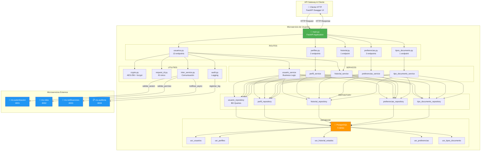
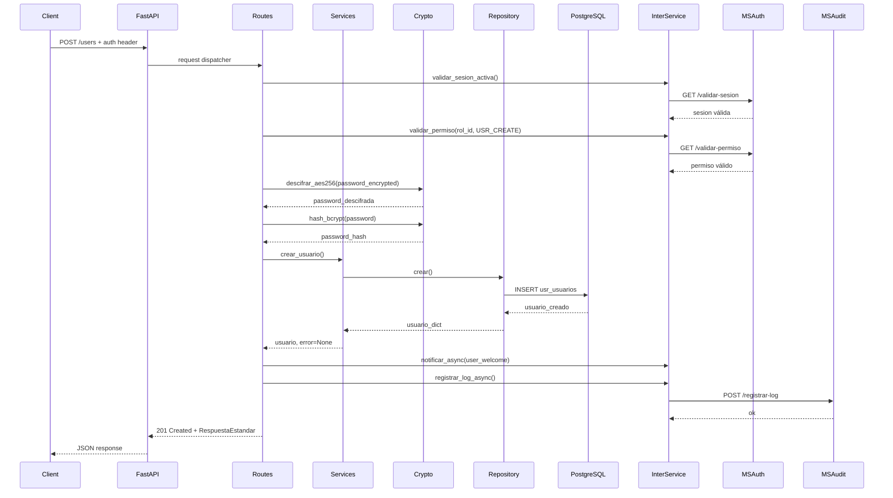
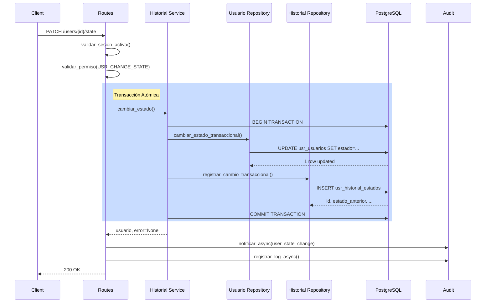
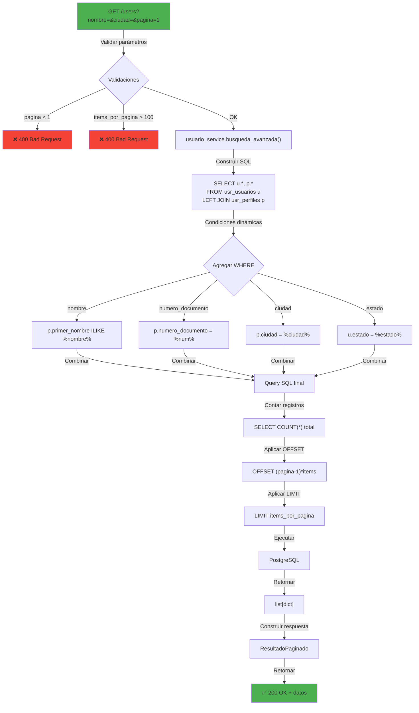
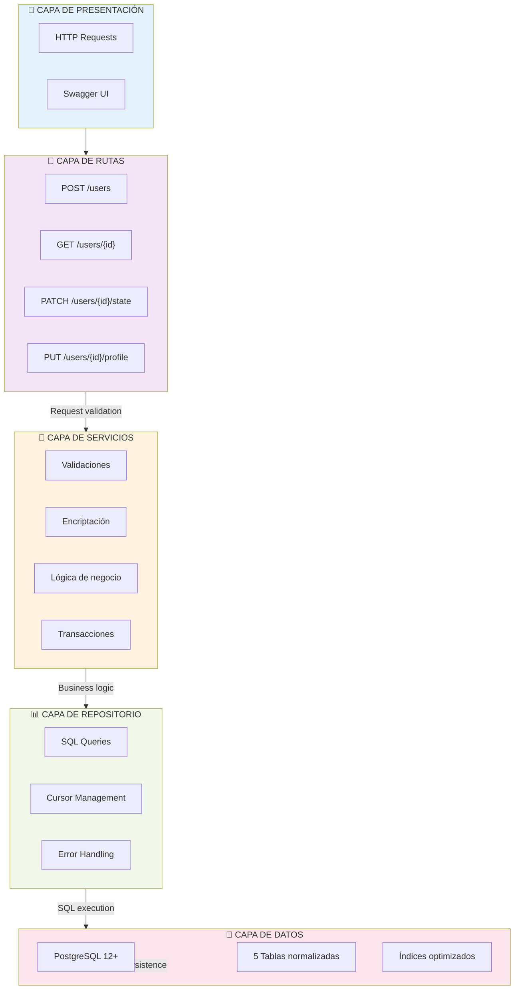
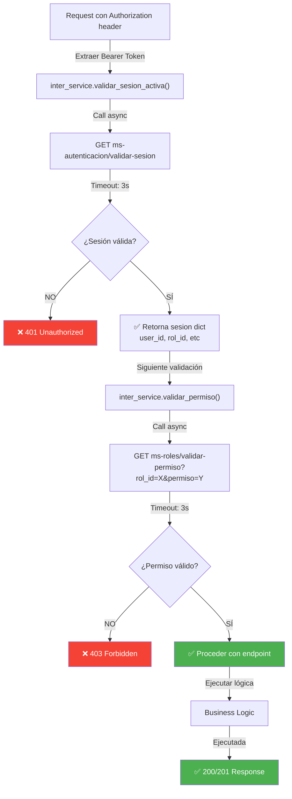
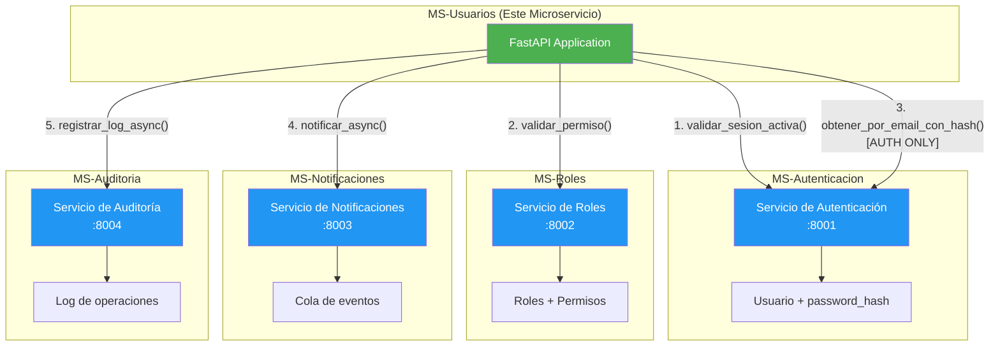
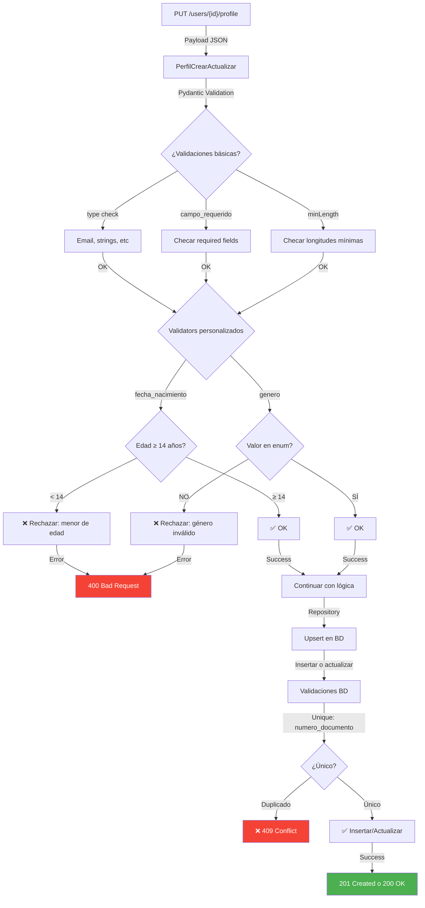
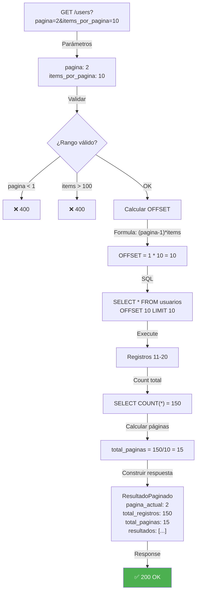

# 🏛️ Arquitectura y Diagramas - MS-Usuarios

## Diagrama de Arquitectura Completa



---

## Flujo de Solicitud - Crear Usuario



---

## Flujo de Solicitud - Cambiar Estado (Transaccional)



---

## Diagrama de Flujo - Búsqueda Avanzada



---

## Capas de Arquitectura



---

## Flujo de Autenticación y Autorización



---

## Flujo de Cifrado y Desencriptado

```mermaid
graph LR
    subgraph "CLIENT SIDE (Frontend)"
        PLAIN["Contraseña en texto<br/>user123"]
        AES["AES-256-CBC<br/>Encrypt"]
        B64["Base64 Encode"]
        ENCRYPTED["eyJhbGciOi...<br/>base64_cipher"]
    end

    subgraph "SERVER SIDE (Backend)"
        RECV["Recibir<br/>password_encrypted"]
        B64D["Base64 Decode"]
        AESD["AES-256-CBC<br/>Decrypt"]
        PLAIN2["Contraseña descifrada"]
        BCRYPT["bcrypt Hash<br/>cost factor 12"]
        HASH["$2b$12$...<br/>password_hash"]
        STORE["Almacenar en BD"]
    end

    PLAIN -->|"User types password"| AES
    AES -->|"IV + Ciphertext"| B64
    B64 -->|"Base64 encode"| ENCRYPTED
    ENCRYPTED -->|"HTTP POST"| RECV
    RECV -->|"Request body"| B64D
    B64D -->|"Decode"| AESD
    AESD -->|"AES_SECRET_KEY from .env"| PLAIN2
    PLAIN2 -->|"Hash"| BCRYPT
    BCRYPT -->|"Cost: 12"| HASH
    HASH -->|"INSERT"| STORE

    style ENCRYPTED fill:#2196F3,color:#fff
    style HASH fill:#4CAF50,color:#fff

```



---

## Estados del Usuario - Diagrama de Transiciones

```mermaid
stateDiagram-v2
    [*] --> ACTIVO: Crear usuario
    
    ACTIVO --> INACTIVO: DELETE /users/{id}<br/>PATCH /state → inactivo
    ACTIVO --> SUSPENDIDO: PATCH /state → suspendido<br/>Violación de política
    ACTIVO --> ELIMINADO: PATCH /state → eliminado<br/>Solicitud usuario
    
    INACTIVO --> ACTIVO: POST /reactivate<br/>Cambiar estado
    INACTIVO --> ELIMINADO: PATCH /state → eliminado
    
    SUSPENDIDO --> ACTIVO: POST /reactivate<br/>Apelación aprobada
    SUSPENDIDO --> ELIMINADO: PATCH /state → eliminado
    
    ELIMINADO --> [*]

    note right of ACTIVO
        Usuario funcional
        Puede autenticarse
        Puede hacer operaciones
    end

    note right of INACTIVO
        Usuario desactivado
        No puede autenticarse
        Sin operaciones
    end

    note right of SUSPENDIDO
        Usuario suspendido
        No puede autenticarse
        En revisión/apelación
    end

    note right of ELIMINADO
        Usuario eliminado (soft delete)
        No puede autenticarse
        Datos conservados
    end

```

---

## Integración con Otros Microservicios



---

## Flujo de Validación de Datos - Perfil



---

## Modelo de Paginación



---

## Arquitectura de Carpetas - Detallada

```
ms_usuario/
├── Microservicio_Usuario/
│   ├── main.py                          # Punto de entrada, instancia de FastAPI
│   ├── config.py                        # Variables de configuración centralizadas
│   ├── database.py                      # Pool de conexiones PostgreSQL
│   ├── requirements.txt                 # Dependencias Python
│   │
│   ├── models/                          # Modelos Pydantic (validación de datos)
│   │   ├── __init__.py
│   │   ├── usuario.py                   # DTOs: UsuarioCrear, UsuarioActualizar, UsuarioRespuesta
│   │   ├── perfil.py                    # DTOs: PerfilCrearActualizar, PerfilRespuesta
│   │   ├── historial_estado.py          # DTO: HistorialRespuesta
│   │   ├── preferencias_notificacion.py # DTOs: PreferenciasActualizar, PreferenciasRespuesta
│   │   ├── tipo_documento.py            # DTO: TipoDocumentoRespuesta
│   │   └── response.py                  # RespuestaEstandar (envelope)
│   │
│   ├── routes/                          # Endpoints FastAPI (capa de presentación)
│   │   ├── __init__.py
│   │   ├── usuarios.py                  # 13 endpoints de usuarios
│   │   ├── perfiles.py                  # 2 endpoints de perfiles
│   │   ├── historial.py                 # 1 endpoint de historial
│   │   ├── preferencias.py              # 2 endpoints de preferencias
│   │   └── tipos_documento.py           # 1 endpoint de tipos de documento
│   │
│   ├── services/                        # Lógica de negocio (capa de aplicación)
│   │   ├── __init__.py
│   │   ├── usuario_service.py           # Crear, actualizar, buscar usuarios
│   │   ├── perfil_service.py            # Gestionar perfiles
│   │   ├── historial_service.py         # Cambios de estado con historial
│   │   ├── preferencias_service.py      # Gestionar notificaciones
│   │   └── tipo_documento_service.py    # Listar tipos de documento
│   │
│   ├── repository/                      # Acceso a datos (capa de persistencia)
│   │   ├── __init__.py
│   │   ├── usuario_repository.py        # Queries: crear, obtener, actualizar usuarios
│   │   ├── perfil_repository.py         # Queries: CRUD de perfiles
│   │   ├── historial_repository.py      # Queries: registrar cambios de estado
│   │   ├── preferencias_repository.py   # Queries: CRUD de preferencias
│   │   └── tipo_documento_repository.py # Queries: listar tipos
│   │
│   ├── utils/                           # Utilidades y funciones auxiliares
│   │   ├── __init__.py
│   │   ├── crypto.py                    # AES-256 (encrypt/decrypt) + bcrypt (hash)
│   │   ├── request_id.py                # Generación de Request IDs únicos
│   │   ├── audit.py                     # Logging asincrónico a ms-auditoria
│   │   └── inter_service.py             # Comunicación con otros microservicios
│   │
│   └── .env                             # Variables de entorno (crear con ms_usuario/init_db.sql)
│
├── documentacion/                       # Documentación técnica
│   ├── README.md                        # Índice y descripción general
│   ├── modelo_relacional.md             # Diagrama ER y descripción de tablas
│   ├── rutas_y_endpoints.md             # API Reference completa
│   ├── arquitectura_y_diagramas.md      # Este archivo
│   ├── diagramas/                       # Diagramas técnicos adicionales
│   ├── requisitos/                      # Especificación de requisitos
│   └── desarrollo/                      # Documentos de desarrollo funcional y datos

```

---

## Métricas de Rendimiento Esperadas

| Operación | Tiempo Promedio | Condiciones |
|-----------|-----------------|-------------|
| Crear usuario | 150-200ms | Validación + hash bcrypt |
| Obtener por ID | 5-10ms | Con índice en id |
| Búsqueda avanzada | 50-100ms | Con 1000 registros, paginación 10 |
| Cambiar estado | 100-150ms | Transacción + historial |
| Buscar por email | 10-15ms | Con índice en email |

> **Nota:** Tiempos incluyen validación, procesamiento y respuesta HTTP

---

## Checklist de Deployment

- [ ] Base de datos PostgreSQL creada
    - [ ] Tablas e índices creados (ms_usuario/init_db.sql)
- [ ] `.env` configurado con valores reales
- [ ] `AES_SECRET_KEY` generado (64 caracteres hex)
- [ ] Tokens de servicios externos configurados
- [ ] URLs de microservicios validadas
- [ ] Timeouts ajustados según red
- [ ] CORS configurado si es necesario
- [ ] Logs centralizados configurados
- [ ] Backups de BD programados
- [ ] Monitoreo de performance activo
