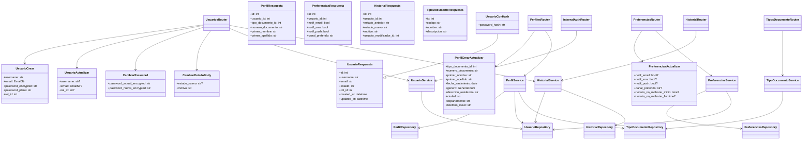

# Diagrama de clases — Microservicio de Usuarios

```mermaid
classDiagram
direction TB

class UsuarioCrear {
  +username: str
  +email: EmailStr
  +password_encrypted: str
  +password_plana: str
  +rol_id: int
}

class UsuarioActualizar {
  +username: str?
  +email: EmailStr?
  +rol_id: int?
}

class CambiarPassword {
  +password_actual_encrypted: str
  +password_nueva_encrypted: str
}

class CambiarEstadoBody {
  +estado_nuevo: str?
  +motivo: str
}

class UsuarioRespuesta {
  +id: int
  +username: str
  +email: str
  +estado: str
  +rol_id: int
  +created_at: datetime
  +updated_at: datetime
}

class UsuarioConHash {
  +password_hash: str
}

class PerfilCrearActualizar {
  +tipo_documento_id: int
  +numero_documento: str
  +primer_nombre: str
  +primer_apellido: str
  +fecha_nacimiento: date
  +genero: GeneroEnum
  +direccion_residencia: str
  +ciudad: str
  +departamento: str
  +telefono_movil: str
}

class PerfilRespuesta {
  +id: int
  +usuario_id: int
  +tipo_documento_id: int
  +numero_documento: str
  +primer_nombre: str
  +primer_apellido: str
}

class PreferenciasActualizar {
  +notif_email: bool?
  +notif_sms: bool?
  +notif_push: bool?
  +canal_preferido: str?
  +horario_no_molestar_inicio: time?
  +horario_no_molestar_fin: time?
}

class PreferenciasRespuesta {
  +id: int
  +usuario_id: int
  +notif_email: bool
  +notif_sms: bool
  +notif_push: bool
  +canal_preferido: str
}

class HistorialRespuesta {
  +id: int
  +usuario_id: int
  +estado_anterior: str
  +estado_nuevo: str
  +motivo: str
  +usuario_modificador_id: int
}

class TipoDocumentoRespuesta {
  +id: int
  +codigo: str
  +nombre: str
  +descripcion: str
}

class UsuariosRouter
class PerfilesRouter
class PreferenciasRouter
class HistorialRouter
class TiposDocumentoRouter
class InternalAuthRouter

class UsuarioService
class PerfilService
class PreferenciasService
class HistorialService
class TipoDocumentoService

class UsuarioRepository
class PerfilRepository
class PreferenciasRepository
class HistorialRepository
class TipoDocumentoRepository

UsuariosRouter --> UsuarioCrear
UsuariosRouter --> UsuarioActualizar
UsuariosRouter --> CambiarPassword
UsuariosRouter --> CambiarEstadoBody
UsuariosRouter --> UsuarioService
UsuariosRouter --> HistorialService

PerfilesRouter --> PerfilCrearActualizar
PerfilesRouter --> PerfilService
PreferenciasRouter --> PreferenciasActualizar
PreferenciasRouter --> PreferenciasService
HistorialRouter --> HistorialService
TiposDocumentoRouter --> TipoDocumentoService
InternalAuthRouter --> UsuarioService

UsuarioService --> UsuarioRepository
PerfilService --> PerfilRepository
PerfilService --> UsuarioRepository
PerfilService --> TipoDocumentoRepository
PreferenciasService --> PreferenciasRepository
PreferenciasService --> UsuarioRepository
HistorialService --> UsuarioRepository
HistorialService --> HistorialRepository
TipoDocumentoService --> TipoDocumentoRepository

UsuarioConHash --|> UsuarioRespuesta
```
