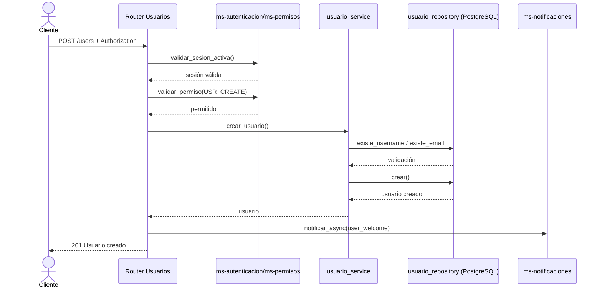
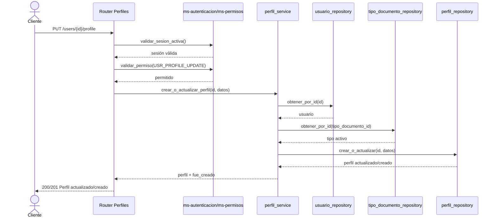
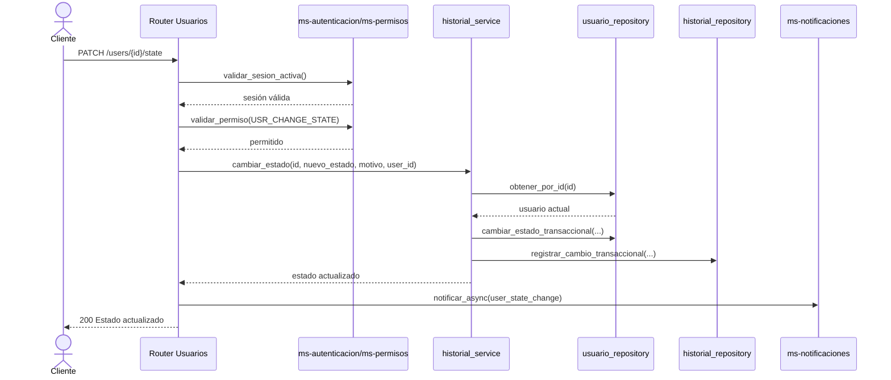

# Diagramas de secuencia — Microservicio de Usuarios

## 1) Crear usuario (`POST /api/v1/users`)

## 2) Actualizar perfil (`PUT /api/v1/users/{usuario_id}/profile`)

## 3) Cambiar estado de usuario (`PATCH /api/v1/users/{usuario_id}/state`)

