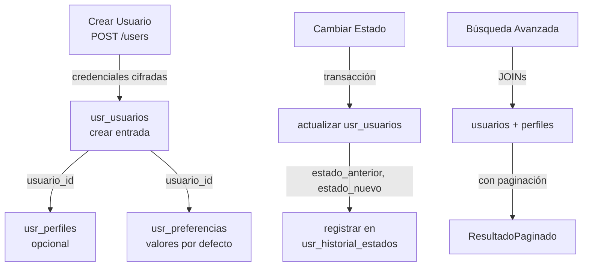

# 📊 Modelo Relacional - Microservicio de Usuarios

## Diagrama de Entidades y Relaciones

```mermaid
erDiagram
    USR_TIPOS_DOCUMENTO ||--o{ USR_PERFILES : "tiene"
    USR_USUARIOS ||--|| USR_PERFILES : "posee"
    USR_USUARIOS ||--|| USR_PREFERENCIAS_NOTIFICACION : "configura"
    USR_USUARIOS ||--o{ USR_HISTORIAL_ESTADOS : "registro"

    USR_TIPOS_DOCUMENTO {
        int id PK
        string codigo UK
        string nombre
        text descripcion
        boolean activo
        timestamp created_at
        timestamp updated_at
    }

    USR_USUARIOS {
        int id PK
        string username UK
        string email UK
        string password_hash
        string estado
        int rol_id
        timestamp created_at
        timestamp updated_at
    }

    USR_PERFILES {
        int id PK
        int usuario_id FK UK
        int tipo_documento_id FK
        string numero_documento UK
        string primer_nombre
        string segundo_nombre
        string primer_apellido
        string segundo_apellido
        date fecha_nacimiento
        string genero
        string direccion_residencia
        string ciudad
        string departamento
        string telefono_fijo
        string telefono_movil
        string contacto_emergencia_nombre
        string contacto_emergencia_telefono
        text biografia
        timestamp created_at
        timestamp updated_at
    }

    USR_PREFERENCIAS_NOTIFICACION {
        int id PK
        int usuario_id FK UK
        boolean notif_email
        boolean notif_sms
        boolean notif_push
        string canal_preferido
        time horario_no_molestar_inicio
        time horario_no_molestar_fin
        timestamp created_at
        timestamp updated_at
    }

    USR_HISTORIAL_ESTADOS {
        int id PK
        int usuario_id FK
        string estado_anterior
        string estado_nuevo
        string motivo
        int usuario_modificador_id
        timestamp created_at
    }
```

---

## 📋 Descripción Detallada de Tablas

### 1. **usr_tipos_documento**
**Propósito:** Catálogo maestro de tipos de documentos válidos en el sistema.

| Campo | Tipo | Restricción | Descripción |
|-------|------|-------------|-------------|
| `id` | SERIAL | PK | Identificador único |
| `codigo` | VARCHAR(10) | UNIQUE NOT NULL | Código corto (ej: CC, PA, CE) |
| `nombre` | VARCHAR(100) | NOT NULL | Nombre legible (ej: Cédula de Ciudadanía) |
| `descripcion` | TEXT | - | Descripción detallada del tipo |
| `activo` | BOOLEAN | DEFAULT true | Indica si el tipo está disponible |
| `created_at` | TIMESTAMP | DEFAULT NOW() | Fecha de creación |
| `updated_at` | TIMESTAMP | DEFAULT NOW() | Fecha de última actualización |

**Tipos predefinidos:**
- `CC` - Cédula de Ciudadanía
- `PA` - Pasaporte
- `CE` - Cédula de Extranjería
- `TI` - Tarjeta de Identidad
- `PEP` - Permiso de Entrada y Permanencia
- `NIT` - Número de Identificación Tributaria
- `OTR` - Otro

---

### 2. **usr_usuarios**
**Propósito:** Tabla principal que almacena datos de autenticación y estado del usuario.

| Campo | Tipo | Restricción | Descripción |
|-------|------|-------------|-------------|
| `id` | SERIAL | PK | Identificador único del usuario |
| `username` | VARCHAR(50) | UNIQUE NOT NULL | Nombre de usuario único (≥3 caracteres) |
| `email` | VARCHAR(120) | UNIQUE NOT NULL | Correo electrónico único |
| `password_hash` | VARCHAR(255) | NOT NULL | Hash bcrypt de la contraseña |
| `estado` | VARCHAR(20) | CHECK (activo\|inactivo\|suspendido\|eliminado) | Estado actual del usuario |
| `rol_id` | INTEGER | - | ID del rol en ms-roles |
| `created_at` | TIMESTAMP | DEFAULT NOW() | Fecha de creación |
| `updated_at` | TIMESTAMP | DEFAULT NOW() | Fecha de última actualización |

**Estados válidos:**
- `activo` - Usuario activo y funcional
- `inactivo` - Usuario desactivado por el sistema
- `suspendido` - Usuario suspendido por violación de políticas
- `eliminado` - Usuario marcado como eliminado (soft delete)

---

### 3. **usr_perfiles**
**Propósito:** Información extendida y personal del usuario.

| Campo | Tipo | Restricción | Descripción |
|-------|------|-------------|-------------|
| `id` | SERIAL | PK | Identificador único del perfil |
| `usuario_id` | INTEGER | UNIQUE FK NOT NULL | Referencia a usr_usuarios (1:1) |
| `tipo_documento_id` | INTEGER | FK NOT NULL | Referencia a tipo de documento |
| `numero_documento` | VARCHAR(30) | UNIQUE NOT NULL | Número de documento único |
| `primer_nombre` | VARCHAR(100) | NOT NULL | Primer nombre |
| `segundo_nombre` | VARCHAR(100) | - | Segundo nombre (opcional) |
| `primer_apellido` | VARCHAR(100) | NOT NULL | Primer apellido |
| `segundo_apellido` | VARCHAR(100) | - | Segundo apellido (opcional) |
| `fecha_nacimiento` | DATE | NOT NULL | Fecha de nacimiento (edad ≥ 14 años) |
| `genero` | VARCHAR(20) | CHECK (masculino\|femenino\|otro\|prefiero_no_decir) | Género |
| `direccion_residencia` | VARCHAR(200) | - | Dirección completa |
| `ciudad` | VARCHAR(100) | - | Ciudad de residencia |
| `departamento` | VARCHAR(100) | - | Departamento/región |
| `telefono_fijo` | VARCHAR(20) | - | Teléfono fijo (opcional) |
| `telefono_movil` | VARCHAR(20) | NOT NULL | Teléfono celular |
| `contacto_emergencia_nombre` | VARCHAR(100) | NOT NULL | Nombre del contacto de emergencia |
| `contacto_emergencia_telefono` | VARCHAR(20) | NOT NULL | Teléfono del contacto de emergencia |
| `biografia` | TEXT | - | Biografía personal (opcional) |
| `created_at` | TIMESTAMP | DEFAULT NOW() | Fecha de creación |
| `updated_at` | TIMESTAMP | DEFAULT NOW() | Fecha de última actualización |

---

### 4. **usr_preferencias_notificacion**
**Propósito:** Configuración de canales y horarios para notificaciones del usuario.

| Campo | Tipo | Restricción | Descripción |
|-------|------|-------------|-------------|
| `id` | SERIAL | PK | Identificador único |
| `usuario_id` | INTEGER | UNIQUE FK NOT NULL | Referencia a usr_usuarios (1:1) |
| `notif_email` | BOOLEAN | DEFAULT true | Recibir notificaciones por email |
| `notif_sms` | BOOLEAN | DEFAULT true | Recibir notificaciones por SMS |
| `notif_push` | BOOLEAN | DEFAULT true | Recibir notificaciones push |
| `canal_preferido` | VARCHAR(20) | DEFAULT 'email' | Canal preferido (email\|sms\|push) |
| `horario_no_molestar_inicio` | TIME | - | Hora inicio de no molestar (HH:MM) |
| `horario_no_molestar_fin` | TIME | - | Hora fin de no molestar (HH:MM) |
| `created_at` | TIMESTAMP | DEFAULT NOW() | Fecha de creación |
| `updated_at` | TIMESTAMP | DEFAULT NOW() | Fecha de última actualización |

---

### 5. **usr_historial_estados**
**Propósito:** Registro de auditoría de cambios de estado de usuario.

| Campo | Tipo | Restricción | Descripción |
|-------|------|-------------|-------------|
| `id` | SERIAL | PK | Identificador único |
| `usuario_id` | INTEGER | FK NOT NULL | Referencia a usr_usuarios |
| `estado_anterior` | VARCHAR(20) | - | Estado previo del usuario |
| `estado_nuevo` | VARCHAR(20) | NOT NULL | Nuevo estado del usuario |
| `motivo` | VARCHAR(255) | - | Motivo del cambio |
| `usuario_modificador_id` | INTEGER | - | ID del usuario que realizó el cambio |
| `created_at` | TIMESTAMP | DEFAULT NOW() | Fecha del cambio |

---

## 🔗 Relaciones

### Relación Usuarios ↔ Perfiles (1:1)
```sql
usr_perfiles.usuario_id → usr_usuarios.id
- Un usuario TIENE un perfil extendido
- Al eliminar un usuario, su perfil se elimina en cascada
```

### Relación Tipos de Documento → Perfiles (1:N)
```sql
usr_perfiles.tipo_documento_id → usr_tipos_documento.id
- Un tipo de documento puede ser usado por muchos perfiles
- Restricción: el tipo debe existir
```

### Relación Usuarios ↔ Preferencias (1:1)
```sql
usr_preferencias_notificacion.usuario_id → usr_usuarios.id
- Un usuario TIENE una configuración de preferencias
- Al eliminar un usuario, sus preferencias se eliminan en cascada
```

### Relación Usuarios ↔ Historial (1:N)
```sql
usr_historial_estados.usuario_id → usr_usuarios.id
- Un usuario TIENE muchos registros históricos
- Al eliminar un usuario, su historial se elimina en cascada
```

---

## 📊 Índices para Optimización

```sql
-- Búsquedas por email y username
CREATE INDEX idx_usr_usuarios_email ON usr_usuarios(email);
CREATE INDEX idx_usr_usuarios_username ON usr_usuarios(username);

-- Filtros de estado
CREATE INDEX idx_usr_usuarios_estado ON usr_usuarios(estado);
CREATE INDEX idx_usr_usuarios_rol_id ON usr_usuarios(rol_id);

-- Búsqueda avanzada en perfiles
CREATE INDEX idx_usr_perfiles_usuario_id ON usr_perfiles(usuario_id);
CREATE INDEX idx_usr_perfiles_numero_documento ON usr_perfiles(numero_documento);
CREATE INDEX idx_usr_perfiles_ciudad ON usr_perfiles(ciudad);
CREATE INDEX idx_usr_perfiles_primer_nombre ON usr_perfiles(primer_nombre);

-- Historial de cambios
CREATE INDEX idx_usr_historial_usuario_id ON usr_historial_estados(usuario_id);
CREATE INDEX idx_usr_historial_created_at ON usr_historial_estados(created_at DESC);

-- Preferencias
CREATE INDEX idx_usr_preferencias_usuario_id ON usr_preferencias_notificacion(usuario_id);
```

---

## 🔐 Integridad Referencial

- **ON DELETE CASCADE:** Cuando se elimina un usuario, se elimina automáticamente:
  - Su perfil extendido
  - Sus preferencias de notificación
  - Su historial de estados

- **ON DELETE RESTRICT:** No se permite eliminar tipos de documento que estén en uso

---

## 📐 Diagrama de Flujo de Datos



---

## 📝 Notas Importantes

1. **Validación de Edad:** Los perfiles requieren `fecha_nacimiento` que coloque al usuario con al menos 14 años de edad.

2. **Horarios de No Molestar:** Si se configura `horario_no_molestar_inicio`, DEBE proporcionarse también `horario_no_molestar_fin`, y `inicio < fin`.

3. **Timestamps:** Todos los campos `created_at` usan `CURRENT_TIMESTAMP` y los `updated_at` se actualizan automáticamente mediante triggers.

4. **Soft Deletes:** No se elimina físicamente a los usuarios, se cambia su estado a `'eliminado'`.

5. **Password Hash:** Se almacena usando bcrypt con cost factor 12 (configurable en `.env` con `BCRYPT_ROUNDS`).

6. **Géneros:** Valores permitidos para inclusividad:
   - `masculino`
   - `femenino`
   - `otro`
   - `prefiero_no_decir`

