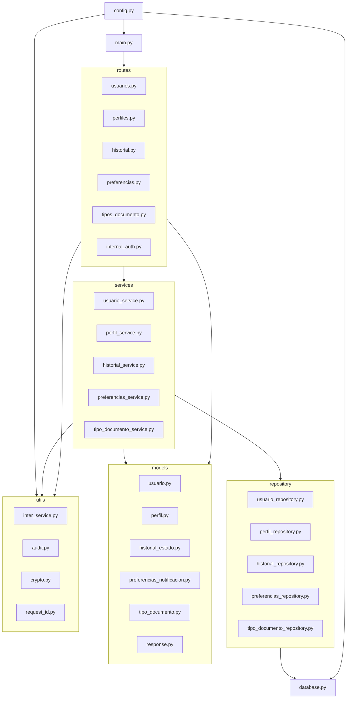
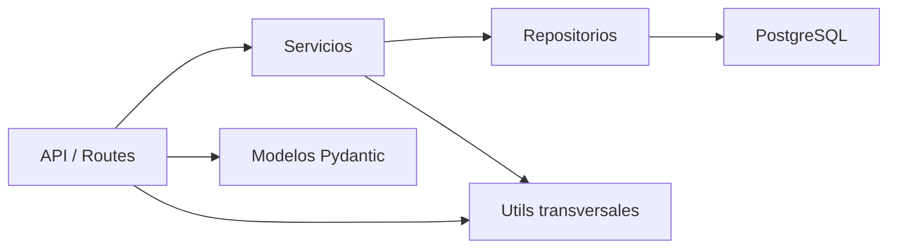

# Software Architecture Document — Microservicio de Usuarios (ms-usuarios [USR])

## 1. Introducción

Este documento describe la arquitectura de software del microservicio **ms-usuarios [USR]**, perteneciente al módulo **Seguridad y Acceso**. La descripción se basa en el documento de requisitos del microservicio y en la implementación actual en código fuente.

### 1.1 Propósito

Este documento presenta una visión arquitectónica integral del microservicio mediante vistas complementarias (caso de uso, lógica, proceso, despliegue, implementación y datos). Su propósito es registrar las decisiones arquitectónicas significativas ya implementadas y servir como guía para desarrollo, integración, pruebas y mantenimiento.

Audiencias principales:
- **Desarrolladores backend:** para entender capas, responsabilidades y contratos internos.
- **Integradores de microservicios:** para conocer endpoints, encabezados y llamadas entre servicios.
- **QA/Arquitectura:** para trazar requisitos funcionales y reglas transversales con componentes reales.
- **Operación/DevOps:** para desplegar y configurar el servicio con sus dependencias.

### 1.2 Alcance

Este documento aplica exclusivamente al microservicio **ms-usuarios** y cubre:
- API HTTP implementada en FastAPI.
- Lógica de negocio, acceso a datos y validaciones.
- Integración con microservicios externos (autenticación, roles, notificaciones, auditoría).
- Modelo de datos persistente PostgreSQL de ms-usuarios.
- Configuración de despliegue local con Docker Compose.

No cubre diseño de frontend ni arquitectura interna de otros microservicios.

### 1.3 Definiciones, Acrónimos y Abreviaturas

- **SAD:** Software Architecture Document.
- **USR:** prefijo del microservicio de usuarios.
- **RF:** requisito funcional.
- **RBAC:** control de acceso basado en roles.
- **API:** interfaz de programación de aplicaciones.
- **JWT/Bearer token:** token de sesión enviado en `Authorization`.
- **X-App-Token:** token de aplicación para llamadas entre microservicios.
- **X-Request-ID:** identificador de trazabilidad de petición.
- **AES-256-CBC:** cifrado simétrico usado para datos sensibles en tránsito.
- **bcrypt:** algoritmo de hash para contraseñas.
- **Fire-and-forget:** ejecución asíncrona sin bloquear la respuesta HTTP.

### 1.4 Referencias

- **Documento de requisitos detallados:** `Microservicio_Usuario/Documentos de desarrollo/ms-usuarios_requisitos_funcionales_detallados.md` (Versión 1.0, Marzo 2026).
- **Especificación de requisitos base:** `Microservicio_Usuario/requisitos/especificacion_requisitos.md`.
- **Código fuente principal:** `Microservicio_Usuario/ms_usuario/`.
- **Configuración de servicio:** `Microservicio_Usuario/ms_usuario/config.py`.
- **Entrada de aplicación:** `Microservicio_Usuario/ms_usuario/main.py`.
- **Esquema de base de datos:** `Microservicio_Usuario/ms_usuario/init_db.sql`.
- **Despliegue Docker Compose:** `Microservicio_Usuario/docker-compose.yml`.
- **Dependencias Python:** `Microservicio_Usuario/ms_usuario/requirements.txt`.

## 2. Representación Arquitectónica

La arquitectura se representa mediante las siguientes vistas, todas necesarias para explicar el comportamiento real implementado:

- **Vista de Caso de Uso:** describe los flujos funcionales principales (creación de usuario, gestión de estado, perfil, preferencias, consultas internas).
- **Vista Lógica:** muestra la descomposición en capas y paquetes (`routes`, `services`, `repository`, `models`, `utils`).
- **Vista de Proceso:** describe el proceso HTTP principal y los hilos auxiliares para notificación/auditoría.
- **Vista de Despliegue:** define nodos de ejecución (contenedor app, contenedor PostgreSQL, red compartida y servicios externos).
- **Vista de Implementación:** especifica módulos, dependencias entre componentes y reglas de acoplamiento por capa.
- **Vista de Datos:** modela entidades persistentes, restricciones e índices.

Elementos de modelo representados:
- Endpoints FastAPI por router.
- Servicios de negocio por entidad.
- Repositorios SQL por agregado.
- Modelos Pydantic de entrada/salida.
- Utilidades transversales (seguridad, integración, trazabilidad, auditoría).
- Estructura relacional PostgreSQL y constraints.

## 3. Objetivos y Restricciones Arquitectónicas

Objetivos con impacto arquitectónico:
- **Seguridad de acceso:** validar sesión y permisos antes de ejecutar lógica de negocio (RF transversales USR-RF-001/002).
- **Protección de credenciales:** contraseñas cifradas en tránsito (AES-256) y almacenadas como hash bcrypt.
- **Trazabilidad distribuida:** uso y propagación de `X-Request-ID`.
- **Auditoría transversal:** registro asíncrono de operaciones en ms-auditoria.
- **Integración desacoplada:** consumo de ms-autenticacion, ms-roles, ms-notificaciones y ms-auditoria vía HTTP.
- **Consistencia de datos en cambios críticos:** actualización de estado e historial en transacción atómica.

Restricciones implementadas:
- Stack fijado en Python + FastAPI + PostgreSQL + psycopg2.
- Configuración por variables de entorno (`.env`).
- Paginación con límite máximo (`ITEMS_POR_PAGINA_MAX=100`).
- Timeouts por dependencia externa (`TIMEOUT_AUTH`, `TIMEOUT_ROL`, `TIMEOUT_NOT`, `TIMEOUT_AUD`).
- Dependencia operativa de servicios externos para autorización/sesión cuando no está en modo debug.
- Docker Compose define ejecución local con red externa `microservicios-network`.

## 4. Vista de Caso de Uso

Casos de uso con mayor cobertura arquitectónica:
- Crear usuario (`POST /api/v1/users`).
- Consultar usuario por ID y por email (`GET /users/{id}`, `GET /users/by-email/{email}`).
- Búsqueda avanzada y estadísticas (`GET /users`, `GET /users/stats/by-state`).
- Actualizar usuario y contraseña (`PUT /users/{id}`, `PATCH /users/{id}/password`).
- Cambiar/desactivar/reactivar estado (`PATCH /users/{id}/state`, `DELETE /users/{id}`, `POST /users/{id}/reactivate`).
- Gestionar perfil (`GET/PUT /users/{id}/profile`).
- Gestionar preferencias (`GET/PUT /users/{id}/notification-preferences`).
- Historial de estados (`GET /users/{id}/state-history`).
- Catálogo de tipos de documento (`GET /document-types`).
- Uso interno de autenticación (`POST /internal/users/credentials/verify`) y validación de existencia (`GET /users/{id}/validate`).

### 4.1 Realizaciones de Caso de Uso

**Realización A: Crear usuario**
1. Route valida `Authorization` y permiso (`validar_sesion_activa`, `validar_permiso`).
2. Service valida unicidad y rol externo.
3. Service descifra `password_encrypted` (o usa `password_plana` en debug), aplica bcrypt.
4. Repository inserta en `usr_usuarios`.
5. Route responde en estructura estándar y dispara notificación/auditoría asíncronas.

**Realización B: Cambiar estado de usuario**
1. Route valida sesión, permiso y datos del cambio.
2. Service `historial_service.cambiar_estado` verifica estado objetivo.
3. Service abre transacción: actualiza `usr_usuarios` y registra en `usr_historial_estados`.
4. Commit atómico; en error, rollback.
5. Route registra auditoría y notifica cambio de estado.

**Realización C: Verificación interna de credenciales**
1. `internal_auth` recibe usuario y contraseña cifrada.
2. `usuario_service.verificar_credenciales_internas` consulta hash.
3. Descifra contraseña, verifica bcrypt y estado de usuario.
4. Retorna estado `ACTIVE`/`BLOCKED` o error 401.

## 5. Vista Lógica

### 5.1 Visión General

El diseño sigue una estructura por capas y paquetes:

1. **Capa de API (routes):** expone endpoints y adapta request/response.
2. **Capa de aplicación (services):** reglas de negocio y coordinación de casos de uso.
3. **Capa de persistencia (repository):** consultas SQL y transacciones contra PostgreSQL.
4. **Capa de modelos (models):** validación/serialización Pydantic.
5. **Capa transversal (utils):** cifrado, integración inter-servicio, auditoría, request-id.
6. **Capa de infraestructura:** configuración, conexión de base de datos y arranque FastAPI.

Regla de dependencia observada:
- `routes -> services -> repository -> database`
- `routes/services -> utils`
- `routes/services -> models`

### 5.2 Paquetes de Diseño Arquitectónicamente Significativos

Paquetes y responsabilidades:

- **routes/**
  - Gestiona contrato HTTP, headers, códigos de respuesta y control de acceso por endpoint.
  - Clases/elementos clave: routers en `usuarios`, `perfiles`, `historial`, `preferencias`, `tipos_documento`, `internal_auth`.

- **services/**
  - Implementa reglas de negocio y validaciones de dominio.
  - Elementos clave:
    - `usuario_service`: creación, actualización, búsqueda, password, validación interna.
    - `historial_service`: cambio de estado transaccional e historial.
    - `perfil_service`: validación de tipo documental y upsert de perfil.
    - `preferencias_service`: defaults + actualización.
    - `tipo_documento_service`: consulta de catálogo activo.

- **repository/**
  - Encapsula SQL y acceso a tablas.
  - Elementos clave por entidad: usuario, perfil, historial, preferencias, tipo de documento.

- **models/**
  - Define DTOs de entrada/salida y validaciones (username mínimo, edad mínima, horarios no molestar, etc.).
  - `response.py` centraliza la envoltura estándar de respuesta.

- **utils/**
  - `inter_service`: llamadas HTTP a servicios externos y validación de tokens internos.
  - `crypto`: AES-256-CBC y bcrypt.
  - `audit`: envío asíncrono de logs y respaldo local.
  - `request_id`: generación/reutilización de identificador de trazabilidad.

## 6. Vista de Proceso

Procesos y hilos relevantes:

- **Proceso principal (pesado):** contenedor `app` ejecutando `uvicorn main:app`.
- **Hilos de control (ligeros):**
  - Manejo de peticiones HTTP por el servidor ASGI.
  - Hilos daemon para `notificar_async` (ms-notificaciones).
  - Hilos daemon para `registrar_log_async` (ms-auditoria).

Comunicación entre procesos:
- **Sincrónica HTTP/JSON:** validación de sesión, permisos y roles (bloqueante para la petición).
- **Asíncrona fire-and-forget:** notificaciones y auditoría (no bloqueante para la respuesta).
- **Persistencia transaccional:** operaciones SQL en PostgreSQL con commit/rollback.

## 7. Vista de Despliegue

Estructura de despliegue observada en `docker-compose.yml`:

- **Nodo 1: `app` (ms_usuarios_app)**
  - Imagen construida desde `ms_usuario/Dockerfile`.
  - Expone puerto `8000`.
  - Monta código fuente `./ms_usuario:/app`.
  - Variables de entorno para BD, tokens, URLs y timeouts.

- **Nodo 2: `db` (ms_usuarios_db)**
  - Imagen `postgres:15-alpine`.
  - Expone puerto `5432`.
  - Inicializa esquema con `ms_usuario/init_db.sql`.
  - Volumen persistente `postgres_data`.

- **Red:** `microservicios-network` (externa), usada para integración con otros servicios.

## 8. Vista de Implementación

### 8.1 Visión General

La implementación está organizada en capas con separación explícita de responsabilidades:

Reglas de inclusión por capa:
- Endpoints HTTP solo en `routes`.
- Reglas de negocio solo en `services`.
- SQL directo solo en `repository`.
- Tipos y validaciones de payload en `models`.
- Funciones transversales de seguridad/integración en `utils`.

### 8.2 Capas

**Capa 1 — Presentación/API**
- Subsistemas: `routes/usuarios.py`, `routes/perfiles.py`, `routes/historial.py`, `routes/preferencias.py`, `routes/tipos_documento.py`, `routes/internal_auth.py`.
- Componente principal: routers FastAPI.

**Capa 2 — Aplicación/Negocio**
- Subsistemas: `services/usuario_service.py`, `services/perfil_service.py`, `services/historial_service.py`, `services/preferencias_service.py`, `services/tipo_documento_service.py`.
- Componente principal: casos de uso por entidad.

**Capa 3 — Persistencia**
- Subsistemas: `repository/*.py`.
- Componente principal: consultas SQL y operaciones transaccionales.

**Capa 4 — Modelado y Contratos**
- Subsistemas: `models/*.py`.
- Componente principal: modelos Pydantic de request/response.

**Capa 5 — Transversal/Infraestructura de aplicación**
- Subsistemas: `utils/*.py`, `config.py`, `database.py`, `main.py`.
- Componente principal: configuración, cifrado, integración, auditoría y arranque.

## 9. Vista de Datos

Persistencia implementada en PostgreSQL con 5 tablas principales:

- `usr_usuarios`: identidad de usuario, correo, hash de contraseña, estado, rol.
- `usr_perfiles`: perfil extendido y datos personales.
- `usr_historial_estados`: trazabilidad de cambios de estado.
- `usr_preferencias_notificacion`: configuración de notificaciones.
- `usr_tipos_documento`: catálogo de tipos documentales.

Relaciones clave:
- `usr_perfiles.usuario_id -> usr_usuarios.id` (1:1).
- `usr_preferencias_notificacion.usuario_id -> usr_usuarios.id` (1:1).
- `usr_historial_estados.usuario_id -> usr_usuarios.id` (1:N).
- `usr_perfiles.tipo_documento_id -> usr_tipos_documento.id` (N:1).

Integridad y consistencia:
- Constraints `CHECK` para estados, género y canal de notificación.
- `UNIQUE` para username, email y número de documento.
- Triggers para mantener `updated_at` en tablas versionadas.
- Índices para username, email, estado, rol, ciudad y claves foráneas.

## 10. Tamaño y Rendimiento

Características de dimensionamiento y desempeño observables:

- API con 22 endpoints HTTP implementados (incluyendo `health` y endpoints internos).
- Paginación configurable con máximo de 100 ítems por página.
- Consultas de búsqueda avanzada con `COUNT + LIMIT + OFFSET` y filtros dinámicos.
- Integraciones externas con timeouts explícitos:
  - Auth: 3s
  - Roles: 3s
  - Notificaciones: 1s
  - Auditoría: 0.5s
- Operaciones no críticas (notificación/auditoría) ejecutadas en hilos daemon para reducir latencia de respuesta.
- Hash de contraseñas con `bcrypt` (costo configurable, default 12), lo que impacta costo computacional en creación/cambio de contraseña.

## 11. Calidad

Contribución arquitectónica a atributos de calidad:

- **Seguridad:** validación de sesión/permisos, cifrado AES-256-CBC implementado para datos sensibles en tránsito, bcrypt para almacenamiento de contraseñas, separación de endpoint interno para hash.
- **Confiabilidad:** transacciones atómicas en cambio de estado, rollback en fallos SQL, respaldo local de auditoría cuando ms-auditoria no responde.
- **Mantenibilidad:** separación en capas claras (`routes/services/repository/models/utils`) y contratos tipados con Pydantic.
- **Interoperabilidad:** comunicación REST JSON estandarizada con otros microservicios y uso de `X-App-Token`/`X-Request-ID`.
- **Observabilidad:** trazabilidad por request ID y auditoría por funcionalidad, método, endpoint y código de respuesta.
- **Escalabilidad funcional:** estructura por paquetes permite añadir nuevas entidades/endpoints sin romper organización actual.
