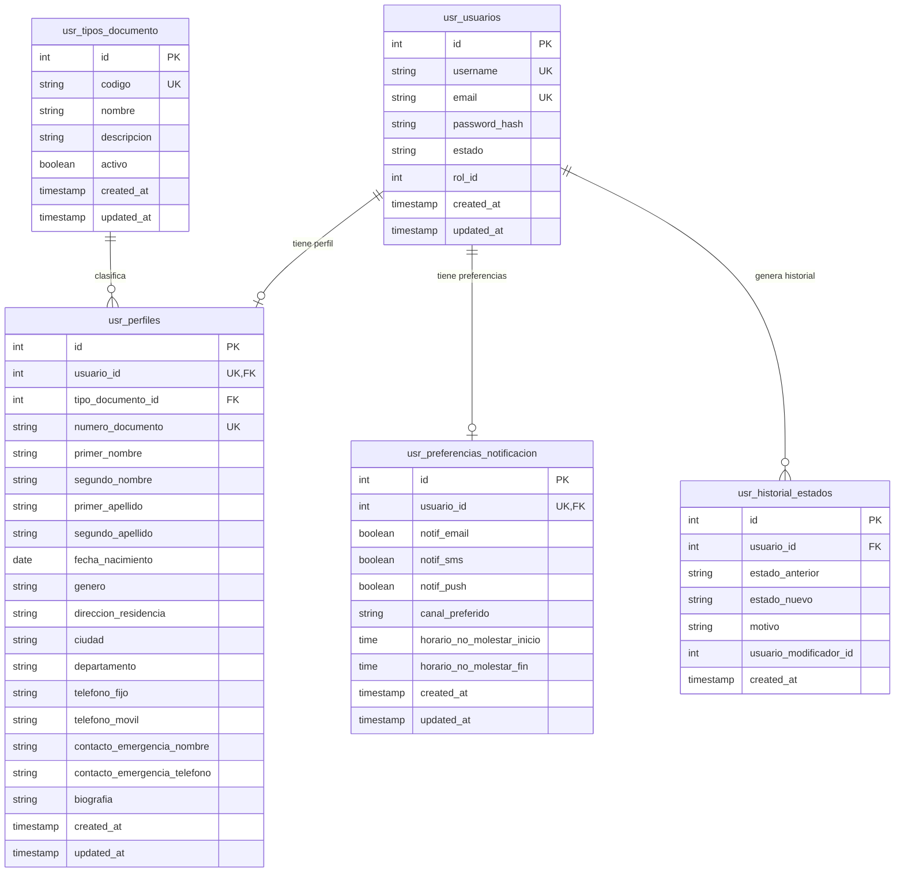

# Diagrama de base de datos — Microservicio de Usuarios

## Restricciones observables en SQL

- `usr_usuarios.estado` limitado por `chk_usuario_estado`: `activo`, `inactivo`, `suspendido`, `eliminado`.
- `usr_perfiles.genero` limitado por `chk_perfil_genero`.
- `usr_historial_estados.estado_nuevo` limitado por `chk_historial_estado`.
- `usr_preferencias_notificacion.canal_preferido` limitado por `chk_pref_canal`: `email`, `sms`, `push`.
- El SQL define los valores permitidos de estado, pero no documenta semántica de negocio detallada para diferenciar cada estado.
