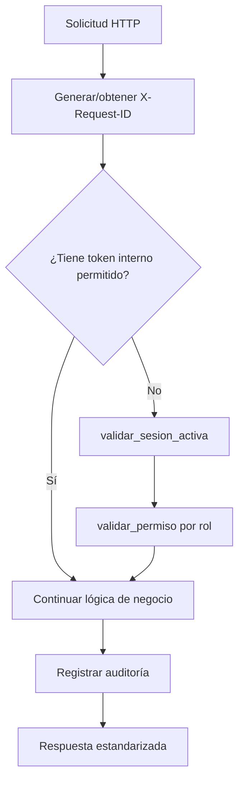

# Diagramas por flujo — Microservicio de Usuarios

## 1) Flujo de autenticación y autorización en endpoints públicos



## 2) Flujo de cambio de estado con historial transaccional

```mermaid
flowchart TD
    A[PATCH /users/{id}/state o DELETE o reactivate] --> B[Validar sesión y permiso]
    B --> C[Validar estado_nuevo y motivo]
    C --> D[Buscar usuario actual]
    D --> E{¿Existe y cambia estado?}
    E -- No --> X[Responder error]
    E -- Sí --> F[Iniciar transacción]
    F --> G[Actualizar estado en usr_usuarios]
    G --> H[Insertar registro en usr_historial_estados]
    H --> I[Commit]
    I --> J[Notificar evento user_state_change]
    J --> K[Respuesta 200]
```

## 3) Flujo de actualización de contraseña

```mermaid
flowchart TD
    A[PATCH /users/{id}/password] --> B[Validar sesión activa]
    B --> C{¿session.user_id == usuario_id?}
    C -- No --> X[403]
    C -- Sí --> D[Obtener usuario con hash]
    D --> E[Descifrar password actual y nueva]
    E --> F[Verificar bcrypt actual]
    F --> G[Validar política de contraseña]
    G --> H[Guardar nuevo hash]
    H --> I[Notificar user_security_alert]
    I --> J[Respuesta 200]
```
