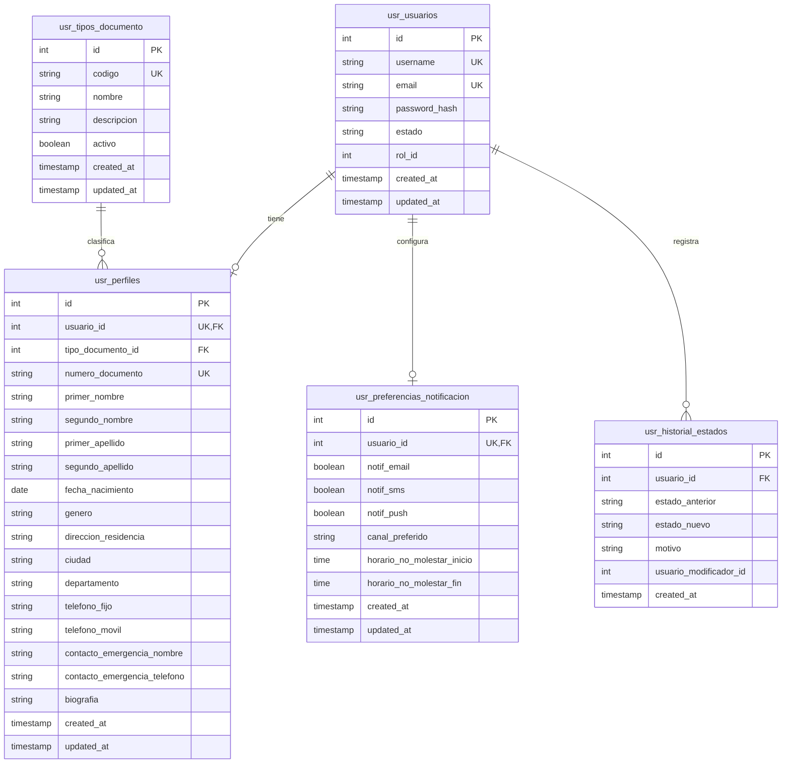
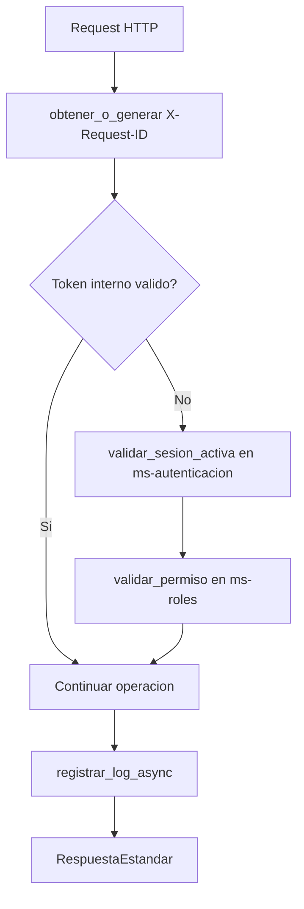
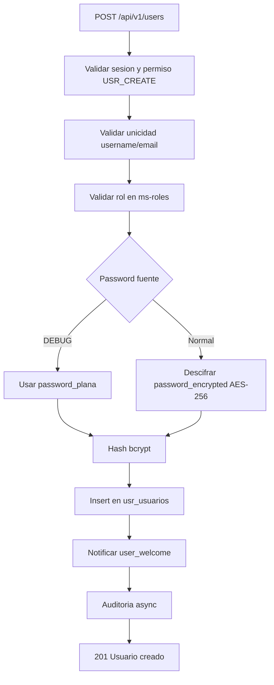
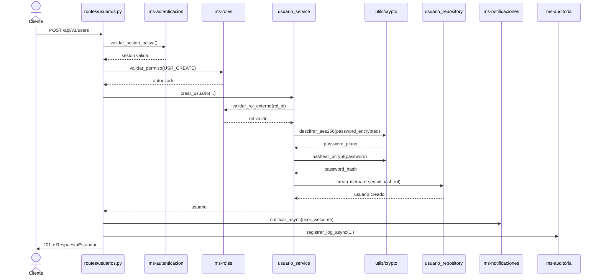
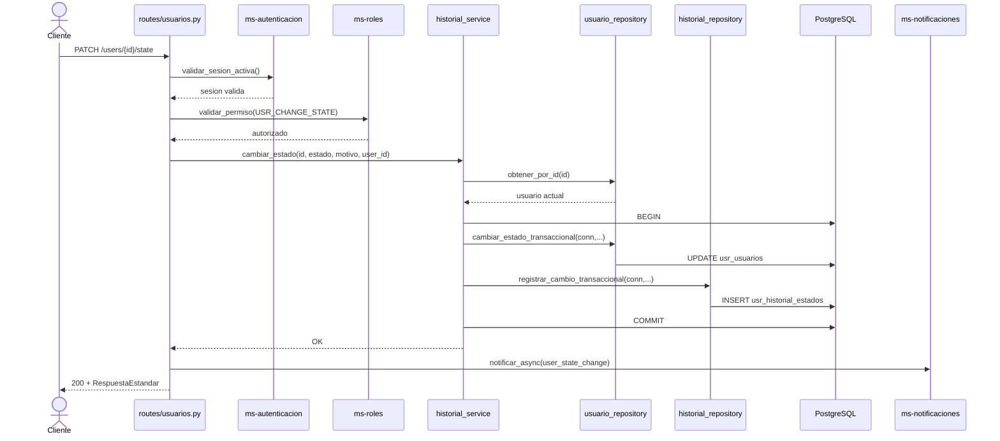
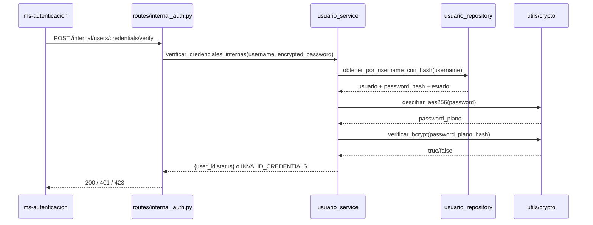

# Diagramas actualizados — Microservicio de Usuarios (ms-usuarios [USR])

Documento reconstruido a partir de:
- `documentacion/software_architecture_document_ms_usuarios.md`
- `Documentos de desarrollo/ms-usuarios_requisitos_funcionales_detallados.md`
- Implementación real en `ms_usuario/`.

## 1) Diagrama de clases (lógico de implementación)

```mermaid
classDiagram

class MainApp {
  +include_router(router)
  +health_check()
  +health_check_v1()
}

class UsuariosRouter
class PerfilesRouter
class HistorialRouter
class PreferenciasRouter
class TiposDocumentoRouter
class InternalAuthRouter

class UsuarioService
class PerfilService
class HistorialService
class PreferenciasService
class TipoDocumentoService

class UsuarioRepository
class PerfilRepository
class HistorialRepository
class PreferenciasRepository
class TipoDocumentoRepository

class UsuarioCrear
class UsuarioActualizar
class CambiarPassword
class CambiarEstadoBody
class UsuarioRespuesta
class PerfilCrearActualizar
class PerfilRespuesta
class PreferenciasActualizar
class PreferenciasRespuesta
class TipoDocumentoRespuesta
class RespuestaEstandar

class InterService
class Crypto
class Audit
class RequestId
class Database

MainApp --> UsuariosRouter
MainApp --> PerfilesRouter
MainApp --> HistorialRouter
MainApp --> PreferenciasRouter
MainApp --> TiposDocumentoRouter
MainApp --> InternalAuthRouter

UsuariosRouter --> UsuarioService
UsuariosRouter --> HistorialService
UsuariosRouter --> UsuarioCrear
UsuariosRouter --> UsuarioActualizar
UsuariosRouter --> CambiarPassword
UsuariosRouter --> CambiarEstadoBody
UsuariosRouter --> UsuarioRespuesta
UsuariosRouter --> RespuestaEstandar

PerfilesRouter --> PerfilService
PerfilesRouter --> PerfilCrearActualizar
PerfilesRouter --> PerfilRespuesta
PerfilesRouter --> RespuestaEstandar

HistorialRouter --> HistorialService
HistorialRouter --> RespuestaEstandar

PreferenciasRouter --> PreferenciasService
PreferenciasRouter --> PreferenciasActualizar
PreferenciasRouter --> PreferenciasRespuesta
PreferenciasRouter --> RespuestaEstandar

TiposDocumentoRouter --> TipoDocumentoService
TiposDocumentoRouter --> TipoDocumentoRespuesta
TiposDocumentoRouter --> RespuestaEstandar

InternalAuthRouter --> UsuarioService

UsuarioService --> UsuarioRepository
UsuarioService --> InterService
UsuarioService --> Crypto

PerfilService --> PerfilRepository
PerfilService --> UsuarioRepository
PerfilService --> TipoDocumentoRepository

HistorialService --> UsuarioRepository
HistorialService --> HistorialRepository
HistorialService --> Database

PreferenciasService --> PreferenciasRepository
PreferenciasService --> UsuarioRepository

TipoDocumentoService --> TipoDocumentoRepository

UsuariosRouter --> InterService
UsuariosRouter --> Audit
UsuariosRouter --> RequestId
PerfilesRouter --> InterService
PreferenciasRouter --> InterService

UsuarioRepository --> Database
PerfilRepository --> Database
HistorialRepository --> Database
PreferenciasRepository --> Database
TipoDocumentoRepository --> Database
```



## 2) Diagrama de base de datos (ER)



## 3) Diagramas de flujo

### 3.1 Flujo transversal de seguridad (USR-RF-001, USR-RF-002, USR-RF-003)



### 3.2 Flujo de creación de usuario (USR-RF-006)



### 3.3 Flujo de cambio de estado transaccional (USR-RF-015)

```mermaid
flowchart TD
    A[PATCH /users/{id}/state] --> B[Validar sesion y permiso USR_CHANGE_STATE]
    B --> C[Validar estado y motivo]
    C --> D[Obtener usuario actual]
    D --> E{Existe y cambia estado?}
    E -- No --> X[Error 4xx]
    E -- Si --> F[BEGIN]
    F --> G[UPDATE usr_usuarios.estado]
    G --> H[INSERT usr_historial_estados]
    H --> I[COMMIT]
    I --> J[Notificar user_state_change]
    J --> K[Auditoria async]
    K --> L[200 Estado actualizado]
```

## 4) Diagramas de secuencia

### 4.1 Crear usuario (`POST /api/v1/users`)



### 4.2 Cambio de estado con historial (`PATCH /users/{id}/state`)



### 4.3 Verificación interna de credenciales (`POST /internal/users/credentials/verify`)



## 5) Cobertura de requisitos trazada en diagramas

- **Transversales:** USR-RF-001, 002, 003, 004, 005.
- **Usuarios:** USR-RF-006, 007, 008, 010, 011, 012, 020, 021, 022, 023, 024.
- **Perfiles:** USR-RF-013, 014.
- **Historial:** USR-RF-015, 016.
- **Catálogo:** USR-RF-017.
- **Preferencias:** USR-RF-018, 019.
